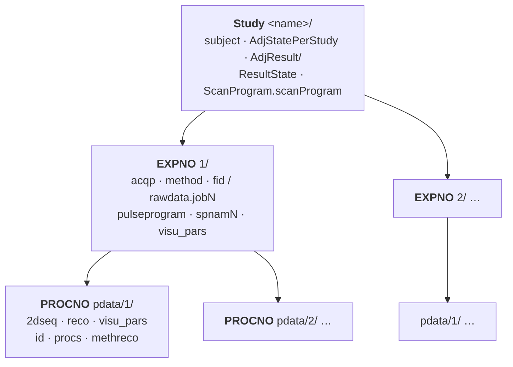
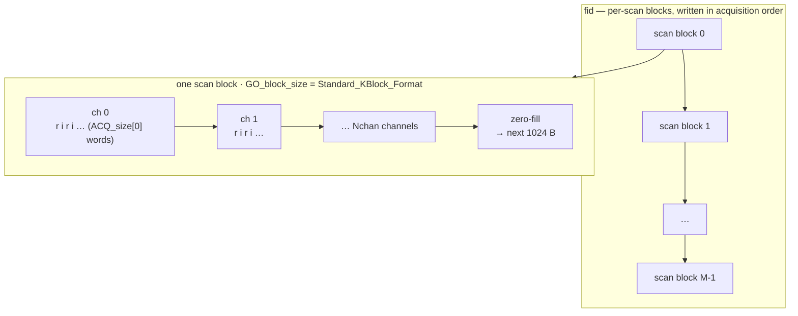
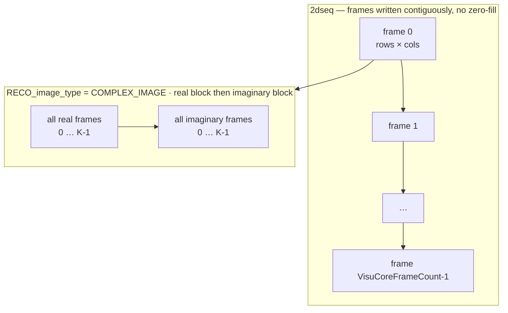
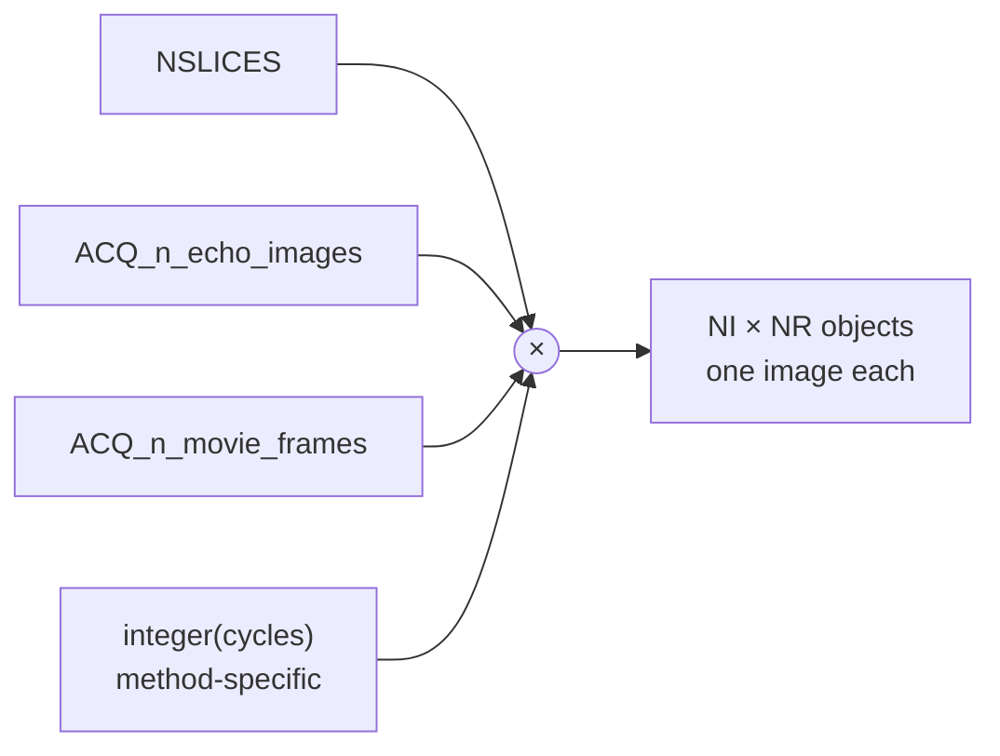
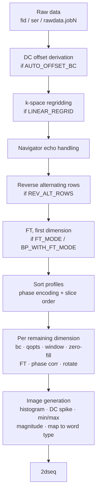
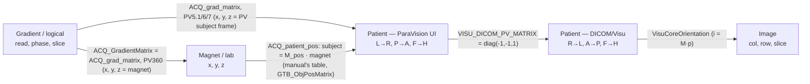

# Bruker ParaVision Raw Data Format

Complete documentation of the Bruker preclinical MRI raw data format as used by ParaVision 5.x and
6.x, with version-specific notes for ParaVision 360 (v3.x) and ParaVision 7.0.

This is a generic specification of the format, independent of any particular dataset. It is
derived from the official Bruker documentation — the File Formats manual (`D01_FileFormats.pdf`
for PV6, `D12_FileFormats.pdf` for PV5.1), the Parameter Reference (`D02_PvParams.pdf` /
`D13_PvParams.pdf`), the Image Reconstruction manual (`D07_ImageReco.pdf`), and the
XWIN-NMR/TopSpin `fileform.pdf` — and the enum names and values are taken verbatim from the
ParaVision C headers that define them (`recotyp.h`, `acqutyp.h`, `d3typ.h`, `Visu/VisuTypes.h`,
`Visu/VisuDefines.h`, `Reco/RecoStageTyp.h`, and the `PvmTypes/*.h` toolbox headers). Where the
file-format manual and the on-disk parameter file disagree on spelling (e.g. the manual's
`RECO_word_type` vs the stored `RECO_wordtype`), both forms are noted.

The core format (directory layout, JCAMP-DX parameter files, `fid`/`2dseq` binary layouts)
follows the Bruker manuals and headers. The ParaVision 360 specifics follow that version's own
Programming & Administration manual — chapter "Data Formats" (§4.12 in the 3.6/3.7 manuals) and
"ParaVision Parameters" (§4.13) — cross-checked against real ParaVision 360 data: the public
PV360 3.6 standard-protocol set
([github.com/cecilyen/PV360_StdData](https://github.com/cecilyen/PV360_StdData)), the PV360 3.4
scan in the MRIReco.jl test data
([media.tuhh.de/ibi/mrireco/MRIRecoTestData.tar.gz](http://media.tuhh.de/ibi/mrireco/MRIRecoTestData.tar.gz)),
and — where marked — Bruker's PV360 standard datasets for 360.3.5 and 360.3.7 (PCI community
download; Bruker login required).

Two classes of statement here are **not** manual-derived, and are marked as such where they
appear: the sequence-specific auxiliary files that no Bruker manual covers (`traj`, `b0`,
`fid.navFid`, `trace.*` and `*.flt` — see
[Section 3.5](#35-method-specific-auxiliary-files); note `rawdata.Navigator` and
`rawdata.DriftCompensation` *are* documented for PV360, and `fid.spiral`'s content and
acquisition order are documented in the PV5.1 Method Descriptions manual), and the size formulas,
which are derived from the documented layouts rather than quoted.

## Table of Contents

- [1. Dataset Directory Structure](#1-dataset-directory-structure)
  - [1.1 Study Level](#11-study-level)
  - [1.2 Experiment Level (EXPNO)](#12-experiment-level-expno)
  - [1.3 Reconstruction Level (PROCNO)](#13-reconstruction-level-procno)
- [2. Parameter File Format (JCAMP-DX)](#2-parameter-file-format-jcamp-dx)
  - [2.1 Basic Format](#21-basic-format)
  - [2.2 Data Types](#22-data-types)
  - [2.3 Array and Struct Encoding](#23-array-and-struct-encoding)
  - [Manual vs on-disk parameter spellings](#manual-vs-on-disk-parameter-spellings)
  - [2.4 Parameter Visibility and Editing](#24-parameter-visibility-and-editing)
- [3. Binary Data Files](#3-binary-data-files)
  - [3.1 fid - Raw Acquisition Data (Single Experiment)](#31-fid---raw-acquisition-data-single-experiment)
  - [3.2 ser - Serial Raw Data (Multiple Experiments)](#32-ser---serial-raw-data-multiple-experiments)
  - [3.3 rawdata.job\[N\] - Job-Based Raw Data (PV6+)](#33-rawdatajobn---job-based-raw-data-pv6)
  - [3.4 2dseq - Reconstructed Image Data](#34-2dseq---reconstructed-image-data)
  - [3.5 Method-Specific Auxiliary Files](#35-method-specific-auxiliary-files)
- [4. Parameter Files by Location](#4-parameter-files-by-location)
  - [4.1 Study-Level Parameter Files](#41-study-level-parameter-files)
  - [4.2 Experiment-Level Parameter Files](#42-experiment-level-parameter-files)
  - [4.3 Reconstruction-Level Parameter Files](#43-reconstruction-level-parameter-files)
- [5. ACQP Parameters (Acquisition)](#5-acqp-parameters-acquisition)
  - [5.1 Basic Dimensions](#51-basic-dimensions)
  - [5.2 Scan Loop Structure](#52-scan-loop-structure)
  - [5.3 Data Encoding](#53-data-encoding)
  - [5.4 Geometry and Orientation](#54-geometry-and-orientation)
  - [5.5 Phase Encoding](#55-phase-encoding)
  - [5.6 Patient Position](#56-patient-position)
  - [5.7 Identification and Timing (ACQ_INFO)](#57-identification-and-timing-acq_info)
  - [5.8 ATS Parameters (PV360)](#58-ats-parameters-pv360)
- [6. RECO Parameters (Reconstruction)](#6-reco-parameters-reconstruction)
  - [6.1 Processing Mode](#61-processing-mode)
  - [6.2 Input Reordering](#62-input-reordering)
  - [6.3 FT Sizes and Output Sizes](#63-ft-sizes-and-output-sizes)
  - [6.4 Baseline Correction](#64-baseline-correction)
  - [6.5 Quadrature Options](#65-quadrature-options)
  - [6.6 Window Functions](#66-window-functions)
  - [6.7 Fourier Transform Mode](#67-fourier-transform-mode)
  - [6.8 Phase Correction](#68-phase-correction)
  - [6.9 Image Type and Transposition](#69-image-type-and-transposition)
  - [6.10 Output Word Type and Mapping](#610-output-word-type-and-mapping)
  - [6.11 Output Parameters (Read-Only)](#611-output-parameters-read-only)
- [7. VISU Parameters (Visualization)](#7-visu-parameters-visualization)
  - [7.1 Dataset Administration (VisuInstance)](#71-dataset-administration-visuinstance)
  - [7.2 Core Image Description (VisuCore)](#72-core-image-description-visucore)
  - [7.3 Data Storage (VisuPixel)](#73-data-storage-visupixel)
  - [7.4 Frame Groups (VisuFrameOrderDesc)](#74-frame-groups-visuframeorderdesc)
  - [7.5 Subject Parameters (VisuSubject)](#75-subject-parameters-visusubject)
  - [7.6 Study Parameters (VisuStudy)](#76-study-parameters-visustudy)
  - [7.7 Series Parameters (VisuSeries)](#77-series-parameters-visuseries)
  - [7.8 Equipment Parameters (VisuEquipment)](#78-equipment-parameters-visuequipment)
  - [7.9 Acquisition Parameters (VisuAcquisition)](#79-acquisition-parameters-visuacquisition)
  - [7.10 Slice Packages](#710-slice-packages)
  - [7.11 Coil Parameters (VisuCoilTransmit/VisuCoilReceive)](#711-coil-parameters-visucoiltransmitvisucoilreceive)
- [8. D3/d3proc Parameters (Legacy Image Display)](#8-d3d3proc-parameters-legacy-image-display)
- [9. Subject File](#9-subject-file)
- [10. Image Reconstruction Pipeline](#10-image-reconstruction-pipeline)
  - [10.1 Standard Reconstruction](#101-standard-reconstruction)
  - [10.2 Multi-Channel Reconstruction](#102-multi-channel-reconstruction)
  - [10.3 DC Spike Elimination](#103-dc-spike-elimination)
  - [10.4 Image Mapping](#104-image-mapping)
- [11. GO Parameters (Acquisition/Reconstruction Control)](#11-go-parameters-acquisitionreconstruction-control)
- [12. Coordinate Systems](#12-coordinate-systems)
- [13. Version Differences (PV5.1 vs PV6 vs PV7 vs PV360)](#13-version-differences-pv51-vs-pv6-vs-pv7-vs-pv360)
  - [Cross-version commonalities](#cross-version-commonalities)
  - [13.1 ParaVision 360 (v3.x)](#131-paravision-360-v3x)
  - [13.2 ParaVision 7.0](#132-paravision-70)
- [14. Worked Examples (Size Calculations)](#14-worked-examples-size-calculations)
  - [14.1 fid size](#141-fid-size--2d-multi-slice-multi-channel)
  - [14.2 2dseq size](#142-2dseq-size--magnitude-vs-complex)
  - [14.3 3D acquisition](#143-3d-acquisition)
  - [14.4 Job-based raw data](#144-job-based-raw-data-files)
  - [14.5 Trajectory size](#145-trajectory-traj-size)
  - [14.6 Acquisition schemes](#146-acquisition-k-space-schemes)
  - [14.7 Interactive size calculator](#147-interactive-size-calculator)

---

## 1. Dataset Directory Structure

A Bruker PvDataset is organized as a three-level hierarchy: study, experiment, and reconstruction.



The three levels are the **Study** (`<name>/`, one per ParaVision study — a session, i.e. a visit, can hold several, see the naming note below), the **experiment**
(`<EXPNO>/`, one acquisition each), and the **reconstruction** (`pdata/<PROCNO>/`, one derived
image series each). The full path to a reconstruction is
`<DataPath>/<name>/<expno>/pdata/<procno>`.

The manuals describe only the most important files that each version may create, not a required
or exhaustive inventory. Their version-specific directory tables compare as follows:

| Version | Dataset path | Study-level changes | EXPNO raw-data model and additions | Manual-listed PROCNO files |
|---------|--------------|---------------------|------------------------------------|----------------------------|
| PV5.1 | `<DiskUnit>/data/<user>/nmr/<name>/<expno>/pdata/<procno>`; `<name>` max. 15 characters | `subject`, `AdjStatePerStudy` | `fid`; no job files or `configscan` | `2dseq`, `id`, `d3proc`, `meta`, `procs`, `reco`, `visu_pars`, `roi`, `isa`, `fun/` |
| PV6 | `<DataPath>/<name>/<expno>/pdata/<procno>`; `<name>` max. 64 characters | Adds `ResultState`, `AdjResult/`, `ScanProgram.scanProgram` | `fid` for non-job acquisition; `rawdata.jobN` for job acquisition; adds `configscan` | Drops `meta`; adds method-specific `methReco`; retains `d3proc` only for legacy datasets; otherwise the PV5.1 inventory |
| PV7 | Same path and 64-character limit as PV6 | Same manual-listed study inventory as PV6 | Same `fid` / `rawdata.jobN` split and `configscan` as PV6 | Same manual-listed inventory as PV6 |
| PV360 1.0–3.7 | Same path and 64-character limit as PV6/PV7 | Adds `study.MR`, `study.PT`, and `AdjProtocol/` | `rawdata.<title>` only (`job0`, `Navigator`, `DriftCompensation` listed); adds experiment-level `visu_pars` | `2dseq`, `id`, `methreco`, `reco`, `visu_pars` |

Sources: PV5.1 D12 §12.1, Tables 12.1–12.4 (pp. D-12-1–D-12-5); PV6 D01 §1.1,
Tables 1.1–1.4 (pp. D-1-1–D-1-6); PV7 Programming & Administration Manual §3.3.1,
Tables 3.8–3.11 (pp. 686–688); every available PV360 complete manual (1.0–3.7), "Dataset Paths"
and its associated directory tables — for example, PV360 3.6 §4.12.1, Tables 4.3–4.6
(pp. 1106–1108), and PV360 3.7 §4.12.1, Tables 4.4–4.7 (pp. 1150–1152). The detailed listings
below add explicitly marked files observed on disk or documented outside those core tables.

Not everything about a study is on disk: from PV6 on, part of the study description lives only in
the ParaVision database — the PV360 manual states that some information "cannot be accessed from
outside the ParaVision graphical user interface" (§4.12). `ScanProgram.scanProgram` is the piece
of that database record which is exported to a file.

### 1.1 Study Level

```
<StudyDir>/
    subject                    # Subject/patient and study parameters (SUBJECT group)
    AdjStatePerStudy           # Info about the last per-study adjustments (AdjStatePerStudy group)
    AdjResult/                 # One subdir per adjustment result, each holding result.jcamp [documented from PV6 — not in PV5.1 D12 Table 12.2, but observed written by PV5.1 itself, see below]
    ResultState                # References to adjustment results (AdjResult group) [PV6+]
    ScanProgram.scanProgram    # Scan-program info from the database (XML) [PV6+; valid only once the study is complete]
    study.MR                   # MRI study hardware context (MR Extended STUDY_MODALITY) [PV360]
    study.PT                   # PET study hardware context (PET Extended STUDY_MODALITY) [PV360]
    AdjProtocols/              # Protocol parameter files for performed adjustments [PV360; on-disk spelling — all available PV360 manuals (1.0–3.7) spell it AdjProtocol]
    Mapshim/<n>/               # [observed, PV7] MapShim work directory: Smat/Cmat shim matrices (.bin + .asc), ShimStatistics.txt, shimstat-report.parfile, LSSU-Regularization.txt (Zenodo 20429962)
    1/                         # First experiment (EXPNO=1)
    2/                         # Second experiment (EXPNO=2)
    ...
```

> **`AdjResult/` predates its documentation.** The PV5.1 File Formats manual's study table (D12
> Table 12.2) lists only `subject` and `AdjStatePerStudy`, but the public PV5.1 study
> ([Zenodo 4048286](https://zenodo.org/records/4048286)) carries
> `AdjResult/<OID>/result.jcamp` files whose own `$$` source-path comments show them written
> under `/opt/PV5.1/` — so a reader should accept `AdjResult/` in PV5.1 data. `ResultState` and
> `ScanProgram.scanProgram` are absent from that study, consistent with those being genuinely
> PV6+.

On PV360, `study.MR` holds `MR_study_coil_configuration` (a coil-configuration identifier, max
64 chars), `MR_study_gradient_system` and
`MR_study_shim_system` (BIS hardware-description strings; PV360 manual §4.13.2.3.1), and
`study.PT` holds `PT_study_isotope`, `PT_study_compound` and `PT_study_assay_time` (§4.13.2.3.2).
The adjustment *definitions* live in `configscan`'s ADJUSTMENT_GROUP (`AdjConfigurationMode`,
`AdjListPerScan`/`AdjListOnDemand` — `AdjContext` structs whose `onDemandResultType` places each
result at global/user/study/scan scope, which is what the `AdjResult/` subdirectories and
`ResultState` references realise; PV360 manual §4.13.4.1.1).

The study directory name is created by ParaVision. Its maximum length is **64 characters in PV6
and PV360** (`<DataPath>/<name>/<expno>/pdata/<procno>`, default `<DataPath>` =
`<PvInstDir>/<USER>`) — PV7 datasets are observed to use the same path form, but no PV7 manual
exists to state a limit (see [Section 13.2](#132-paravision-70)) — and **15 characters in PV5**
(`<DiskUnit>/data/<user>/<type>/<name>/<expno>/pdata/<procno>`, where `<type>` is `nmr`, `<user>`
is limited to 15 characters and `<DiskUnit>` to 255).

ParaVision generates the name. The manuals do not specify its composition, but the software does
(PV6.0.1 `de.bruker.mri.dsetserver.util.NeedFulThings.buildStudyPath`): the "Study Directory
Pattern" option — `$Date_$Time_$AnimalID` (default) or `$AnimalID_$Date_$Time`, with `$Date` =
`yyyyMMdd`, `$Time` = `HHmmss` and `$AnimalID` = `SUBJECT_id` — followed by
`_<session number>_<study number>`, and then every non-word character replaced by `_`
(`std_PV360_3.6` becomes `std_PV360_3_6`). Read it from the right: the last field is the study
number (`SUBJECT_study_nr`), the field before it is the session number. Since PV6 the dataset
levels are Project → Subject → **Session** → Study → Examination (EXPNO) → Image Series (PROCNO)
(PV6.0.1 Operating Manual 1.7.4; PV360 manual, "Hierarchical Structure of Datasets"): a session
is a visit and can hold several studies, one per study template of a project, and a study is one
directory. The session number, the session name and the project live only in the ParaVision
database and the directory name; no parameter file carries them. Observed: the sample studies
`naive1` … `naive5` of subject `FC0001` (Default session) are `_1_1` … `_1_5`; a project with two
study templates scanned twice gives `_1_1`, `_2_1` (template 1) and `_1_2`, `_2_2` (template 2)
(CoBrALab PV6.0.1). A reader must take the session number from the name — nothing else records
it (ADR 0003) — and should take everything else from the `subject` file and the Visu study
parameters.

### 1.2 Experiment Level (EXPNO)

Each experiment directory (numbered starting from 1) contains the acquisition data and parameters:

```
<EXPNO>/
    acqp                   # Acquisition parameters (ACQP group)
    method                 # Method-specific parameters (MethodClass)
    fid                    # Raw acquisition data (binary) - non-job-based acquisition
    rawdata.job0           # Job-based raw data (binary) [PV6+]
    rawdata.job1           # Additional raw data jobs [PV6+]
    pulseprogram           # Pulse program source code (created when acquisition completes) [PV5.1–PV7 on disk; PV360 writes pulseprogram.precomp instead, see Section 13.1]
    spnamN                 # Shape pulse definitions used during acquisition (N = 0,1,2,...) — JCAMP-DX 5.00 Shape Data, not a 4.24 parameter list (see the note in Section 2.1)
    configscan             # Scan-specific configuration, e.g. coil and operation mode (CONFIG_SCAN) [PV6+]
    AdjStatePerScan        # Info about the last per-scan adjustments (AdjStatePerScan group)
    AdjRefgProfiles.dat    # [observed] Adjustment reference profiles (binary, when reference scans run)
    uxnmr.info             # [observed] Acquisition info (XWIN-NMR/TopSpin compatibility)
    uxnmr.par              # [observed] Acquisition parameters (XWIN-NMR/TopSpin compatibility)
    specpar                # [observed] Spectrometer parameters
    visu_pars              # (Experiment-level) Visu parameters - documented for PV360; used when the image is not reconstructed
    traj                   # [observed] k-space trajectory (binary, float64) - non-Cartesian methods (UTE/ZTE/Spiral)
    PowAdjustment/<n>/Results     # [observed, PV7] per-adjustment JCAMP results written by power adjustments (ActChan, SESumProfile, STESumProfile, ...) — Zenodo 20429962
    SetupPulsePower/<n>/Profiles  # [observed, PV7] pulse-power adjustment profiles (same study)
    pdata/                 # Processing data directory
        1/                 # First reconstruction (PROCNO=1)
        2/                 # Second reconstruction (optional)
        ...
```

Entries marked `[observed]` appear in real datasets but are **not** listed in any ParaVision File
Formats manual's EXPNO table; the manuals state that they describe only the most important files
and exclude TopSpin-created ones.

> **Method-specific companion files:** In addition to `fid`, certain acquisition methods write
> binary companion files alongside it (e.g. `fid.spiral`, `fid.navFid`, `fid.orig`) or a
> `traj` trajectory file. PV6 job-based acquisitions write numbered `rawdata.jobN` files only;
> ParaVision 360 uses named jobs, `rawdata.<title>` (e.g. `rawdata.Navigator`,
> `rawdata.DriftCompensation`). These are described in
> [Section 3.5](#35-method-specific-auxiliary-files).

> **Note on `fid` vs `ser`:** Where native ParaVision writes a `fid` — PV5.x, and PV6/PV7
> non-job-based acquisitions — that file is never called `ser` on the scanner; it is only
> **renamed to `ser` when the experiment is exported to TopSpin** (PV6 D01 §1.1 Table 1.3 and
> §1.3; PV5.1 D12 §12.3). PV6 job-based acquisitions write `rawdata.jobN` instead, and a
> ParaVision 360 EXPNO contains no file named `fid` at all — raw data goes to `rawdata.<title>`,
> `job0` by convention for the main experiment. PV5.1 has no acquisition-job concept: `ACQ_jobs`
> first appears in PV6. The TopSpin `ser` format stores the experiment as `TD(F1)` individual 1D
> fids, each aligned to a 1024-byte block boundary (256 32-bit points); see
> [Section 3.2](#32-ser---serial-raw-data-multiple-experiments). A TopSpin conversion also emits
> `acqu`, `acqus`, `proc` and `procs` parameter files alongside the renamed data.

### 1.3 Reconstruction Level (PROCNO)

Each reconstruction directory contains the processed image data:

```
<PROCNO>/
    2dseq                  # Reconstructed image data (binary)
    visu_pars              # Visualization parameters (Visu group)
    reco                   # Reconstruction input/output parameters (RECO group)
    methreco               # Method-specific reconstruction input (MethodRecoGroup) [PV6, some reconstructions only]
    id                     # Unique dataset identification (DATASET_ID group: DATASET_KEY; PV360 adds DATASET_Modality and DATASET_ExperimentValid)
    procs                  # Extra processing parameters (PROC group, for TopSpin)
    pvmeta                 # Small native JCAMP file (group PV_META, e.g. RefCopyId) [PV6+, optional; see Section 13.2]
    d3proc                 # Legacy image display parameters (D3 group) [PV5: every PROCNO; PV6: legacy/derived PROCNOs only]
    meta                   # ParaVision/TopSpin marker via MAGIC NUMBER [PV5, legacy]
    roi                    # Region-of-interest definitions (ROI group)
    isa                    # Image Sequence Analysis tool status (ISA group)
    fun/                   # Functional imaging tool files (directory) — observed contents: default.frm, default.slc, default.stm (Zenodo 4048286)
    dicom/                 # DICOM export directory (written on export, not at reconstruction) — see below
```

> **PV5 vs PV6:** In ParaVision 5.x every PROCNO carries a `d3proc` (and a `meta`), as the D3
> class predates the Visu parameters that supersede it. PV6 drops `meta` and no longer writes
> `d3proc` for primary reconstructions, but it **still writes `d3proc` for legacy/derived
> reconstructions** (e.g. secondary `pdata/2` ISA maps — the PV6 File Formats manual lists it as
> "exists only for legacy datasets"). PV6 may instead add `methreco`, but only for reconstructions
> that have method-specific reco input — many PROCNOs have no `methreco`.
>
> Every entry in these listings is optional in the manuals' own framing ("may contain"), and
> derived PROCNOs bear that out: parameter-map and ISA PROCNOs carry `2dseq` and `visu_pars` but
> **no `reco`**, since nothing was reconstructed from raw data there. The dependable minimum for
> reading image data is therefore `2dseq` + `visu_pars`; expect `reco` for primary
> reconstructions only.

**Auxiliary PROCNO parameter files.** The smaller files above hold:

- **`procs`** — the TopSpin PROC status parameters: spectrometer frequency `SF`, `OFFSET`, and
  the processed min/max `YMIN_p`/`YMAX_p` (the pair the parameter manuals document under the D3
  Image Scaling section, see
  [Section 8](#8-d3d3proc-parameters-legacy-image-display) — on disk it appears in `procs`, not
  in `d3proc`). After a TopSpin export, `BYTORDP`
  (processed-data byte order) and `XDIM` (submatrix size) in `procs`/`proc2s` govern the
  TopSpin-side processed files (XWIN-NMR `fileform` §15). ParaVision itself does not read them,
  and PV360 no longer writes the file.
- **`roi`** — geometry definitions of drawn ROIs. The `ROI_*` members the parameter manuals
  document (`ROI_identifier`, `ROI_area`, `ROI_mean_source_value`, …) are statistics of the
  Image Display & Processing viewport, valued only while the ROI tool is open (PV5.1 D13
  §13.4.11.4 / PV6 D02 §2.4.10.4) — do not expect them in the file.
- **`isa`** — the ISA group records which frames were analysed (`ISA_first_image`,
  `ISA_num_images`, `ISA_image_incr`), the fit function (`ISA_func_name`, `ISA_func_descr`,
  `ISA_x_axis`) and fit controls (`ISA_tolerance`, `ISA_max_iter`, `ISA_scaling`) — PV5.1 D12
  Table 12.4 + D09 (PV6: D05). The resulting maps are labelled via `FG_ISA` /
  `VisuFGElemComment` (see [Section 7.4](#74-frame-groups-visuframeorderdesc)).
- **`dicom/`** — DICOM images written on *export*, not at reconstruction. PV5.1 names frames
  `MRIm<N>` (ExportType `MRExport`) or `PvMRIm<N>` (`PvMRExport`) — PV5.1 O12 Data Manager
  §12.9. PV6/PV7 write `EnIm<N>.dcm` for multi-frame and `MRIm<N>.dcm` for single-frame objects
  — the multi-frame name matches the PV360 manual's export naming (`<Type>` = `EnIm`), while the
  single-frame name keeps the PV5.1 `MRIm` prefix (PV360's single-frame `<Type>` is plain `Im`,
  i.e. `Im<N>.dcm`). Observed publicly across PV6.0.1 and PV7 datasets
  ([Zenodo 4522220](https://zenodo.org/records/4522220),
  [gitlab.com/naveau/bruker2nifti_qa](https://gitlab.com/naveau/bruker2nifti_qa),
  [Zenodo 3823441](https://zenodo.org/records/3823441)).

---

## 2. Parameter File Format (JCAMP-DX)

ParaVision parameter lists (`acqp`, `method`, `reco`, `visu_pars`, `d3proc`, `subject`, etc.) use
an enhanced JCAMP-DX 4.24 format, an ASCII-based labelled data interchange format originally
designed for spectroscopic data (PV5.1 D12 §12.2; PV6 D01 §1.2; PV7 manual §3.3.2; all available
PV360 manuals, 1.0–3.7, "Parameter Files"). ParaVision-specific image parameters use private
labels because JCAMP-DX itself does not define image parameters.

### 2.1 Basic Format

Each file begins with a header and ends with a terminator:

This example is the (elided) header of a real public PV360 3.6 `acqp`
([github.com/cecilyen/PV360_StdData](https://github.com/cecilyen/PV360_StdData), `T1_FLASH`):

```
##TITLE=Parameter List, ParaVision 360 V3.6
##JCAMPDX=4.24
##DATATYPE=Parameter Values
##ORIGIN=Bruker BioSpin GmbH & Co. KG
##OWNER=nmrsu
$$ Write Options: Symbolic Enums, RLE encoded arrays, symbol visibility
$$ 2024-07-25 09:18:04.415 +0200  nmrsu@host
$$ /opt/nmrdata/PV-360.3.6/data/nmrsu/20240725_090212_..._1_1/4/acqp
$$ process /opt/PV-360.3.6/prog/bin/parxserver
...parameter definitions, interleaved with $$ comments...
##END=
$$ File finished by PARX at 2024-07-25 09:18:04.417 +0200
```

Three details of this envelope matter to a parser:

- **`$$` lines are JCAMP-DX comments**, and ParaVision emits them both in the header (write
  options, timestamp, source path, writing process) and *between parameter records* — most often
  as `$$ @vis= <names>` visibility hints. They must be skipped when scanning for parameters, and
  they are what makes "the next line starting with `##`" the correct end-of-value test rather than
  "the next non-value line".
- **The file may not end at `##END=`.** PV6 and PV360 append a trailing
  `$$ File finished by PARX at ...` line after it; PV5.1 files end at `##END=`, as do
  TopSpin-written files in any version. Do not treat `##END=` as EOF, and do not reject a file
  that has content after it.
- **`##ORIGIN` is not a stable identifier.** PV5.1 through PV360 3.5 write
  `Bruker BioSpin MRI GmbH`; PV360 3.6 and later write `Bruker BioSpin GmbH & Co. KG`. The old
  form is verified in public PV5.1 ([Zenodo 4048286](https://zenodo.org/records/4048286)),
  PV6.0.1 ([Zenodo 4048253](https://zenodo.org/records/4048253)) and PV360 3.4 (MRIReco.jl test
  data) files, the new form in the public PV360 3.6 set
  ([github.com/cecilyen/PV360_StdData](https://github.com/cecilyen/PV360_StdData)); that 3.5 is
  the last old-form version is observed in Bruker's login-gated 360.3.5 standard dataset.
  `##OWNER` is the writing account name, unquoted. Match on neither.

Individual parameters are encoded as Labelled Data Records (LDR):

```
##$ParameterName=value
```

The `##$` prefix indicates a private (application-specific) parameter. Standard JCAMP-DX labels use `##` without the `$`.

> **Version note on `##TITLE`:** PV6 writes the version into the title
> (`##TITLE=Parameter List, ParaVision 6.0.1`), whereas PV5.1 writes only
> `##TITLE=Parameter List`. The `##$` parameter syntax is otherwise identical, so
> do not rely on `##TITLE` to detect the version — use `VisuCreatorVersion` /
> `ACQ_sw_version` instead.

> **Not every JCAMP file in a dataset is a 4.24 parameter list.** The `spnamN` shape-pulse files
> are **JCAMP-DX 5.00 "Shape Data"** (XWIN-NMR `fileform` §15.7): a header of standard labels
> (`##JCAMP-DX= 5.00`, `##DATA TYPE= Shape Data`, `##MINX`/`##MAXX`/`##MINY`/`##MAXY`), the
> shape descriptors `##$SHAPE_EXMODE` / `_TOTROT` / `_BWFAC` / `_INTEGFAC` / `_REPHFAC` /
> `_TYPE` / `_MODE`, then `##NPOINTS` and an `##XYPOINTS= (XY..XY)` record of one
> comma-separated amplitude/phase pair per line (observed in the public PV6.0.1 study,
> [Zenodo 4048253](https://zenodo.org/records/4048253), `12/spnam1`). A parser assuming the
> `##$`-only parameter-list structure above fails on them.

### 2.2 Data Types

Parameters can hold the following data types:

| Type | Example |
|------|---------|
| Integer | `##$ACQ_dim=2` |
| Float/Double | `##$RG=101` |
| Enum | `##$ACQ_dim_desc=( 2 ) Spatial Spatial` |
| String | `##$ACQ_scan_name=( 64 ) <RARE_8echo>` |
| Yes/No | `##$ACQ_SetupRecoDisplay=Yes` — an enum of type `YesNo` (`bruktyp.h`: `No` = 0, `Yes` = 1), not a distinct primitive |
| Array | `##$ACQ_size=( 2 ) 200 128` |
| Struct | `##$ACQ_RfShapes=( 64 ) (<$ExcPulse1Shape>, 14.998, 0, 0.5, 0, ...)` |
| Time (PV6+) | `##$ACQ_time=<2018-03-06T14:09:24,219+0100>` or `##$ACQ_abs_time=(1520341764, 219, 60)` |

Strings are enclosed in angle brackets `<...>`. The empty string is `<>`. For a string parameter
the length indicator is the string's **maximum** length, not its actual length.

A double whose value happens to be integral is written **without** a decimal point (`##$RG=101`,
and the manual's own example `##$RG=500`), so the on-disk literal does not reveal the declared
type — an integer-looking value may be a `double`. Take the type from the parameter definition,
not from the text.

**Encoding.** Although JCAMP-DX is nominally an ASCII standard, ParaVision 360 writes parameter
files as **UTF-8**, and string values may contain non-ASCII characters — the public PV360 3.6
T2-map scan ([github.com/cecilyen/PV360_StdData](https://github.com/cecilyen/PV360_StdData),
`T2map_MSME/pdata/2/visu_pars`) writes `<σ of Signal Intensity>` and `<Fit χ²>` in
`VisuFGElemComment`. Decode as UTF-8, and do not assume one byte per character when working with
the declared maximum length.

**Time values (`pvtime_t`).** PV6 D01 §1.2 lists the value kinds as "int, double, a string, an
array value or a structure" and omits the time type, but PV6.0.1 already **declares** `ACQ_time`
and `ACQ_abs_time` as `pvtime_t` (PV5.1 declared them `char[24]` and `int` respectively). The
ParaVision 360 manual is the one that documents the two on-disk forms:

- **String form** — ISO 8601 with milliseconds, `<YYYY-mm-ddThh:MM:SS,zzzTZ>`, where `zzz` is
  milliseconds and `TZ` is the offset as `±hhMM`.
- **Struct form** — `(seconds, milliseconds, tzMinutes)`: seconds since 1970-01-01 00:00 UTC,
  milliseconds within that second, and the time-zone difference in minutes.

**Enum encoding.** The manuals consistently permit a symbolic enum name or its integer ordinal,
but their documented symbolic spelling changed. PV5.1 D12 §12.2 writes the name as a bare
`EnumValue`; PV6 D01 §1.2, PV7 §3.3.2, and every available PV360 manual (1.0–3.7) document
`<EnumValue>`. Those later manuals also document a
`(<EnumValue>, <EnumDisplayName>)` tuple when the enum has a separate human-readable display
name. Real later parameter files nevertheless commonly write symbolic values as bare tokens:

```
##$VisuCoreByteOrder=littleEndian               # bare symbolic name — the usual form
##$Method=<Bruker:FLASH>                        # namespaced value — PV6+/PV360 (PV5.1 writes the bare  ##$Method=FLASH )
##$parname=(<EnumValue>, <EnumDisplayName>)     # name + display name (PV6+)
##$CONFIG_SCAN_operation_mode=(<$Bis,1,...>, <[1H] TX Volume Array, RX Surface Array>)
```

**Do not infer the declared type from angle brackets.** They delimit ordinary strings and are
also part of the manual's documented symbolic-enum representation. Conversely, the bare form is
common in PV6 and PV360 — the public PV360 3.6 `T1_FLASH` `visu_pars`
([github.com/cecilyen/PV360_StdData](https://github.com/cecilyen/PV360_StdData)) writes
`##$VisuInstanceType=STANDARD_INSTANCE`, `##$VisuCoreWordType=_16BIT_SGN_INT` and
`##$VisuCoreByteOrder=littleEndian` unbracketed, and the
only `=<...>` values in that file are timestamps, not enums. Angle brackets appear where the value
is a string, a symbolic enum, or a namespaced/dynamic identifier (`<Bruker:FLASH>`,
`<$Bis,1,...>`), and the `(name, display-name)` tuple where an enum carries a separate display
name. A parser must therefore accept bare and angle-bracketed symbolic values, integer ordinals,
and the documented name/display-name tuple; only the parameter definition identifies the actual
type.

Because the enum ordinals are what the `RECO_*`/`ACQ_*` C headers define, this specification lists
both the symbolic names and, where the ordinal is observable on disk or matters for
interpretation, their order.

> **Parsing note — strings are opaque, and you must mask them.** The text inside `<...>` is
> free-form and may contain characters that are otherwise structural, including `(`, `)` and `,`.
> A frame-group comment can read `<T2 relaxation: y=A+C*exp(-t/T2)>`, and the public PV360 3.6
> T2-map scan ([github.com/cecilyen/PV360_StdData](https://github.com/cecilyen/PV360_StdData),
> `T2map_MSME/pdata/2/visu_pars`) writes `<Parameter maps T2 relaxation, bg: Otsu.>` — **a comma
> followed by a space inside a string**.
>
> That last case matters because it rules out the shortcut. ParaVision does write struct/array
> separators as the two-character sequences `", "` and `") "`, so a tokenizer that splits only on
> those gets most files right — but it is defeated by real Bruker data, not merely by hypothetical
> data. **Mask or skip `<...>` regions before tokenizing parentheses and commas.**
>
> **Join the value block before tokenizing.** A parameter's value runs from the end of its
> `##$name=` line to the next line beginning with `##` (skipping `$$` comments), and ParaVision
> hard-wraps it near column 80. The wrap can fall in the middle of a struct tuple *and in the
> middle of a `<...>` string*:
>
> ```
> ##$VisuFGElemComment=( 6, 65 )
> <Signal Intensity> <σ of Signal Intensity> <T2 Relaxation Time> <σ of T2
> Relaxation Time> <Fit χ²> <Fit Valid>
> ```
>
> Here `<σ of T2 Relaxation Time>` is split across the newline (from the same public
> `T2map_MSME/pdata/2/visu_pars`; on disk the wrapped line ends with a **trailing space** before
> the newline, which is what makes plain newline-removal reassemble the string correctly). A
> line-at-a-time tokenizer
> mis-parses this; concatenate the whole value block first.

### 2.3 Array and Struct Encoding

Arrays are preceded by their dimension in parentheses:

```
##$ACQ_size=( 2 )
200 128
```

Multi-dimensional arrays give one length indicator per dimension:

```
##$ACQ_grad_matrix=( 3, 3, 3 )
1 0 0 0 1 0 0 0 1
0.707 0.707 0 -0.707 0.707 0 0 0 1
...
```

**Dimension order.** The length indicators read outermost-first: "the first length indicator
defines the limits of the outer loop and the last length indicator the limits of the inner loop".
So `( 9, 3, 3 )` is nine 3×3 matrices with the last index varying fastest — C/row-major traversal.
(This is the *parameter* convention; the binary `2dseq`/`fid` payloads are a separate matter.)

**Omitted length indicators.** For fixed-length arrays the indicator may be absent and the values
written directly after the parameter name. PV6 D01 notes this "is only supported for backward
compatibility and should not be used anymore", but a parser reading older datasets still has to
accept it.

**String arrays** are written as multi-dimensional arrays in which the outer loops are the array
dimensions and the inner loop is the string length.

Struct arrays encode each struct element in parentheses:

```
##$VisuGroupDepVals=( 2 )
(<VisuCoreOrientation>, 0) (<VisuCorePosition>, 0)
```

A **scalar** struct carries no dimension indicator at all and sits on the parameter's own line:

```
##$VisuCoreSlicePacksDef=(1, 1)
##$ACQ_abs_time=(1755160159, 558, 120)
```

A struct array with a **single** element is written as one parenthesised tuple
with no enclosing wrapper, e.g. a one-group `VisuFGOrderDesc`:

```
##$VisuFGOrderDesc=( 1 )
(6, <FG_ISA>, <Parameters>, 0, 2)
```

whereas a two-element array is two adjacent tuples:

```
##$VisuFGOrderDesc=( 2 )
(5, <FG_SLICE>, <>, 0, 2) (9, <FG_DIFFUSION>, <diffusion>, 2, 2)
```

A parser must handle both the single-tuple and multi-tuple forms, and (per the
note in 2.2) treat any `<...>` field as opaque while splitting.

Inside a struct, arrays and strings carry **no** length indicator of their own — they are required
to have static length, so the indicator would be redundant.

**Run-length encoding (ParaVision 360).** PV360 compresses runs of equal values as `@N*(value)`,
meaning *N* repetitions of *value*. The file announces it in its own header
(`$$ Write Options: Symbolic Enums, RLE encoded arrays, symbol visibility`), and it appears both
in top-level arrays and inside struct fields — both examples from the public PV360 3.6
`T1_FLASH` `acqp` ([github.com/cecilyen/PV360_StdData](https://github.com/cecilyen/PV360_StdData)):

```
##$ACQ_branch_preload=( 10, 2 )
@18*(1000000) 500 500

##$ACQ_RfShapes=( 64 )
(<$ExcPulse1Shape>, 65.353359982412812, 0, 0.5, 1, 0 100 100 @21*(0), 0 0 90
@21*(0)) (<>, 0, 0, 0.5, 0, @24*(0), @24*(0)) ...
```

A reader that does not expand `@N*(v)` will read far fewer elements than the declared dimensions
promise, and will silently mis-shape every affected array. Expand before reshaping, then check the
element count against the product of the declared dimensions.

### Manual vs on-disk parameter spellings

Several parameters are spelled one way in the ParaVision manuals and another way in the files
ParaVision actually writes. Always match on the stored spelling:

| Manual prose | Stored in the file | Where |
|--------------|--------------------|-------|
| `RECO_word_type` | `RECO_wordtype` | `reco` |
| `GO_32_BIT_SGN_INT`, `GO_16_BIT_SGN_INT`, `GO_32_BIT_FLOAT` | `GO_32BIT_SGN_INT`, `GO_16BIT_SGN_INT`, `GO_32BIT_FLOAT` | `acqp` |
| `methReco` | `methreco` | PROCNO filename |
| `ACQ_ReceiversSelectPerChannel` | `ACQ_ReceiverSelectPerChan` | `acqp` (PV360) |
| `Standard_KBlock_format` | `Standard_KBlock_Format` | `acqp` |

ParaVision 360 additionally writes `ACQ_GradientMatrix` (and `ACQ_GradientMatrixSize`) alongside
the classic `ACQ_grad_matrix` / `ACQ_grad_matrix_size`; both carry the same values, and the PV360
manual uses the new spelling in its examples.

### 2.4 Parameter Visibility and Editing

Parameters belong to classes that define their scope and behavior. Key parameter classes relevant to raw data:

| Class | File | Scope |
|-------|------|-------|
| ACQP | `acqp` | Acquisition parameters |
| MethodClass | `method` | Method-specific parameters |
| RECO | `reco` | Reconstruction parameters |
| VISU | `visu_pars` | Visualization/display parameters |
| D3 | `d3proc` | Legacy image display parameters |
| CONFIG | system config | Spectrometer/hardware configuration |
| CONFIG_SCAN | `configscan` (EXPNO) | Scan-specific configuration — current coil and operation mode; the source of `CONFIG_SCAN_operation_mode` |
| SUBJECT | `subject` | Subject/patient information |
| GO | `acqp` (subclass of ACQP) | GOP acquisition pipeline control — **PV5.1/PV6/PV7 only** |
| GS | `acqp` (subclass of ACQP) | GSP / GS_Auto setup pipeline parameters — **PV5.1/PV6/PV7 only** |

ParaVision 360 writes **no** `GO_*` or `GS_*` parameter at all — zero occurrences in the `acqp`
of the public PV360 3.6 standard-protocol scans
([github.com/cecilyen/PV360_StdData](https://github.com/cecilyen/PV360_StdData)), the public
PV360 3.4 CS-FLASH scan (MRIReco.jl test data), and Bruker's 360.3.5–360.3.7 standard datasets —
so a reader must not depend on `GO_raw_data_format` or
`GO_block_size` being present — see [Section 13.1](#131-paravision-360-v3x).

**Out-of-scope parameter classes.** The parameter reference manuals additionally document
classes this specification deliberately does not cover (PV5.1 D13 §13.3–13.4; PV6 D02 §2.4;
PV360 §4.13.5.2–4). `GRADIENT_STATUS`, `SHIM_STATUS`, `SHIMS`/`SHIMSET` and `PREEMPHASIS`
describe installation state, read from and written to files under `<PvInstDir>/conf` rather than
into the dataset. The ACQP hardware subclasses `HIRES` and `AVANCE`,
`ACQ_trim_values`/`GRAD_PARS`, the SCON blanking-pulse parameters, the `ACQ_BF` frequency
mechanism, and `RECI` are spectrometer-control detail — omitted here even though many of their
members (`DIGMOD`, `DECIM`, `SPNAM0`, `SOLVENT`, `ACQ_trim`, the GS-pipeline entries) do appear
inside every real `acqp`.

---

## 3. Binary Data Files

### 3.1 fid - Raw Acquisition Data (Single Experiment)

The `fid` file contains the accumulated, but otherwise unprocessed data coming from the
receiver (or, when the User Pipeline Filer is used, the output of the user filter). Raw data
is not saved when `GO_data_save = No` (default is `Yes`). The data is a header-less binary
stream of complex (quadrature) points.

**Location:** `<EXPNO>/fid`

**Word type:** Each data point is written as a **pair of words: real part followed by
imaginary part**. The word type is governed by the GO-class parameter
[`GO_raw_data_format`](#11-go-parameters-acquisitionreconstruction-control):

| `GO_raw_data_format` | Stored value in `acqp` | Description |
|----------------------|------------------------|-------------|
| `GO_32_BIT_SGN_INT`  | `GO_32BIT_SGN_INT`     | 32-bit signed integer (default; the only type supported by TopSpin processing) |
| `GO_16_BIT_SGN_INT`  | `GO_16BIT_SGN_INT`     | 16-bit signed integer (may overflow on oversampling/accumulation; not recommended) |
| `GO_32_BIT_FLOAT`    | `GO_32BIT_FLOAT`       | 32-bit floating point |

> The legacy ACQP parameter `ACQ_word_size` (`_32_BIT` / `_16_BIT`) is also present in `acqp`
> as a descriptor of the acquired word size. The authoritative control of the on-disk raw word
> type is `GO_raw_data_format` (per the Bruker File Formats manual).

**Byte order:** Determined by `BYTORDA` (`little` or `big` endian).

**Block size:** Data is written in blocks representing **one scan** (the effect of a single
`ADC_START` command in the pulse program). The `GO_block_size` parameter selects how blocks
are laid out:

| `GO_block_size` | Description |
|-----------------|-------------|
| `Standard_KBlock_Format` (default) | Each scan block is zero-filled to a multiple of 1 kByte (1024 bytes). Required by TopSpin processing. |
| `continuous` | Blocks are written continuously with no padding. |

Because `Standard_KBlock_Format` rounds every scan **up** to the next 1024-byte boundary, small
acquisitions can carry substantial zero-fill overhead — a `fid` is often larger than the raw
sample count alone would suggest. The staircase below shows stored vs raw bytes per scan for a
single-channel 32-bit acquisition as the read size grows (overhead is zero only where
`ACQ_size[0] × wordsize` is already a multiple of 1024):

```chart
{
  "type": "bar",
  "title": "Standard_KBlock_Format zero-fill overhead",
  "subtitle": "single channel, 32-bit words — each scan padded up to a 1024-byte boundary",
  "labels": ["128", "256", "300", "512", "640", "768", "1000"],
  "datasets": [
    { "label": "raw bytes/scan", "values": [512, 1024, 1200, 2048, 2560, 3072, 4000] },
    { "label": "stored bytes/scan", "values": [1024, 1024, 2048, 2048, 3072, 3072, 4096] }
  ],
  "xAxis": "ACQ_size[0] (words)",
  "yAxis": "bytes per scan",
  "format": "comma"
}
```

The raw `fid` is a flat sequence of per-scan blocks; each block holds the interleaved
real/imaginary samples of every active channel and (under `Standard_KBlock_Format`) is padded up
to the next 1024-byte boundary:



**Data organization & size:** Data is saved in the order of acquisition. The functional order
(echoes, slices, k-space lines, channels) is sequence-specific and depends on `ACQ_dim`,
`ACQ_size`, `NI`, `NR`, and the number of active receiver channels. The first array dimension
`ACQ_size[0]` is expressed in raw data words and **includes both the real and imaginary
samples** (i.e. `ACQ_size[0] / 2` complex points). This is consistent with the reconstruction
constraint `RECO_ft_size[0] >= ACQ_size[0] / 2` (see [Section 6.3](#63-ft-sizes-and-output-sizes)).

For a typical imaging acquisition the file size is:

```
size = wordsize_bytes * blocksize_words * product(ACQ_size[1..n-1]) * NI * NR
```

where `wordsize_bytes` is 4 for `GO_32BIT_SGN_INT`/`GO_32BIT_FLOAT` and 2 for `GO_16BIT_SGN_INT`,
and `blocksize_words` is the per-scan block size in words:

```
GO_block_size = Standard_KBlock_Format:  blocksize_words = ceil(ACQ_size[0] * Nchan * wordsize_bytes / 1024) * 1024 / wordsize_bytes
GO_block_size = continuous:              blocksize_words = ACQ_size[0] * Nchan
```

and `Nchan` is the number of active receiver channels — the count of `Yes` entries in
`ACQ_ReceiverSelect` (on PV6+, `ACQ_ReceiverSelectPerChan[chanNum-1]` for the job in question;
`PVM_EncNReceivers` is the corresponding PVM *method* parameter, not an ACQP one). Note that `NI`
(number of
objects) and the receiver-channel count are easily overlooked factors; `ACQ_total_completed` in
`acqp` records the total number of scans written (`NI * NR * product(ACQ_size[1..])` for standard
sequences).

> **Encoded matrix vs `ACQ_size`.** The `product(ACQ_size[1..])` factor above is the nominal case.
> For reduced/partial-Fourier or segmented acquisitions the number of stored higher-dimension
> blocks follows the *encoded* matrix (`PVM_EncMatrix`, together with per-scheme factors such as
> `NSegments`, `NPro`, `PVM_NEchoImages`), which can be smaller than `ACQ_size[1..]`; the on-disk
> block count is therefore derived from those encoding parameters rather than from `ACQ_size`.

### 3.2 ser - Serial Raw Data (Multiple Experiments)

The `ser` file is the **TopSpin** representation of multi-experiment (serial) raw data. In
native ParaVision the raw data is written to `fid` and **renamed to `ser` when the experiment
is exported to TopSpin** (per the Bruker File Formats manual).

**Location:** `<EXPNO>/ser` (after TopSpin export) or `<EXPNO>/fid` (native ParaVision).

A `ser` file contains `TD(F1)` individual 1D fids (one per indirect-dimension increment /
experiment repetition). Each 1D fid is `TD(F2)` points, and **each 1D fid starts at a
1024-byte block boundary** (i.e. 256 32-bit points), zero-padded if its size is not a multiple
of 1024 bytes. The word type and byte order follow the same rules as `fid`
(`GO_raw_data_format`, `BYTORDA`).

### 3.3 rawdata.job[N] - Job-Based Raw Data (PV6+)

In ParaVision 6.x, raw data storage was reorganized into numbered job files.

**Location:** `<EXPNO>/rawdata.<title>` — `rawdata.job0`, `rawdata.job1`, and named subtypes such
as `rawdata.Navigator` and `rawdata.DriftCompensation`.

For each defined acquisition job a file is created and filled with the raw data from that job.
`ACQ_jobs_size` gives the number of jobs and `ACQ_jobs` describes each job's layout. Data within a
raw data file is a sequence of digitized scans, real and imaginary interleaved; for parallel
receiver systems the scans from the different receivers are appended. Data is stored in
acquisition order unless it is accumulated or averaged after acquisition, and the file itself
carries **no** information about encoding order or gradient trajectory — that must come from the
method parameters.

Each `ACQ_jobs[n]` is a struct whose **arity is version-dependent**: PV6/PV7 write an **8-field**
form, ParaVision 360 a **9-field** form. The authoritative 8-field layout is
`JOB_DESCRIPTION_TYPE` in `acqutyp.h`:

```c
typedef struct
{
    int scanSize;          /* TD-size for job 0 for inactive job*/
    int transactionBlocks; /* blocks for GS mode */
    int dummyScans;        /* dummy scans to be performed for job */
    int nTotalScans;       /* number of scans for GOP experiment */
    double receiverGain;   /* RG to be used for job */
    double swh;            /* sweepwidth in Hertz */
    int scanShift;         /* scanShift */
    int nStoredScans;      /* number of stored scans for GOP experiment */
} JOB_DESCRIPTION_TYPE;     /* PV6.0.1 prog/include/acqutyp.h */
```

ParaVision 360 drops `scanShift` and appends `chanNum` and a symbolic `title`, giving
`(scanSize, transactionBlocks, dummyScans, nTotalScans, receiverGain, swh, nStoredScans, chanNum, title)`.
So the two forms share their first six fields and differ only in the tail:

| Field | 8-field (PV6/PV7) | 9-field (PV360) | Meaning |
|-------|:-----------------:|:---------------:|---------|
| `scanSize` | `[0]` | `[0]` | Number of **real-valued** points per scan (one `ADC_START`) — twice the complex count; **need not equal `ACQ_size[0]`** |
| `transactionBlocks` | `[1]` | `[1]` | Blocks for GS (setup) mode |
| `dummyScans` | `[2]` | `[2]` | Dummy scans performed for the job |
| `nTotalScans` | `[3]` | `[3]` | Total scans for the GOP experiment — **not** the stored count |
| `receiverGain` | `[4]` | `[4]` | Receiver gain (`RG`) for the job |
| `swh` | `[5]` | `[5]` | Sweep width / effective sample rate (Hz) |
| `scanShift` | `[6]` | — | Scan shift (may be negative) |
| `nStoredScans` | `[7]` (last) | `[6]` | Scans written to the file |
| `chanNum` | — | `[7]` | RF channel the job is acquired on |
| `title` | — | `[8]` (last) | Symbolic job name (`job0` for the main job; also the `rawdata.<title>` suffix) |

Worked instances, both from real public data (the 8-field tuple from the PV7 study,
[Zenodo 4522220](https://zenodo.org/records/4522220), expno 38; the 9-field tuple from the PV360
3.6 `T1_FLASH`, [github.com/cecilyen/PV360_StdData](https://github.com/cecilyen/PV360_StdData)):

| Form | `ACQ_sw_version` | Example `ACQ_jobs[n]` | `scanSize` | `nStoredScans` |
|------|------------------|-----------------------|:----------:|:--------------:|
| **8-field** | `PV 6.0.1`, `PV-7.0.0` | `(256, 8, 0, 128, 101, 50000, -1, 128)` | `[0]` = 256 | `[7]` = 128 |
| **9-field** | `PV-360.3.x` | `(400, 9, 18, 7776, 101, 74626.9, 2592, 1, <job0>)` | `[0]` = 400 | `[6]` = 2592 |

> **Do not read the scan count from `[3]`.** `[3]` is `nTotalScans`, the number of scans the
> experiment *acquires*; `nStoredScans` is the number *written*, and the two differ whenever
> post-acquisition averaging is in play. In the public PV360 3.6 `T1_FLASH`
> ([github.com/cecilyen/PV360_StdData](https://github.com/cecilyen/PV360_StdData);
> `ACQ_jobs = (400, 9, 18, 7776, 101, 74626.9, 2592, 1, <job0>)`, `NAE = 3`) they differ by
> exactly the averaging factor: `7776 / 2592 = 3 = NAE`. Sizing the file from `[3]` overestimates
> it threefold. A reader should branch on the struct **arity** (`len(ACQ_jobs[n])`), not on the
> version string: `nStoredScans` is the **last** element of the 8-field form and `[6]` of the
> 9-field form.

> **`ACQ_jobs[n].nStoredScans` vs `ACQ_ScanPipeJobSettings[n].nStoredScans`.** These usually agree,
> but only the latter is defined to track the file. The ParaVision 360 manual says
> `ACQ_ScanPipeJobSettings[n].nStoredScans` is the "number of scans actually written to disk –
> corresponds to the file size, even if the scan was aborted", whereas `ACQ_jobs[n].nStoredScans`
> is the number "that can be used for processing" and "may be overwritten by a method, when a scan
> is aborted, to indicate, that the file can be used only partially for reconstruction". **Size the
> file from `ACQ_ScanPipeJobSettings[n].nStoredScans`**; use `ACQ_jobs[n].nStoredScans` to decide
> how much of it is reconstructable.

The number of **parallel receivers** stored for job *n* is keyed on that job's channel: look up
`c = ACQ_jobs[n].chanNum`, then count the `Yes` entries in the per-channel receiver array at index
`c-1`. The manual spells that array `ACQ_ReceiversSelectPerChannel`; the parameter actually written
to `acqp` is **`ACQ_ReceiverSelectPerChan`**, a 2-D `( nChannels, nReceivers )` array (see
[the spelling table](#manual-vs-on-disk-parameter-spellings)). The flat `ACQ_ReceiverSelect` gives
the same count for the common single-channel case. Within the file, each scan is stored
real/imaginary-interleaved, channel-blocked:
`Re(scan,ch0) Im(scan,ch0) … | Re(scan,ch1) Im(scan,ch1) … | …`. The resulting file size is
given in [Section 14.4](#144-job-based-raw-data-files).

ParaVision 360 allows **up to 8 jobs** per experiment; the PV6 header sets `ACQ_MAX_JOBS` to 15.

> **ParaVision 360:** PV360 stores **all** raw data in `rawdata.<title>` (there is no `fid`), and
> the GO subclass parameters (`GO_raw_data_format`, `GO_block_size`, ...) are **absent**. The
> per-scan size is taken from `ACQ_jobs[0][0]` (e.g. `ACQ_jobs=( 1 ) (400, 9, 18, ...,
> <job0>)` -> scan size 400 real-valued points). The stored word type comes from
> `ACQ_ScanPipeJobSettings[0].storageDataType` (`STORE_32bit_signed` or
> `STORE_64bit_float`), and the byte order from `BYTORDA` (all available PV360 manuals,
> 1.0–3.7, "Raw Data Files" / "Raw Data Files (MRI)"; PV360 3.7 §4.12.3, pp. 1154–1155).
> `ACQ_word_size` describes the acquisition word size but is not sufficient to
> determine the file type: unlike `storageDataType`, it cannot express the documented 64-bit
> floating-point storage mode. The `ACQ_size[0]` value need not equal the job scan size. See
> [Section 13](#13-version-differences-pv51-vs-pv6-vs-pv7-vs-pv360).

> **`fid` and `rawdata.jobN` may coexist:** In PV6 these are not always alternatives. Some
> methods write **both** - e.g. the spectroscopy methods CSI, NSPECT, PRESS, STEAM and ISIS
> write a `fid` and a `rawdata.job0` holding different contents — in the public PV6.0.1 study
> ([Zenodo 4048253](https://zenodo.org/records/4048253)) the PRESS scan (expno 35) has a
> 32,768-byte `fid` beside a 2,097,152-byte `rawdata.job0` — whereas the same study's IgFLASH
> scan (expno 5) is purely job-based
> (`ACQ_jobs_size = 2`). `ACQ_jobs_size` indicates how many `rawdata.jobN` files to expect.

### 3.4 2dseq - Reconstructed Image Data

The `2dseq` file contains the reconstructed image data as a flat binary file of pixel values,
**without a header and without block-wise zero-filling**. Pixel values are written
sequentially, line by line, frame by frame, starting from the top-left pixel of the first frame.

**Location:** `<EXPNO>/pdata/<PROCNO>/2dseq`

**Data format:**
- Word type: Determined by `RECO_wordtype` (in `reco`) or `VisuCoreWordType` (in `visu_pars`).
  The Bruker File Formats manual spells this `RECO_word_type`; the parameter actually stored in
  `reco` is `RECO_wordtype` (no underscore), and the reference value in `visu_pars` is
  `VisuCoreWordType`. Allowed values:
  - `_32BIT_SGN_INT` - 32-bit signed integer (default)
  - `_16BIT_SGN_INT` - 16-bit signed integer
  - `_8BIT_UNSGN_INT` - 8-bit unsigned integer
  - `_32BIT_FLOAT` - 32-bit float
- Byte order: Determined by `RECO_byte_order` (`reco`) / `VisuCoreByteOrder` (`visu_pars`),
  taking `littleEndian` or `bigEndian`.

**Complex images:** Unlike the raw data file (real/imag interleaved per point), complex pixel
values (`RECO_image_type = COMPLEX_IMAGE`) are **not** written interleaved. Instead **all real
frames are written first, followed by all imaginary frames**, effectively doubling the file size.
(`VisuIds.h` reserves an `FG_COMPLEX` frame-group id and the `VisuFGElemId` values
`COMPLEX_REAL`/`COMPLEX_IMAG` that would label its two elements, but no Bruker manual states that
the real/imaginary split is expressed through them. Rely on the ordering rule above, and on
`VisuFGOrderDesc` only where such a group is actually present.)



**Data size formula:**
```
size_bytes = sizeof(word) * VisuCoreFrameCount * product(VisuCoreSize[i])
```
Equivalently, in terms of RECO parameters:
```
size_bytes = sizeof(word) * NR * NI * product(RECO_size[i]) * RecoNumOutputChan * (2 if COMPLEX_IMAGE else 1)
```

> **Apply the complex factor to exactly one of these.** `VisuCoreFrameCount` **already counts the
> imaginary frames**, so the Visu form needs no `×2` — adding one doubles the answer. `NI`/`NR` do
> not, so the RECO form does need it. Verified against a public PV7 complex reconstruction
> ([Zenodo 4522220](https://zenodo.org/records/4522220), STEAM expno 37, `pdata/2`):
> `VisuCoreSize = 2048`, `VisuCoreFrameCount = 2`, `_16BIT_SGN_INT` → `2 × 2 × 2048 = 8192` bytes,
> which is the on-disk size exactly.

Where:
- `sizeof(word)` = 1, 2, or 4 bytes depending on the word type
- `VisuCoreFrameCount` = total number of frames stored, **including** the imaginary half of a
  complex dataset
- `VisuCoreSize[i]` / `RECO_size[i]` = output matrix size in each dimension
- `RecoNumOutputChan` = number of output channels (1 when channels are combined, else `RecoNumInputChan`)

For example, a 9-slice 2D magnitude acquisition reconstructed to 256x256, 16-bit, gives
`2 * 9 * 256 * 256 = 1,179,648` bytes.

**Intensity scaling:** Stored pixel/data-point values in `2dseq` are transformed as follows:
```
scaled_value[frame] = (VisuCoreDataSlope[frame] * pixel_value
                       + VisuCoreDataOffs[frame])
```

The slope and offset arrays have exactly `VisuCoreFrameCount` elements and are indexed in stored
frame order. Apply the matching pair to every pixel/data point in that frame, including when the
stored word type is `_32BIT_FLOAT`. `VisuCoreDataMin` and `VisuCoreDataMax` are likewise
frame-count arrays in the **stored** value domain: transform them with the same slope and offset
before using them as scaled extrema. `VisuCoreDataUnits` names the scaled quantity when present;
an absent or empty unit means that no intensity unit is specified, not that scaling should be
skipped.

The RECO equivalent is the **inverse**, not the same expression. `RECO_map_slope` describes the
reconstruction's forward mapping *internal value → pixel* (`y = (x - b) · s`, see
[Section 10.4](#104-image-mapping)), so recovering the scaled value divides:
```
scaled_value = pixel_value / RECO_map_slope + RECO_map_offset
```

Consequently `VisuCoreDataSlope = 1 / RECO_map_slope`. This holds exactly in real data — Bruker's
login-gated PV360 3.7 T1-FLASH has `RECO_map_slope = 0.60257982959531287` and
`VisuCoreDataSlope = 1.6595311540241746`, whose product is 1.0 to the last bit, and the public
PV360 3.6 `T1_FLASH` ([github.com/cecilyen/PV360_StdData](https://github.com/cecilyen/PV360_StdData))
agrees to within one ulp: `0.98905588699847902 × 1.0110652119312826 = 0.9999999999999999`.
Multiplying by
`RECO_map_slope` instead of dividing makes values `slope²` too small (≈2.75× in the 3.7 example);
prefer the `VisuCoreDataSlope` form, which needs no inversion.

### 3.5 Method-Specific Auxiliary Files

The File Formats manual documents only the core data files (`fid`, `2dseq`, `rawdata.jobN`).
Specific PVM **acquisition methods** additionally write companion binary files alongside the
`fid`/`rawdata` stream. These are not part of the core spec and are produced only by certain
sequences.

> **Most of these files are undocumented by Bruker — but not all.** `rawdata.Navigator` and
> `rawdata.DriftCompensation` *are* listed in the ParaVision 360 EXPNO file table, `fid.raw` /
> `fid.ref` / `fid.orig` are described in the PV5.1 application manuals, and `fid.spiral`'s
> content and acquisition order are documented in the PV5.1 Method Descriptions manual (A06,
> SPIRAL §6.25.4 and DtiSpiral §6.28.3). Everything else here —
> `traj`, `trajDC`, `b0`, `fid.navFid`, `trace.*`, `*.flt` — appears in no ParaVision manual.
> The toolbox headers (`PvmTypes/TrajectoryTypes.h`, `SpiralTypes.h`, `epiTypes.h`) name the
> governing *method parameters* and their mode enums but define no file layouts, so those entries
> are reconstructed from method parameters plus inspection of real datasets and should be read as
> observation rather than specification — unlike the rest of this document.

| File | Produced by | Description |
|------|-------------|-------------|
| `traj` | UTE, UTE3D, ZTE (radial), SPIRAL | K-space sampling **trajectory**, header-less binary of **64-bit floats** (`float64`). Shape `(ACQ_dim, points_per_projection, num_projections)`; for spiral the last axis is the number of interleaves (`PVM_SpiralNbOfInterleaves`). Observed publicly in PV6.0.1 3D-UTE data (MRIReco.jl test data) and the PV360 3.6 UTE3D scan ([github.com/cecilyen/PV360_StdData](https://github.com/cecilyen/PV360_StdData)). Consumed by the non-Cartesian regridding network via `RecoRegridNTrajFile` / `RecoRegridNTrajType` (see [Section 10.2](#102-multi-channel-reconstruction)) — **not** by `RECO_regrid_mode`, which is EPI gradient-ramp resampling. |
| `trajDC` | SPIRAL, DtiSpiral (PV6+) | [observed] Second trajectory file written next to `traj` by spiral methods; header-less `float64` binary, slightly smaller than the `traj` beside it (230,400 vs 250,368 bytes in the PV6.0.1 SPIRAL scan, [Zenodo 4048253](https://zenodo.org/records/4048253) expno 23; also that study's DtiSpiral expno 24, and the PV7 DtiSpiral/SPIRAL scans, [Zenodo 4522220](https://zenodo.org/records/4522220) expnos 11/36). Mentioned in no ParaVision manual. |
| `fid.spiral` | SPIRAL, DtiSpiral | **The raw (as-acquired) data file** — `fid` in the same EXPNO holds the *regridded* result, so the usual roles are reversed. Acquisition order in `fid.spiral` is slices → movie frames → `NA` → interleaves (`PVM_SpiralNbOfInterleaves`) → `NR`, with `fid` then ordered slices → repetitions (PV5.1 A06, SPIRAL §6.25.4 "Loop Structure"). DtiSpiral's variant inserts the diffusion loop: slices → `NA` → dummy scans → interleaves → diffusion → `NR`, `fid` ordered slices → diffusion → repetitions (A06 §6.28.3). Binary, same word type as `fid`. |
| `fid.navFid` | PV5.1 IntraGate | **Navigator** echo data acquired interleaved with imaging echoes, written into the EXPNO by the IntraGate pipeline (observed in the public PV5.1 study, [Zenodo 4048286](https://zenodo.org/records/4048286), expno 35). |
| `rawdata.job1` | PV6 navigator acquisition | Serially stored FIDs of each navigator scan; size = scan size × RX channels × `NA` × `NR`. Present when navigator acquisition is selected — note PV6 puts navigators in a numbered job, not a named one. |
| `rawdata.Navigator` | PV360 | The PV360 named-job spelling of the same thing, listed in the PV360 EXPNO file table. |
| `rawdata.DriftCompensation` | Methods running drift compensation | Raw data for the drift-compensation job; documented alongside `rawdata.job0` and `rawdata.Navigator` in the PV360 EXPNO file table. |
| `b0` | UTE3D (PV6+, PV360) | Off-resonance reference, `float64`, two values per sample over the same sample/projection grid as `traj` — see [Section 14.5](#145-trajectory-traj-size). Written by PV6.0.1 as well as PV360: the public PV6.0.1 3D-UTE scan (MRIReco.jl test data) carries `b0` alongside `traj` with the same 2-per-sample size ratio. |
| `fid.orig` | Spectroscopy post-processing | Written when **Eddy Current Compensation and/or Retro Frequency Lock** is active: the original, uncorrected FID before post-processing. File size = scan size. |
| `trace.singleData`, `trace.dualData`, `trace.infoData`, `trace.resultData` | Spectroscopy / method-debug (e.g. PRESS) | Acquisition **trace** data (the ParaVision trace/debug facility). The `trace.*Data` files are `32-bit float` binary; `trace.infoData` is a text descriptor that names the binary trace files and their data type. Observed in the public PV5.1 study ([Zenodo 4048286](https://zenodo.org/records/4048286), PRESS expno 27). |
| `*.flt` | IntraGate self-gating application/AU (not the acquisition method) | Raw binary **float arrays**, not filters. In the EXPNO: per-repetition coefficient arrays `Magnetization.flt`, `Phase.flt`, `MagSlope.flt`, `PhaseSlope.flt` with matching `*SequencePattern.flt` descriptors and a `respReference.flt`. In the PROCNO: `heartAssignment.flt` / `respAssignment.flt` and the `heartSignalCombined.flt` / `respSignalCombined.flt` / `*Demerged.flt` cardiac and respiratory self-gating signals. The application also writes a text `IntraGate.info` into the PROCNO — Tcl-style `set par::<name> "<value>"` lines recording the detected respiration/heart rates and gating window. All observed in the public PV5.1 study ([Zenodo 4048286](https://zenodo.org/records/4048286), expno 35). |
| `fid.refscan` | Methods acquiring a reference scan | The accumulated reference signal, also mirrored into `PVM_RefScan`. PV5.1 spectroscopy additionally writes `fid.raw` (each individual scan, size = scan size × `NA`) and `fid.ref` (each navigator scan). |
| `fid_proc.64`, `fid_refscan.64` | PV360 spectroscopy (e.g. PRESS) — in the **PROCNO**, not the EXPNO | Processed and reference FIDs as **64-bit doubles**, real/imaginary interleaved. The public PV360 3.6 `PRESS_1H` scan ([github.com/cecilyen/PV360_StdData](https://github.com/cecilyen/PV360_StdData)) has `PVM_SpecMatrix = 2048` and a 32,768-byte `fid_proc.64` = 8 × 2 × 2048, i.e. one complex float64 pair per spectral point. |

> **Dataset typing convention:** the binary filename stem identifies the dataset type
> (`fid`, `2dseq`, `rawdata`, `ser`, `traj`), and any dot-suffix identifies a subtype
> (e.g. `rawdata.job0`, `rawdata.Navigator`, `fid.spiral`). The raw-data dtype comes from
> `GO_raw_data_format` + `BYTORDA` on PV5.1/PV6/PV7; **ParaVision 360 has no GO subclass**, and
> there the stored type is `ACQ_ScanPipeJobSettings[n].storageDataType` and the byte order is
> `BYTORDA`. The on-disk array is stored in column-major (Fortran) order. The `fid` data layout —
> the meaning of the raw block sequence — depends on the pulse program (`PULPROG`) together with
> the ACQP loop parameters.
>
> Note that the scheme names used in [Section 14.6](#146-acquisition-k-space-schemes) (`CART_2D`,
> `RADIAL`, `SPIRAL`, `EPI`, …) are a **reader's classification vocabulary, not ParaVision
> identifiers** — none of them appears in any Bruker manual or header.

---

## 4. Parameter Files by Location

### 4.1 Study-Level Parameter Files

#### `subject`
Contains subject/patient demographic information. Key parameters:

| Parameter | Description |
|-----------|-------------|
| `SUBJECT_id` | Subject identifier |
| `SUBJECT_name_string` | Subject name (the subject's, not the operator's — see [Section 9](#9-subject-file)) |
| `SUBJECT_study_name` | Study name |
| `SUBJECT_date` | Study date (PV360: `SUBJECT_study_date`, struct form) |
| `SUBJECT_referral` | Operator entered at study registration (PV360: `SUBJECT_study_operator`); the login is `##OWNER`/`ACQ_operator` |
| `SUBJECT_type` | Subject type (version-dependent enum — PV5: `Human`/`Animal`/`Phantom`/`Other`; PV6+/360: `Biped`/`Quadruped`/`Phantom`/`Other`/`OtherAnimal`; see [Section 9](#9-subject-file)) |
| `SUBJECT_sex` | Subject sex (PV5.1/PV6; PV360 uses `SUBJECT_gender`) |
| `SUBJECT_weight` | Subject weight (PV5.1/PV6; PV360 uses `SUBJECT_study_weight`) |
| `SUBJECT_position` | Subject position in magnet (PV5.1/PV6) |
| `SUBJECT_entry` | Subject entry, head or feet first (PV5.1/PV6) |

ParaVision 360 renames much of this group — see [Section 9](#9-subject-file) for the full mapping.

### 4.2 Experiment-Level Parameter Files

#### `acqp`
Acquisition parameters controlling the scanner. See [Section 5](#5-acqp-parameters-acquisition).

#### `method`

The `method` file holds the user-level **PVM** (ParaVision Method) parameters from which the
base-level `acqp` and `reco` parameters are derived (PV5.1 Method Programming manual D08
§8.3–8.4). `##$Method` names the sequence — bare on PV5.1 (`##$Method=MGE`), namespaced on
PV6+/PV360 (`##$Method=<Bruker:FLASH>`). The sequence-specific parameters vary by method, but
the PVM common groups below appear in essentially every imaging method file, in every version
(counts below are from 144 method files across the public PV5.1/PV6.0.1/PV7/PV360 datasets).
The family definitions are in the PV5.1 Applications manual (A06 §6.3, "Common Parameter
Classes"), the PV6 User Manual (§1.9.1.6) and the PV360 manual (§2.11.1.6) — near-identical text
across versions.

**Encoding (`PVM_Enc*`)** — the acquired-k-space description (PV5.1 A06 §6.3.5; PV6 User Manual
§1.9.1.6.1; PV360 §2.11.1.6.1; programming side PV5.1 D08 §8.4.5.1). PV5.1 spells the per-axis
members as numbered scalars (`PVM_EncOrder1`, `PVM_EncStart1`, `PVM_EncZfAccel1`,
`PVM_EncPpiAccel1`, `PVM_EncPftAccel1`, …); PV6+/PV360 write per-dimension arrays
(`PVM_EncOrder`, `PVM_EncStart`, `PVM_EncZf`, `PVM_EncPpi`, `PVM_EncPft`, …). Both spellings are
listed where they differ:

| Parameter | Type | Description |
|-----------|------|-------------|
| `PVM_EncMatrix` | int[dim] | Effective **acquisition** matrix: `PVM_Matrix × PVM_AntiAlias` reduced by all accelerations; sets `ACQ_size` (see the encoded-matrix note in [Section 3.1](#31-fid---raw-acquisition-data-single-experiment)) |
| `PVM_EncSteps1`, `PVM_EncSteps2` | int[] | Phase-encode step positions in k-space, units of 1/FOV, **in acquisition order** |
| `PVM_EncValues1` | double[] | The encoding steps scaled to the `[-1, 1]` gradient range — **stored by PV6+ only** (defined but not written by PV5.1) |
| `PVM_EncCentralStep1` | int | Step within a segment that samples the k-space centre (effective-TE bookkeeping) |
| `PVM_EncOrder1` (PV5.1) / `PVM_EncOrder[]` (PV6+) | enum | k-space ordering: `LINEAR_ENC` or `CENTRIC_ENC`; PV360 adds `RARE_ENC` (RARE-based methods write `( 2 ) LINEAR_ENC RARE_ENC`) and Zig-Zag (§2.11.1.6.1) |
| `PVM_EncStart1` (PV5.1) / `PVM_EncStart[]` (PV6+) | double | Phase-encode start position, −1 (edge) … +1 |
| `PVM_EncPpiAccel1` (PV5.1) / `PVM_EncPpi[]` (PV6+) | int | Parallel-imaging (GRAPPA) acceleration factor |
| `PVM_EncPpiRefLines1` / `PVM_EncPpiRefLines[]` | int | Auto-calibration reference lines at the k-space centre |
| `PVM_EncPftAccel1` / `PVM_EncPft[]` | double | Partial-Fourier acceleration, 1.0 (full) … 2.0 (half k-space) |
| `PVM_EncPftOverscans1` / `PVM_EncPftOverscans[]` | int | Lines sampled on the truncated k-space half |
| `PVM_EncZfAccel1` + `PVM_EncZfRead` (PV5.1) / `PVM_EncZf[]` (PV6+) | double | Zero-fill acceleration (symmetric truncation) |
| `PVM_EncTotalAccel` | double | Product of all acceleration factors |
| `PVM_EncNReceivers` | int | Number of active receive channels (present in 144/144 sampled files) |
| `PVM_EncUseMultiRec`, `PVM_EncAvailReceivers`, `PVM_EncActReceivers`, `PVM_EncChanScaling` | — | Multi-receiver switch, available/active channels, per-channel scaling |

PV360 additionally writes `PVM_EncCS*` (compressed sensing) and `PVM_EncGen*` (generalized
3D/CAIPIRINHA encoding tables) — PV360 manual §2.11.1.6.1. Worked public examples:
`##$PVM_EncOrder1=LINEAR_ENC` (PV5.1, [Zenodo 4048286](https://zenodo.org/records/4048286));
`##$PVM_EncMatrix=( 2 ) 256 256`, `##$PVM_EncSteps1=( 256 ) -128 -127 ...`,
`##$PVM_EncCentralStep1=1` (PV6.0.1, [Zenodo 4048253](https://zenodo.org/records/4048253)).

**In-plane geometry** (PV5.1 A06 §6.3.3; PV360 §2.11.1.6 "Resolution Card"):

| Parameter | Type | Description |
|-----------|------|-------------|
| `PVM_SpatDimEnum` | enum | Spatial dimensionality `1D`/`2D`/`3D` — written bare by PV5.1 (`=2D`), as a string by PV6+ (`=<2D>`) |
| `PVM_Matrix` | int[dim] | **Reconstructed** image size per dimension; the acquired size is `PVM_EncMatrix` |
| `PVM_Fov` | double[dim] | Field of view (mm) |
| `PVM_SpatResol` | double[dim] | Reconstructed pixel size (mm) = `PVM_Fov / PVM_Matrix` |
| `PVM_AntiAlias` | double[dim] | Anti-alias oversampling factor (relative object size that will not fold in) |
| `PVM_Isotropic` + `PVM_IsotropicFovRes` | enum | Isotropy constraint on FOV/matrix/resolution. `PVM_Isotropic` exists in every version; PV6+ *adds* `PVM_IsotropicFovRes` (the documented parameter — PV6 §1.9.1.6, PV360 §2.11.1.6) and keeps writing both side by side |

**Slice geometry** (PV5.1 A06 §6.3.4; types and dimensions in PV5.1 D08 §8.4.3.2 — the
slice-package arrays have one entry per package, `PVM_ObjOrderList` has one per slice):

| Parameter | Type | Description |
|-----------|------|-------------|
| `PVM_SliceThick` | double | Slice thickness (mm), profile FWHM |
| `PVM_NSPacks` | int | Number of slice packages |
| `PVM_SPackArrNSlices` | int[NSPacks] | Slices per package |
| `PVM_SPackArrSliceOrient` | enum[NSPacks] | `axial`/`sagittal`/`coronal` per package |
| `PVM_SPackArrReadOrient` | enum[NSPacks] | Read direction (`L_R`/`A_P`/`H_F`) per package |
| `PVM_SPackArrGradOrient` | double[NSPacks][3][3] | Package orientation matrix in the gradient system |
| `PVM_SPackArrReadOffset` / `Phase1Offset` / `Phase2Offset` / `SliceOffset` | double[NSPacks] | FOV offsets (mm) along read/phase1/phase2/slice |
| `PVM_SPackArrSliceGap`, `PVM_SPackArrSliceGapMode` | double[NSPacks], enum | Inter-slice gap and `contiguous`/`non_contiguous` mode |
| `PVM_SPackArrSliceDistance` | double[NSPacks] | Centre-to-centre slice spacing (D08 Table 8.10; linked to slice thickness and gap) |
| `PVM_ObjOrderScheme` | enum | Slice excitation order: `Sequential`, `Reverse_sequential`, `Interlaced` (default — reduces cross-talk), `Reverse_interlaced`, `Angiography`, `User_defined_slice_scheme` (`PV_SLICE_SCHEME_TYPE`, `methodTypes.h`; no PV5.1/PV6/PV360 manual lists the members — the PV2.1 MicroImaging manual names most of them descriptively) |
| `PVM_ObjOrderList` | int[total slices] | The actual excitation order — a 0-based permutation, e.g. `( 3 ) 0 2 1` |
| `PVM_MajSliceOri` | YesNo | Restrict to pure axial/sagittal/coronal orientations |

**Timing and loops** (PV5.1 A06 §6.5 "Common Parameters" and §6.3.10.1):

| Parameter | Type | Description |
|-----------|------|-------------|
| `PVM_EchoTime` | double | TE (ms) |
| `PVM_RepetitionTime` | double | TR (ms) between consecutive excitations of the same slice |
| `PVM_NAverages` | int | Signal averages accumulated before storage |
| `PVM_NRepetitions` | int | Repetitions of the whole experiment (the `NR`/time dimension) |
| `PVM_NEchoImages` | int | Images with different echo times per excitation |
| `PVM_NMovieFrames` | int | Cine/movie frames (movie methods) |
| `PVM_DummyScans`, `PVM_DummyScansDur` | int, double | Steady-state preparation scans (not stored) and their duration (ms) — **PV6+** (PV6 User Manual "Dummy Scans"); PV5.1 methods write local names instead (`NDummyScans`, `NDummyCycles`, `DummyTime`) |
| `PVM_ScanTimeStr` | string | Total scan duration, human-readable (`<0h1m42s400ms>`) |
| `PVM_ScanTime` | double | Total scan duration in **ms** — **PV6+ only**; PV5.1 writes only `PVM_ScanTimeStr`. No manual documents it (declared in the PV6.0.1 header `proto/pvm_extern.h`); the millisecond unit is confirmed by `PVM_ScanTime=102400` beside `PVM_ScanTimeStr=<0h1m42s400ms>` in the public PV6.0.1 study ([Zenodo 4048253](https://zenodo.org/records/4048253)) |
| `PVM_DeriveGains` | YesNo | Automatic RF gain calculation from flip angles |

**Bandwidth and digitizer** (`PVM_EffSWh`: PV5.1 A06 §6.5; the DigitizerPars group: PV5.1 D08
§8.4.2, which documents `PVM_DigEndDelMin`/`PVM_DigEndDelOpt` itself — the other members'
meanings exist only in the PV5.1 header `digitizerClassDefs.h` comments):

| Parameter | Type | Description |
|-----------|------|-------------|
| `PVM_EffSWh` | double | Effective readout bandwidth (Hz); equals `acqp` `SW_h`; receiver dwell time = `1/PVM_EffSWh` |
| `PVM_DigDw` / `PVM_DigSw` | double | ADC dwell time (ms) / sampling bandwidth (Hz) — control `SW_h` |
| `PVM_DigNp` | int | Points per scan — controls `ACQ_size[0]` |
| `PVM_DigShift` | int | Digital-filter group delay in **points** (the leading samples of each stored scan) |
| `PVM_DigGroupDel` | double | The same group delay in ms |
| `PVM_DigQuad`, `PVM_DigFilter`, `PVM_DigRes`, `PVM_DigAutSet` | — | Quadrature mode (controls `AQ_mod`), DSP firmware (`DSPFIRM`), digitizer resolution (bits), auto-setup switch |
| `PVM_DigDur`, `PVM_DigEndDelMin`, `PVM_DigEndDelOpt` | double | Acquisition-interval duration and end-of-scan delays |

PV360 no longer writes the `PVM_Dig*` group (zero occurrences in the public PV360 3.6 method
files); receiver-filter information moves to `ACQ_RxFilterInfo` / `ACQ_RxFilterSettings` in
`acqp`. PV7 still writes the full group ([Zenodo 4522220](https://zenodo.org/records/4522220)).

**EPI and segmentation** (`PVM_EpiEchoSpacing`: PV6 User Manual / PV360 manual "Echo Spacing";
`PVM_EpiNShots`, `NSegments`: PV5.1 A06):

| Parameter | Type | Description |
|-----------|------|-------------|
| `PVM_EpiEchoSpacing` | double | Time (ms) between centres of consecutive gradient echoes in the EPI train |
| `PVM_EpiNShots` | int | Number of interleaved shots (segments) of a segmented EPI |
| `NSegments` | int | Segment count of segmented (multi-shot) EPI-family methods (EPI, FAIR_EPI, DtiEpi, T1/T2/T2S_EPI); method-local, not PVM-namespaced. Other methods use their own local spellings — FISP writes `Nsegments`, MDEFT writes `SegmNumber`, RARE segments via `PVM_RareFactor` |

EPI methods carry a large further `PVM_Epi*` group (gradient shapes, ramp/blip timing,
trajectory adjustment `PVM_EpiTrajAdj*`, ghost correction, per-channel GRAPPA coefficients),
documented per method in the EPI chapters of the version manuals.

**Diffusion (`PVM_Dw*`)** (PV5.1 A06 §6.3.13.2 "Main Diffusion Parameter Class" and §6.3.13.4
"Diffusion Output Parameter Class"; identical text in the PV360 manual):

| Parameter | Type | Description |
|-----------|------|-------------|
| `PVM_DwNDiffDir` | int | Number of diffusion gradient directions |
| `PVM_DwNDiffExpEach` | int | Diffusion experiments (b-values) per direction |
| `PVM_DwAoImages` | int | A0 (b≈0) images |
| `PVM_DwNDiffExp` | int | Total diffusion experiments `N_D = A0 + NDir × NExpEach` |
| `PVM_DwDir` | double[NDir][3] | Unit diffusion direction vectors |
| `PVM_DwBvalEach` | double[] | Nominal b-values (s/mm²) |
| `PVM_DwBMat` | double[N_D][3][3] | Full b-matrix per experiment, **imaging (r,p,s) frame**, including imaging-gradient cross terms |
| `PVM_DwBMatImag` | double[N_D][3][3] | **[PV6+]** same b-matrices in image coordinates: image left→right, top→bottom, into screen |
| `PVM_DwBMatMag` | double[N_D][3][3] | **[PV6+]** same b-matrices in physical magnet-gradient x,y,z coordinates |
| `PVM_DwBMatPat` | double[N_D][3][3] | **[PV6+]** same b-matrices in DICOM patient coordinates: right→left, anterior→posterior, feet→head |
| `PVM_DwEffBval` | double[N_D] | Effective b-value = trace of `PVM_DwBMat` (differs slightly from nominal) |
| `PVM_DwGradVec` | double[N_D][3] | Normalized diffusion-gradient amplitudes in `[-1,1]`: x,y,z with direct scaled switching, but read/phase/slice when `PVM_DwDirectScale` is disabled |
| `PVM_DwModDur`, `PVM_DwModEchDel` | double | Diffusion module duration and its echo-time contribution |

The manual's formula is verifiable publicly: the 60-direction, 4-shell mouse DWI
([Zenodo 8120834](https://zenodo.org/records/8120834)) has `PVM_DwNDiffDir=60`,
`PVM_DwNDiffExpEach=4`, `PVM_DwAoImages=5` and `PVM_DwNDiffExp=245` = 5 + 60 × 4, with
`PVM_DwEffBval=( 245 )` and `PVM_DwGradVec=( 245, 3 )` sized to match.

**Arterial spin labeling (FAIR/CASL)** (PV5.1 A06 §§6.23–6.24; PV6 Software Manual
FAIR/CASL cards; PV7 §§1.9.1.9–1.9.1.10; unchanged in the available PV360 1.0–3.7
manuals):

FAIR is pulsed ASL. It alternates a slice-selective inversion (label-sensitive) with a
non-selective inversion (control), followed by EPI or RARE readout. The stored parameter names
changed after PV5.1 even though later manuals often continue to show the short UI names:

| PV5.1 `method` | PV6+/PV7/PV360 `method` | Description |
|----------------|--------------------------|-------------|
| `FairMode` | `PVM_FairMode` | `SELECTIVE`, `NONSELECTIVE`, `INTERLEAVED`, or `INTERLEAVED2` |
| `FairTIR` | `PVM_FairTIR` | First inversion time (ms), measured to excitation of the first slice |
| `FairTIR_NExp` | `PVM_FairTIR_NExp` | Number of inversion-time values per inversion mode |
| `FairTIR_Mode` | `PVM_FairTIR_Mode` | `LINEAR_TIR`, `GEOMETRIC_TIR`, or `USER_TIR` |
| `FairTIR_Inc` | `PVM_FairTIR_Inc` | Linear inversion-time increment (ms) |
| `MaxTIR` | `PVM_FairMaxTIR` | Maximum inversion time for geometric spacing (ms) |
| `FairTIR_Arr` | `PVM_FairTIR_Arr` | Effective inversion-time array |
| `InvSlabThick`, `InvSlabMargin` | `PVM_FairInvSlabThick`, `PVM_FairInvSlabMargin` | Selective inversion slab thickness and margin (mm) |

For `INTERLEAVED`, all inversion times with selective inversion precede all inversion times with
non-selective inversion; `INTERLEAVED2` instead stores the selective/non-selective pair for one
inversion time before advancing to the next. The selective image is first in either paired case.
`SELECTIVE` and `NONSELECTIVE` contain only that preparation. Do not assume that alternating
stored frames always mean label/control: the loop also contains slices, repetitions and possibly
multiple inversion times, and must be expanded through the VISU frame groups.

CASL is continuous ASL. PV6.0/6.0.1 stores the prefix `CASL_`; PV7 and PV360 store `PVM_Casl`:

| PV6 `method` | PV7/PV360 `method` | Description |
|--------------|--------------------|-------------|
| `CASL_ExpType` | `PVM_CaslExpType` | Acquire label and control, label only, or control only |
| `CASL_AcqOrder` | `PVM_CaslAcqOrder` | `Interleaved` (one label and one control per slice) or `Dynamic` |
| `CASL_LabelImages`, `CASL_ControlImages` | `PVM_CaslLabelImages`, `PVM_CaslControlImages` | Dynamic label/control image counts |
| `CASL_LabelTime` | `PVM_CaslLabelTime` | Labeling duration (ms) |
| `CASL_PostLabelTime` | `PVM_CaslPostLabelTime` | Delay from labeling to imaging (ms) |
| `CASL_LabelSliceOffset` | `PVM_CaslLabelSliceOffset` | Label-plane offset (mm) |
| `CASL_LabelGradient` | `PVM_CaslLabelGradient` | Labeling-gradient strength |
| `CASL_Frequency` | `PVM_CaslFrequency` | Label RF frequency offset, derived from gradient and plane offset |
| `CASL_ModuleTime` | `PVM_CaslModuleTime` | Total CASL preparation duration (ms) |
| `CASL_Images` | `PVM_CaslImages` | Total label/control preparations represented by the method |

`Method` identifies the readout combination (`FAIR_EPI`, `FAIR_RARE`, `CASL_EPI`, or
`CASL_FcFLASH`). These method parameters describe acquisition preparation and ordering; a
separately reconstructed subtraction or quantitative CBF map is a derived processing and must not
be mistaken for an additional label/control acquisition.

**Spectroscopy (`PVM_Spec*`)** (PV5.1 A06 §6.3.7; identical definitions in the PV360 manual):

| Parameter | Type | Description |
|-----------|------|-------------|
| `PVM_SpecDimEnum` | enum | Spectroscopic dimensionality (`1D`, …) |
| `PVM_SpecMatrix` | int[specdim] | Sampling points per spectroscopic dimension |
| `PVM_SpecSWH` / `PVM_SpecSW` | double[] | Spectral width in Hz / ppm (Nyquist limit) |
| `PVM_SpecDwellTime` | double[] | Dwell time between successive real-valued digitizer samples (µs); half the interval between complex points |
| `PVM_SpecNomRes` | double[] | Nominal spectral resolution (Hz/point) |
| `PVM_SpecAcquisitionTime` | double | Acquisition duration (ms); see the complex-sampling formula below |
| `PVM_SpecOffsetHz` / `PVM_SpecOffsetppm` | double[] | Receiver offset from the basic frequency |
| `PVM_EncSpectroscopy` | YesNo | Selects the spectroscopy encoding-toolbox model (PV6+); not a general spectroscopy/CSI detector |

Public example: the PV360 3.6 `PRESS_1H` scan
([github.com/cecilyen/PV360_StdData](https://github.com/cecilyen/PV360_StdData)) writes
`PVM_SpecMatrix=( 1 ) 2048`, `PVM_SpecSWH=( 1 ) 4385.96...`, `PVM_SpecDimEnum=<1D>` — the
`PVM_SpecMatrix` consumed by the `fid_proc.64` size in [Section 3.5](#35-method-specific-auxiliary-files).

The dwell time is defined between **real-valued** digitizer samples, while each complex spectral
point comprises a real and an imaginary sample. For the first spectral dimension the stored values
therefore obey

```
PVM_SpecAcquisitionTime_ms = 2 * PVM_SpecMatrix[0] * PVM_SpecDwellTime[0] / 1000
                           = 1000 * PVM_SpecMatrix[0] / PVM_SpecSWH[0]
```

This relationship was verified in 26 PRESS, STEAM, ISIS, NSPECT, SINGLEPULSE, CPMG, SLASER and
CSI method files spanning PV5.1, PV6.0.1, PV7 and PV360 3.6/3.7, with no mismatches.
`PVM_EncSpectroscopy=Yes` occurs in the sampled single-voxel methods, but the sampled CSI methods
write `No` because they use imaging-style spatial encoding. Detect spectroscopy from a
`Spectroscopic` entry in `ACQ_dim_desc` or a `spectroscopic` entry in `VisuCoreDimDesc`, not from
`PVM_EncSpectroscopy` alone.

**Nuclei and frequency** (PV5.1 A06 §6.3.6). Present in every sampled method file:
`PVM_Nucleus1` (string, e.g. `<1H>`) with `PVM_Nucleus[1-8]Enum` channel selectors, and
`PVM_GradCalConst` (double — maximum gradient frequency in Hz/mm for the channel-1 nucleus).
The RF-calibration group split by version: PV5.1 writes reference *attenuations*
(`PVM_RefAttMod1`/`PVM_RefAttCh1`/`PVM_RefAttStat1`), PV6+ reference *powers*
(`PVM_RefPowMod1`/`PVM_RefPowCh1`/`PVM_RefPowStat1`) plus the per-channel frequency table
`PVM_FrqRef`/`PVM_FrqRefPpm`/`PVM_FrqWork`/`PVM_FrqWorkOffset` (not written by PV5.1 — split
verified between [Zenodo 4048286](https://zenodo.org/records/4048286) and
[Zenodo 4048253](https://zenodo.org/records/4048253)).

**Preparation modules.** Most methods embed optional preparation modules, each contributing an
On/Off switch plus its own parameter set: fat suppression (`PVM_FatSupOnOff`), spatial
saturation (`PVM_FovSatOnOff`, `PVM_FovSat*`), external triggering (`PVM_TriggerModule`,
`PVM_TriggerDelay`), navigators (`PVM_NavOnOff`, `PVM_Nav*`), and on PV6+ the map-based
shimming group (`PVM_MapShim*`). See the Preparation Modules chapters (PV5.1 A06 §6.3.10;
PV6/PV360 User Manual method-card chapters).

#### `configscan`

Scan-specific configuration snapshot (group CONFIG_SCAN), PV6+. On PV360 the manual documents
its members (§4.13.4.1, §4.13.5.1): `CONFIG_SCAN_version` (1 for PV360), the ADJUSTMENT_GROUP
(see [Section 1.1](#11-study-level)), and the MR extension —
`CONFIG_SCAN_coil_configuration` (ID of the active coil configuration),
`CONFIG_SCAN_operation_mode` (the current routing mode — the enum-with-display-name example of
[Section 2.2](#22-data-types)), the per-channel active-element tables
`CONFIG_SCAN_receive_coil_select` / `CONFIG_SCAN_transmit_coil_select` and
`CONFIG_SCAN_RxCoilsNames` / `CONFIG_SCAN_TxCoilsNames` (a useful cross-check for the
receiver-count logic of [Section 3.3](#33-rawdatajobn---job-based-raw-data-pv6)), and the
hardware BIS strings `CONFIG_SCAN_gradient_system` / `CONFIG_SCAN_shim_system` with
`ACQ_status` (`<manufacturer>_<partNo>_<serialNo>`) and `SHIM_status_check_sum`.

### 4.3 Reconstruction-Level Parameter Files

#### `reco`
Reconstruction parameters. See [Section 6](#6-reco-parameters-reconstruction).

#### `visu_pars`
Visualization parameters describing the complete reconstructed dataset. See [Section 7](#7-visu-parameters-visualization).

#### `d3proc`
Legacy image display parameters. See [Section 8](#8-d3d3proc-parameters-legacy-image-display).

---

## 5. ACQP Parameters (Acquisition)

The `acqp` file contains all parameters controlling data acquisition. These are set by the measurement method and the acquisition pipeline.

### 5.1 Basic Dimensions

| Parameter | Type | Description |
|-----------|------|-------------|
| `ACQ_dim` | int | Number of acquisition dimensions — typically 1, 2 or 3, though ParaVision supports up to 10 independent dimensions. `ACQ_size` and `ACQ_dim_desc` each have `ACQ_dim` elements |
| `ACQ_dim_desc` | enum[] | Description of each dimension. The ACQP `DIM_TYPE` enum has only `Spatial` and `Spectroscopic` (e.g. `( 2 ) Spatial Spatial`, or `Spectroscopic Spatial Spatial` for CSI). Note this is **not** the same enum as the VISU `VisuCoreDimDesc`, which additionally allows `temporal`. |
| `ACQ_size` | int[] | Number of data points in each dimension. `ACQ_size[0]` includes both real and imaginary samples (divide by 2 for complex points) |
| `ACQ_fov` | double[] | Field of view in cm for each spatial dimension |

### 5.2 Scan Loop Structure

The acquisition loop generates `NI * NR` "objects" (images). The key loop parameters are:

| Parameter | Type | Description |
|-----------|------|-------------|
| `NI` | int | Number of objects per repetition |
| `NR` | int | Number of repetitions |
| `NA` | int | Number of accumulations (signal averages) |
| `NAE` | int | Number of accumulated experiments |
| `DS` | int | Number of dummy scans (discarded) |
| `NSLICES` | int | Number of slices |
| `ACQ_n_echo_images` | int | Number of echo images |
| `ACQ_n_movie_frames` | int | Number of movie frames (cine) |
| `ACQ_phase_factor` | int | Number of consecutive phase-encoding scans belonging to the same image object — the segment / echo-train length within one multiplex step. `1` keeps the encoding constant within a multiplex step |
| `ACQ_rare_factor` | int | Controls the placement of those `ACQ_phase_factor` scans in k-space: the phase-encoding increment is `ACQ_size[1] / ACQ_rare_factor` |

`ACQ_phase_factor` and `ACQ_rare_factor` are related but not interchangeable. RARE sets them
equal, which distributes equal amounts of T2 and diffusion weighting across the k-space segments;
other segmented acquisitions may choose a different `ACQ_rare_factor`. This distinction is
unchanged in PV5.1 D13 §13.4.5.1, PV6 D02 §2.4.5.1, the PV7 parameter chapter, and every
available PV360 complete manual (1.0–3.7, ACQP parameter group).

**Object loop relationship.** This describes the loop arrangement in the reconstructed image file
(`2dseq`) for PVM methods, and is a *condition* the ACQ_INFO parameters must satisfy rather than an
identity that always holds — if a method sets them inconsistently, ParaVision deactivates the image
description instead of producing a wrong one:
```
NI * NR = NSLICES * ACQ_n_echo_images * ACQ_n_movie_frames * integer(cycles)
```



Where `integer(cycles)` represents additional loop cycles from method-specific parameters.

**Object ordering:** The parameter `ACQ_obj_order` (int array of length NI) specifies the order in which objects are acquired. For example, interleaved slice acquisition reorders slices so that even-numbered slices are acquired before odd-numbered ones.

**Acquisition loop nesting (default).** The ParaVision 360 manual documents the default nesting of
the acquisition loops, which fixes the order scans are written to `fid`/`rawdata.jobN` (Bruker
default relations; individual methods may deviate):

```
NS > ACQ_phase_factor > NSLICES > NI or NSLICES > NA > ACQ_size[1]/ACQ_phase_factor
   > ACQ_size[1] > ACQ_size[2] > NAE > NR
```

quoted as written in the manual, with `NR` (repetitions) the outermost loop. Note the two terms
that are easy to lose: the level after `NSLICES` is `NI` **or** `NSLICES` depending on the method,
and the level after `NA` is the *quotient* `ACQ_size[1]/ACQ_phase_factor` (the number of
phase-encode groups), which is distinct from the `ACQ_size[1]` level below it.

Here `NS` = number of averaged scans, `NA` = number of averaged phase-encoding steps, and
`NAE` = number of averaged experiments on the level of the `NR` loop (distinct averaging stages,
all co-added into the stored signal). For a Cartesian multi-slice interleaved experiment the
manual gives the corresponding job relations
`ACQ_jobs[0].scanSize = ACQ_size[0]` and `ACQ_jobs[0].nTotalScans = NI * NA * ACQ_size[1] * NR` —
though `scanSize` and `ACQ_size[0]` do **not** coincide in general (see
[Section 3.3](#33-rawdatajobn---job-based-raw-data-pv6)).

### 5.3 Data Encoding

| Parameter | Type | Description |
|-----------|------|-------------|
| `BYTORDA` | enum | Byte order of raw data: `little` (little-endian) or `big` (big-endian) |
| `GO_raw_data_format` | enum | On-disk raw word type (authoritative): `GO_32BIT_SGN_INT` (default), `GO_16BIT_SGN_INT`, `GO_32BIT_FLOAT` |
| `ACQ_word_size` | enum | Legacy descriptor of the acquired word size: `_32_BIT` (default) or `_16_BIT` |
| `GO_block_size` | enum | Per-scan block layout: `Standard_KBlock_Format` (default; zero-fill to 1024 bytes) or `continuous` |
| `AQ_mod` | enum | Digitization/acquisition (quadrature) mode — **PV5.1/PV6/PV7 only** |
| `ACQ_scan_size` | enum | Scans acquired per digitizer start: `One_scan` (default) or `ACQ_phase_factor_scans` (EPI-style continuous trains) |
| `ACQ_scan_shift` | int | Digital-filter group-delay compensation, in points — **PV5.1/PV6/PV7 only**. Recommended negative (a negative value makes ParaVision compute the optimal scan-shift value automatically — D13). Per D13 the shift compensates the digital-filter group delay by acquiring additional data points; observed `fid` files carry no residual group-delay transient, so no skipping is needed at read time (derived/observed — the manuals do not state the on-disk effect explicitly) |

> **Not present in ParaVision 360.** `AQ_mod`, `ACQ_scan_shift` and the whole `GO_*` subclass are
> absent from the `acqp` of the public PV360 3.4 and 3.6 datasets (MRIReco.jl test data;
> [github.com/cecilyen/PV360_StdData](https://github.com/cecilyen/PV360_StdData)) and of Bruker's
> 360.3.5–360.3.7 standard datasets (zero occurrences). For
> PV360 the stored type comes from `ACQ_ScanPipeJobSettings[n].storageDataType`, the byte order
> from `BYTORDA`, and the layout from `ACQ_jobs` / `ACQ_ScanPipeJobSettings`. (`DTYPA` is a
> separate case — it is a TopSpin `acqu`/`acqus` parameter and ParaVision never writes it into
> `acqp` in *any* version.)

**Digitization modes (`AQ_mod`, enum `AQ_mod_TYPE`, in header order):**

| Mode | Ordinal | Description |
|------|---------|-------------|
| `qf` | 0 | Quad off — no quadrature detection. Data come from a single detector, digitized and stored continuously (real only). |
| `qsim` | 1 | Simultaneous quadrature detection. Two detectors with reference frequencies 90° apart; the ADC digitizes the 1st and 2nd detector simultaneously. |
| `qseq` | 2 | Sequential quadrature detection. Like `qsim`, but the ADC alternately digitizes the 1st and 2nd detector. |
| `qdig` | 3 | Digital quadrature — like `qsim` but allowing digital filtering (AVANCE spectrometer with DSP filters). |

> **`AQ_mod` vs `DTYPA`.** `AQ_mod` selects the quadrature/digitization mode (above). `DTYPA`
> (enum `DTYPA_TYP`: `Int`=0 → 32-bit integer, `Float`=1 → 32-bit float, `Double`=2 → 64-bit
> float) is the legacy TopSpin descriptor of the raw word type stored in `fid`/`ser`. On modern
> ParaVision the authoritative raw word type is `GO_raw_data_format` (see
> [Section 3.1](#31-fid---raw-acquisition-data-single-experiment)); `DTYPA` is retained for
> TopSpin compatibility.

### 5.4 Geometry and Orientation

| Parameter | Type | Description |
|-----------|------|-------------|
| `ACQ_grad_matrix` | double[N][3][3] | Gradient rotation matrix. **Read `N` from the array's own leading dimension** (see below). Transforms from the logical gradient frame (read, phase, slice) to the magnet/laboratory frame (x, y, z) |
| `ACQ_grad_matrix_size` | int | Number of 3×3 matrices in `ACQ_grad_matrix` — **PV6+ only**, absent in PV5.1 |
| `ACQ_slice_offset` | double[] | Slice offsets in mm from magnet isocenter |
| `ACQ_slice_thick` | double | Slice thickness in mm |
| `ACQ_slice_sepn` | double[] | Separation between slices in mm |
| `ACQ_slice_sepn_mode` | enum | Slice separation mode (`SL_SEPN_MODE`), see below |
| `ACQ_slice_orient` | enum | Slice orientation / read-gradient direction (`SL_ORIENT_TYPE`), see below |
| `ACQ_read_offset` | double[] | Read offset for each slice |
| `ACQ_phase1_offset` | double[] | First phase encoding offset for each slice |
| `ACQ_phase2_offset` | double[] | Second phase encoding offset for each slice (3D) |
| `ACQ_patient_pos` | enum | Patient position in magnet (`PATIENT_POS_TYPE`), see [Section 5.6](#56-patient-position) |

> The enum `READ_DIRECTION` (`Left_Right`, `Head_Foot`, `Posterior_Anterior`) is declared in
> `acqutyp.h`, but **no ACQP parameter carries it** — there is no `ACQ_read_dir` in any ParaVision
> header, manual or dataset. The read direction is implied by `ACQ_slice_orient` and, definitively,
> by `ACQ_grad_matrix`.

**Gradient matrix structure:** Each `ACQ_grad_matrix[i]` is a 3x3 rotation matrix where:
- Row 0: Read direction unit vector in magnet coordinates
- Row 1: Phase direction unit vector in magnet coordinates
- Row 2: Slice direction unit vector in magnet coordinates

The gradient compiler drives the rotation from `ACQ_grad_matrix`; `ACQ_slice_orient` is a
descriptive label of the resulting geometry.

> **Take the count from the array, never from `ACQ_slice_sepn_mode`.** The PV5.1 and PV6 parameter
> manuals say the slice dimension holds only **one** item for `Contiguous`, `Equidistant` and
> `Var_Parallel` (parallel slices sharing an orientation) and `NSLICES` items only for `Var_Angle`.
> **ParaVision does not write it that way.** The toolbox function that fills the parameter,
> `ATB_SetAcqGradMatrix`, is documented as building it from the slice-pack orientations *and the
> slice order*, with the slice-order array required to be the total number of slices — and real
> files agree, in every version:
>
> | Dataset | `ACQ_slice_sepn_mode` | `NSLICES` | `ACQ_grad_matrix` |
> |---|---|---|---|
> | PV5.1 `0.2H2` expno 13 ([Zenodo 4048286](https://zenodo.org/records/4048286)) | `Contiguous` | 4 | `( 4, 3, 3 )` |
> | PV6.0.1 Cyceron DWI expno 1 ([gitlab.com/naveau/bruker2nifti_qa](https://gitlab.com/naveau/bruker2nifti_qa)) | `Contiguous` | 15 | `( 15, 3, 3 )` |
> | PV360 3.6 `T1_FLASH` ([github.com/cecilyen/PV360_StdData](https://github.com/cecilyen/PV360_StdData)) | `Contiguous` | 9 | `( 9, 3, 3 )` |
>
> So one matrix per slice is the norm across PV5.1, PV6 and PV360 alike, and the matrices simply
> repeat when the slices are parallel. Read `N` from the array's own leading dimension in the
> JCAMP-DX header. `ACQ_grad_matrix_size` is a **PV6+ addition** — it does not exist anywhere in
> PV5.1 — so use it only as a cross-check, and broadcast a single matrix across all slices if a
> dataset ever does store just one.

> **The matrices are in acquisition order; the offsets are per slice.** `ACQ_grad_matrix[i]`
> belongs to the *i*-th slice *acquired*, i.e. to slice `ACQ_obj_order[i]` (once `NI > NSLICES`
> makes `ACQ_obj_order` count objects, the method's `PVM_ObjOrderList` is the slice order), whereas
> `ACQ_slice_offset`, `ACQ_read_offset` and `ACQ_phase1_offset` are indexed by slice id. For
> parallel slices the matrices repeat and the difference is invisible; a multi-package scout shows
> it. The tripilot of PV5.1 `0.2H2` expno 1 ([Zenodo 4048286](https://zenodo.org/records/4048286))
> — three orthogonal packages of five slices, `ACQ_obj_order = 0 2 4 6 8 10 12 14 1 3 5 7 9 11 13`
> — stores its 15 matrices as `A A A B B C C C A A B B B C C` (A axial, B sagittal, C coronal).
> Read per slice id, its sagittal and coronal slices land 5.66 mm from the reconstruction's
> `VisuCorePosition`; re-indexed with `argsort(ACQ_obj_order)` all 15 are exact, and so is every
> 2-D slice of a ~1,500-acquisition corpus (PV5.1–PV360) checked the same way (1,412/1,412 at
> 1e-3 mm, [Section 12](#12-coordinate-systems)).

> **`ACQ_patient_pos` is the magnet ↔ subject map, and which frame the matrix is in depends on the
> version.** The PV5.1/PV6 manuals define the position by how it negates and exchanges the
> physical gradient axes relative to the matrix's x, y, z (`Head_Supine` negates Gx and Gz …
> `Foot_Supine` leaves all unchanged; [Section 5.6](#56-patient-position)): `ACQ_grad_matrix` is
> written in the **ParaVision subject frame**, and the position relates that frame to the magnet
> (`GTB_ObjPosMatrix(ppos, m, dicom)` in `PvGeoTools.h`: "converts magnet coordinate system into
> object coordinate system", keyed by position). ParaVision 360's `ACQ_GradientMatrix` instead
> maps "directly to the physical gradient vector", the subject position already folded in — it is
> written in the **magnet frame** — and PV360 writes the same values into `ACQ_grad_matrix` (57/57
> scans), so one code path reads both, but the map to `VisuCoreOrientation` is fixed for
> PV5.1/6/7 and position-dependent for PV360. Measured against the reconstruction, that is exactly
> what the files do: on PV5.1/6/7 `Head_Supine` and `Head_Prone` (1,341 and 221 acquisitions)
> share one map; on PV360 `Head_Prone` (78 scans) and the one `Head_Supine` acquisition give the two
> maps the manual predicts — [Section 12](#12-coordinate-systems). `Head_Left`/`Head_Right` and
> `Foot_*` do not occur in the corpus and are untested. In every version the Visu frame is the
> frame of the *declared* position; Section 12 says what that means for a reader.

**Slice separation mode (`ACQ_slice_sepn_mode`, enum `SL_SEPN_MODE`):**

| Mode | Description |
|------|-------------|
| `Contiguous` | No gap between acquired slices |
| `Equidistant` | Constant gap between slices |
| `Var_Parallel` | Variable gap, but all slices share one orientation |
| `Var_Angle` | Each slice may have a different orientation (multi-oblique) |
| `Packages` | Several packages; slices within each package are equidistant |

**Slice orientation (`ACQ_slice_orient`, enum `SL_ORIENT_TYPE`)** — a descriptor of the slice
plane and read-gradient direction as seen from the subject. Values: `Transverse_Left_Right`,
`Transverse_Posterior_Anterior`, `Sagittal_Posterior_Anterior`, `Sagittal_Head_Foot`,
`Coronal_Left_Right`, `Coronal_Head_Foot` (orthogonal); `Trans_Cor_oblique`,
`Trans_Cor_Left_Right`, `Trans_Sag_oblique`, `Trans_Sag_Posterior_Anterior`, `Cor_Sag_oblique`,
`Cor_Sag_Head_Foot` (single oblique); `Double_Oblique_In_Plane`,
`Double_Oblique_Perpendicular` (double oblique, adjusted from a reference image); and
`Arbitrary_Oblique` (fully arbitrary, defined by `ACQ_grad_matrix`).

### 5.5 Phase Encoding

| Parameter | Type | Description |
|-----------|------|-------------|
| `ACQ_phase_encoding_mode` | enum[] | Phase encoding order for each dimension |
| `ACQ_spatial_phase_0` | double[] | Phase encoding table for acquisition dimension 0 |
| `ACQ_spatial_phase_1` | double[] | Phase encoding table for acquisition dimension 1 |
| `ACQ_spatial_phase_2` | double[] | Phase encoding table for acquisition dimension 2 (3D) |
| `ACQ_spatial_size_0` | int | Size of the dimension-0 encoding table |
| `ACQ_spatial_size_1` | int | Size of the dimension-1 encoding table |
| `ACQ_spatial_size_2` | int | Size of the dimension-2 encoding table (3D) |

The suffixes `_0`/`_1`/`_2` index the **acquisition dimension**, not the phase-encode ordinal —
each family has a zeroth member, and all six are declared as scalars/plain arrays
(`extern int parameter ACQ_spatial_size_0`, `extern double parameter ACQ_spatial_phase_0[]`), not
as structs. Encoding-table values are normalised gradient amplitudes in `[-1, 1]`, where `-1` is
maximum negative phase-gradient strength.

**Phase encoding modes** (`ACQ_phase_encoding_mode`, one entry per acquisition dimension):

| Mode | Description |
|------|-------------|
| `Read` | Not phase encoded (read direction) |
| `Linear` | Sequential linear k-space traversal |
| `Centred` | Center-out k-space traversal |
| `Rare` | RARE-specific interleaved encoding |
| `User_Defined_Encoding` | Custom encoding table, given by `ACQ_spatial_phase_0/1/2` for the corresponding acquisition dimension |

### 5.6 Patient Position

The `ACQ_patient_pos` parameter defines how the subject is positioned in the magnet. Valid values:

| Position | Description |
|----------|-------------|
| `Head_Supine` | Head first, face up |
| `Head_Prone` | Head first, face down |
| `Head_Left` | Head first, left side down |
| `Head_Right` | Head first, right side down |
| `Foot_Supine` | Feet first, face up |
| `Foot_Prone` | Feet first, face down |
| `Foot_Left` | Feet first, left side down |
| `Foot_Right` | Feet first, right side down |

The patient position affects the mapping between gradient axes and anatomical directions. For non-default positions, specific gradient axes must be negated or exchanged to maintain correct anatomical orientation. The per-position matrices are in [Section 12](#12-coordinate-systems); read as `subject = M_pos · magnet` they are ParaVision's own `GTB_ObjPosMatrix` (`PvGeoTools.h`), and every entry then matches its name (the `*_Left` matrices put the left side down). On PV5.1/PV6/PV7 `ACQ_grad_matrix` is already written in the subject frame and carries them; only PV360's gradient matrix is in the magnet frame.

### 5.7 Identification and Timing (ACQ_INFO)

The ACQ_INFO subgroup records what was acquired, by whom, and with what timing — the parameters
a reader uses for metadata rather than for decoding bytes (PV5.1 D13 §13.4.5.4; PV6 D02
§2.4.5.4; PV360 §4.13.4.2.1 "Common Base-Level Acquisition Parameters"):

| Parameter | Type | Description |
|-----------|------|-------------|
| `ACQ_sw_version` | string | ParaVision version, set automatically (e.g. `<PV 6.0.1>`, `<PV-360.3.6>`) — the version detector used throughout this document |
| `ACQ_scan_name` | string | Scan name shown in the UI |
| `ACQ_method` | string | Method name (the `acqp`-side mirror of `##$Method`) |
| `ACQ_protocol_name` | string | Protocol the scan was created from |
| `ACQ_protocol_location` | string | Protocol location. Stored by the sampled PV5.1 files and documented again by PV360, but absent from the sampled PV6/PV7/PV360 files |
| `ACQ_operator`, `ACQ_institution`, `ACQ_station` | string | Operator, institution and station names |
| `ACQ_system_order_number` | string | Bruker system order number. Stored in every sampled PV6/PV7/PV360 `acqp`; absent in PV5.1 |
| `ACQ_abs_time` | int / pvtime_t | Acquisition start time: Unix seconds in PV5.1, `pvtime_t` in PV6+ (see [Section 2.2](#22-data-types)) |
| `ACQ_series_time` | pvtime_t | Start time of the series (for example, its first adjustment). Documented for PV360, but absent from all sampled files |
| `ACQ_echo_time` | double[] | The **weighted** echo time(s) in ms |
| `ACQ_inter_echo_time` | double[] | The echo time (TE) for every image |
| `ACQ_repetition_time` | double[] | Repetition time between subsequent multiplex steps (ms) |
| `ACQ_inversion_time` | double[] | Inversion time(s) (ms) |
| `ACQ_recov_time` | double[] | Recovery time(s) (ms) |
| `ACQ_scan_time` | double | Total scan time (ms) — declared `double` in the PV5.1/PV6.0.1 headers (`proto/acq_extern.h`); PV360 documents it (§4.13.4.2.1) but real PV360 `acqp` files do not write it |
| `ACQ_flip_angle` | double | Excitation flip angle (degrees) |
| `ACQ_echo_descr`, `ACQ_movie_descr` | string[] | Per-echo / per-movie-frame display descriptions |
| `ACQ_completed` | YesNo | Whether the acquisition ran to completion |
| `ACQ_scans_completed`, `ACQ_nr_completed` | int | Scans / repetitions completed — with `ACQ_completed` these let a reader detect aborted scans, complementing `nStoredScans` ([Section 3.3](#33-rawdatajobn---job-based-raw-data-pv6)). Stored by the sampled PV5.1/PV6/PV7 files; although still documented by PV360, absent from all 63 sampled PV360 scans |
| `GRPDLY` | double | Group delay of the digital filter, in (possibly fractional) points |

The version notes above deliberately distinguish a parameter's declaration from its presence in a
stored file. In particular, PV360 §4.13.4.2.1 documents `ACQ_protocol_location`,
`ACQ_series_time` and `ACQ_system_order_number`, but this does not mean that PV360 introduced all
three or that it writes them all. The corpus check covers 32 PV5.1, 44 PV6.0.1, 39 PV7 and 63
PV360 3.6/3.7 `acqp` files. `ACQ_comment` is already documented in the PV5.1/PV6 parameter
references (D13 §13.4.5.4 / D02 §2.4.5.4).

### 5.8 ATS Parameters (PV360)

On PV360 multi-modality systems, the animal transport system (ATS) carries the subject between
modalities, and the ACQ_ATS subgroup records the table position (PV360 manual §4.13.4.2.2).
These matter for geometry: `ACQ_AtsCenterDistance` "contains the distance between the reference
origin of the ATS and the selected image position in mm for the study, **which will be used as
origin in Visu coordinates**" — the origin shift warned about in
[Section 12](#12-coordinate-systems).

| Parameter | Type | Description |
|-----------|------|-------------|
| `ACQ_AtsOffsetsSize`, `ACQ_AtsOffsets` | int, double[] | Cradle offsets (mm) relative to the selected position of interest; 0 disables repositioning |
| `ACQ_AtsAbsolutePosition` | double | Absolute table position at scan start (0.0 when no ATS) |
| `ACQ_AtsCenterDistance` | double | ATS reference origin → selected image position (mm); the Visu coordinate origin |
| `ACQ_AtsCurrentOffset` | double | Current cradle offset |
| `ACQ_AtsForceMove`, `ACQ_AtsCoverOpen` | YesNo | Movement/interlock state |

Whether a study used the ATS at all is recorded in the `subject` file: `CMN_study_use_ats`
(YesNo) and `CMN_study_bed` (cradle name) — PV360 manual §4.13.2.2 (see
[Section 9](#9-subject-file)).

---

## 6. RECO Parameters (Reconstruction)

The `reco` file controls how raw data is transformed into images. Most RECO parameters are arrays with one element per acquisition dimension (indexed by `ACQ_dim`).

### 6.1 Processing Mode

| Parameter | Values | Description |
|-----------|--------|-------------|
| `RECO_mode` | `FT_MODE`, `BP_WITH_FT_MODE`, `BP_MODE`, `USER_MODE` | Reconstruction type (enum `RECO_TYPE`) |

- **FT_MODE** (0) - Standard Fourier transform reconstruction (default)
- **BP_WITH_FT_MODE** (1) - FT in first direction, then back projection
- **BP_MODE** (2) - Pure back projection, no FT
- **USER_MODE** (3) - User-defined filter-graph reconstruction network, available since **PV5.1**
  (member 3 of `RECO_TYPE` in the PV5.1 header; the public PV5.1 study,
  [Zenodo 4048286](https://zenodo.org/records/4048286), stores `RECO_mode=USER_MODE` in 14 of
  its reconstructions).
  The filter-network architecture is documented in the PV5.1 Image Reconstruction manual under
  "Network description (RecoStageGroup)", but serialization of that graph in `RecoStage*`
  parameters is a later on-disk feature (see [Section 10.2](#102-multi-channel-reconstruction)).
  Used for multi-channel, GRAPPA, and regridding reconstructions. PV360 omits `RECO_mode` from
  sampled `reco` files even though it serializes the graph, so do not require `USER_MODE` there.

For 3-dimensional back projection the sampling pattern used to acquire the projections is given by
**`RECO_bp_pattern`** (enum `RECO_BP_TYPE`): `MERIDIANS` or `GREAT_CIRCLES`. Note the parameter is
`RECO_bp_pattern`; `RECO_BP_TYPE` is the enum *type*, not a parameter name.

Changing `RECO_mode` resets other RECO parameters to defaults.

### 6.2 Input Reordering

| Parameter | Values | Description |
|-----------|--------|-------------|
| `RECO_inp_order` | `NO_REORDERING`, `REV_ALT_ROWS` | Input data reordering |

- **NO_REORDERING** - Normal (default)
- **REV_ALT_ROWS** - Reverse every second scan prior to processing (first direction only). Used for EPI data.

### 6.3 FT Sizes and Output Sizes

| Parameter | Type | Description |
|-----------|------|-------------|
| `RECO_ft_size` | int[] | Size of the complex data matrix after FT (see the power-of-two condition below) |
| `RECO_size` | int[] | Output image matrix size after cropping |
| `RECO_offset` | int[dim][NI] | Starting point of output extraction from the FT result — `RECO_offset[i][j]` is the start for direction *i* of image *j*. It must be two-dimensional because the offsets can change from image to image (frequency offsets in a standard multi-slice experiment are the typical case). |
| `RECO_fov` | double[] | Field of view of output images in cm |

**Constraints:**
```
RECO_ft_size[0] >= ACQ_size[0] / 2     (first dimension, complex points)
RECO_ft_size[i] >= ACQ_size[i]          (higher dimensions)
RECO_ft_size[i] = 2^n                   (only when RECO_ft_mode[i] is an *_FFT option)
RECO_ft_size[i] >= RECO_size[i] > 0

RECO_ft_size[0] = RECO_ft_size[1] = RECO_ft_size[2]   (any back projection)
RECO_ft_size[i] = ACQ_size[0]                          (RECO_mode = BP_MODE)
```

The power-of-two requirement is **conditional**: it applies when `RECO_ft_mode[i]` selects one of
the `*_FFT` options, in which case the value is automatically rounded up to the next power of two
whenever it changes. The general `*_FT` options accept any size ≥ the acquisition size.

Zero-filling is performed to expand the input to `RECO_ft_size[i]` when FT processing is being
done in dimension *i* and `RECO_ft_size[i]` exceeds the acquired size in that dimension — compared
against `ACQ_size[0] / 2` for the first dimension and `ACQ_size[i]` for the others. The halving in
dimension 0 is the same real+imaginary convention as everywhere else: `ACQ_size[0]` counts raw
words, the FT size counts complex points.

**RECO_fov** is derived from: `ACQ_fov`, `ACQ_size`, `RECO_ft_size`, and `RECO_size`.

### 6.4 Baseline Correction

| Parameter | Type | Description |
|-----------|------|-------------|
| `RECO_bc_mode` | enum[] | Baseline correction type per dimension |
| `RECO_bc_start` | int[] | Start point for baseline calculation |
| `RECO_bc_len` | int[] | Number of points for baseline averaging |
| `RECO_dc_offset` | int[2] | DC offset for real (u) and imaginary (v) channels |

**Baseline correction modes:**

| Mode | Description |
|------|-------------|
| `NO_BC` | No baseline correction |
| `CONST_BC` | Subtract constant baseline (averaged from `RECO_bc_start` to `RECO_bc_start + RECO_bc_len`) |
| `POLY_BC` | 5th-order polynomial fit and subtraction |
| `RCVR_OFFSET_BC` | Subtract `RECO_dc_offset` from all points (first dimension only) |
| `AUTO_OFFSET_BC` | Automatic DC offset estimation from first scan (read direction only) |
| `SINGLE_PROF_BC` | Single profile CONST_BC correction (second dimension only) |

**Default values:**
```
RECO_bc_start[i] = ACQ_size[i] / 8   if i = 0
RECO_bc_start[i] = ACQ_size[i] / 4   otherwise
RECO_bc_len[i]   = ACQ_size[i] / 8   if i = 0
RECO_bc_len[i]   = ACQ_size[i] / 4   otherwise
```

**Constraints:**
```
0 <= RECO_bc_start[i] < ACQ_size[i] / 2                 if i = 0
0 <= RECO_bc_start[i] < ACQ_size[i]                      otherwise
RECO_bc_start[i] + RECO_bc_len[i] <= ACQ_size[i] / 2    if i = 0
RECO_bc_start[i] + RECO_bc_len[i] <= ACQ_size[i]         otherwise
```

### 6.5 Quadrature Options

| Parameter | Type | Description |
|-----------|------|-------------|
| `RECO_qopts` | enum[] | Quadrature processing per dimension |

| Mode | Description |
|------|-------------|
| `NO_QOPTS` | No quadrature processing |
| `COMPLEX_CONJUGATE` | Negate imaginary component |
| `QUAD_NEGATION` | Negate every second complex point |
| `CONJ_AND_QNEG` | Both conjugate and quad negation |

**Defaults depend on `AQ_mod`:**
```
RECO_qopts[0] = QUAD_NEGATION    if AQ_mod = qseq
RECO_qopts[0] = CONJ_AND_QNEG   if AQ_mod = qsim
RECO_qopts[0] = NO_QOPTS         otherwise
RECO_qopts[i] = NO_QOPTS         for i > 0
```

### 6.6 Window Functions

| Parameter | Type | Description |
|-----------|------|-------------|
| `RECO_wdw_mode` | enum[] | Window function type per dimension |
| `RECO_lb` | double[] | Line broadening (exponential/gaussian decay rate) |
| `RECO_sw` | double[] | Sweep width in Hz (first dimension frequency range) |
| `RECO_gb` | double[] | Gaussian broadening (0 < gb <= 1) |
| `RECO_sbs` | double[] | Sine bell shift |
| `RECO_tm1` | double[] | Trapezoid/square window rising edge |
| `RECO_tm2` | double[] | Trapezoid/square window falling edge |
| `RECO_usr_wdw` | int[] | User-defined window coefficients |

**Window function types:**

Window function types (enum `RECO_WDW_TYPE`, in header order):

| Ordinal | Mode | Description |
|---------|------|-------------|
| 0 | `NO_WDW` | No windowing |
| 1 | `EXPONENTIAL` | Exponential decay (uses `RECO_lb`, `RECO_sw`) |
| 2 | `GAUSSIAN` | Gaussian bell curve (uses `RECO_lb`, `RECO_gb`, `RECO_sw`) |
| 3 | `SINE` | Half-cycle sine (uses `RECO_sbs`) |
| 4 | `SINE_SQUARED` | Squared half-cycle sine |
| 5 | `SINC` | Sinc window |
| 6 | `SINC_SQUARED` | Squared sinc window |
| 7 | `TRAPEZOID` | Trapezoid shape (uses `RECO_tm1`, `RECO_tm2`) |
| 8 | `TRAFICANTE` | Traficante window |
| 9 | `TRAFICANTE_SQUARED` | Squared Traficante window |
| 10 | `SQUARE` | Square pulse (uses `RECO_tm1`, `RECO_tm2`) |
| 11 | `USER_DEF_WDW` | User-defined (uses `RECO_usr_wdw`) |

### 6.7 Fourier Transform Mode

| Parameter | Type | Description |
|-----------|------|-------------|
| `RECO_ft_mode` | enum[] | FT type per dimension |

Modes (enum `RECO_FT_TYPE`, in header order): `NO_FT`, `REAL_FT`, `REAL_FFT`, `COMPLEX_FT`,
`COMPLEX_FFT`, `REAL_IFT`, `REAL_IFFT`, `COMPLEX_IFT`, `COMPLEX_IFFT`.

| Mode | Description |
|------|-------------|
| `NO_FT` | No Fourier transform |
| `REAL_FT` / `REAL_FFT` | Real input, complex output (forward). Real FT is only used for `qf` acquisition, and then only in the read direction. |
| `COMPLEX_FT` / `COMPLEX_FFT` | Complex input, complex output (forward). The normal case. |
| `REAL_IFT` / `REAL_IFFT` | Real input, inverse FT |
| `COMPLEX_IFT` / `COMPLEX_IFFT` | Complex input, inverse FT |

**FT vs FFT.** The `*_FFT` variants require the input length to be a power of two and are much
faster; selecting one forces `RECO_ft_size` up to the next power of two. The `*_FT` variants use
a general DFT accepting any length ≥ the acquisition size. At transform time, if `RECO_ft_size`
happens to be a power of two the fast FFT algorithm is used even when an `*_FT` option was
selected.

**Default:**
```
RECO_ft_mode[0] = REAL_FT          (unless AQ_mod = qsim, then COMPLEX_FT)
RECO_ft_mode[i] = COMPLEX_FT       for i > 0
```

**Data rotation:** `RECO_rotate` specifies a circular shift of data rows after FT and before
output cropping. Like `RECO_offset` it is **two-dimensional, `[direction][object]`** — the public
PV360 3.6 `T1_FLASH` `reco`
([github.com/cecilyen/PV360_StdData](https://github.com/cecilyen/PV360_StdData)) writes
`##$RECO_rotate=( 2, 9 )` for a 2-direction, 9-object reconstruction. A reader that
treats it as a flat per-direction vector mis-reads every multi-slice dataset.
```
0 <= RECO_rotate[i][j] < 1    (fraction of RECO_ft_size[i])
```

### 6.8 Phase Correction

Two types of phase correction are supported:

#### In-line Phase Correction (per-direction, part of FT processing)

Applied as part of the FT processing in each direction, before the FT in subsequent directions.
The in-line phase correction mode is selected per direction by `RECO_pc_mode` (enum
`RECO_PC_TYPE`). The `recotyp.h` enum in the supported PV5.1/PV6.0.1 headers defines only `NO_PC`
and `FIRST_ORDER_PC`, so **linear (first-order)** is the only in-line phase correction carried by
the stored enum ordinals. The `D02`/`D13` PvParams manuals additionally document a `FIFTH_ORDER_PC`
mode — with a companion `RECO_pc_pol` parameter of type `RECO_5ORD_COEFFS` (coefficients
`pc0`…`pc5`) — that is **not** present in these header enums.

| Parameter | Type | Description |
|-----------|------|-------------|
| `RECO_pc_mode` | enum[] | Phase correction type per dimension (`RECO_PC_TYPE`) |
| `RECO_pc_lin` | struct[] | First-order coefficients (`RECO_1ORD_COEFFS`: `pc0`, `pc1`) per dimension, in **degrees**, constrained to `0 <= pc0, pc1 < 360`. Significant only where `RECO_pc_mode[i] = FIRST_ORDER_PC` |

| Ordinal | Mode | Description |
|---------|------|-------------|
| 0 | `NO_PC` | No phase correction (default) |
| 1 | `FIRST_ORDER_PC` | Linear phase correction: to each complex point *n* the correction `δn = n·pc1 + pc0` is added to its phase angle (magnitude unchanged) |

#### Post-processing Phase Correction

Controlled by `RECO_ppc_mode`:

| Mode | Description |
|------|-------------|
| `NO_PPC` | No post-processing phase correction |
| `AUTO_PPC` | Automatic phase correction derived from data |
| `MANUAL_PPC` | User-specified coefficients in `RECO_ppc_coeffs` |

Auto PPC parameters: `RECO_ref_image`, `RECO_nr_supports`, `RECO_sig_threshold`, `RECO_ppc_coeffs`.

### 6.9 Image Type and Transposition

#### Image Type

| Parameter | Type | Description |
|-----------|------|-------------|
| `RECO_image_type` | enum | Type of output images |

Enum `RECO_IMAGE_TYPE`, in header order (the ordinal matters when the value is stored numerically):

| Ordinal | Type | Description |
|---------|------|-------------|
| 0 | `MAGNITUDE_IMAGE` | Magnitude: `m = sqrt(r^2 + i^2)` |
| 1 | `COMPLEX_IMAGE` | Both real and imaginary. **Not** truly interleaved complex: all real-part frames are written first, then all imaginary-part frames, doubling the frame count. |
| 2 | `REAL_IMAGE` | Real component only (imaginary discarded) |
| 3 | `IMAGINARY_IMAGE` | Imaginary component only (real discarded) |
| 4 | `PHASE_IMAGE` | Quadrant-aware phase `arg(R + iI)` / `atan2(I, R)`, producing values in (−π, π). Computed only where magnitude ≥ `RECO_image_threshold`; below the threshold, zero is written. Before integer output it is scaled upward by `2^29` by default to reduce truncation; recover the represented phase through the output scaling parameters |
| 5 | `IR_IMAGE` | Inversion-recovery magnitude image — a magnitude image whose contrast mimics a phase-corrected image, using a coarse phase correction from the position of the raw-data maximum (scaled by `RECO_ir_scale`). Simpler and more reliable than automatic PPC for IR data. |

For back projection with FT in the first direction, only `REAL_IMAGE`, `IMAGINARY_IMAGE`, and
`MAGNITUDE_IMAGE` are selectable; pure back projection forces `REAL_IMAGE`.

> **Phase formula and scale.** The PV5.1 reconstruction manual prints `atan(I/R)` but also states
> the result spans `(−π, π)`; a one-argument arctangent cannot distinguish opposite quadrants and
> spans only `(−π/2, π/2)`. The stated range therefore identifies the operation as the complex
> argument, conventionally `atan2(I, R)`. The parameter references for PV5.1, PV6, PV7 and every
> PV360 1.0–3.7 manual say the phase is scaled by `2^29` by default—the superscript is easily lost
> in PDF text extraction and appears there as “229”. That is reconstruction-time integer scaling,
> not a claim that values in `2dseq` are already radians. Decode each frame with
> `VisuCoreDataSlope`/`VisuCoreDataOffs` (or the inverse RECO mapping in §3.4).

#### Transposition

| Parameter | Type | Description |
|-----------|------|-------------|
| `RECO_transposition` | int[nRecoObjects] | Axis transposition for each reconstruction object represented by this processing, before any output-type expansion such as real/imaginary frame blocks |

The rule is general, not a fixed value list. **The values are 1-based *direction* numbers, not
0-based array axes:**
- `RECO_transposition[i] = 0` — no transposition
- `0 < RECO_transposition[i] < ACQ_dim` — transpose directions `v` and `v+1`, i.e. **0-based axes
  `v-1` and `v`**. So `1` swaps axes 0↔1 (read/phase) and `2` swaps axes 1↔2 (phase/slice)
- `RECO_transposition[i] = ACQ_dim` — transpose the **first and final** directions

> **The value `2` is not always "phase and slice".** For `ACQ_dim = 3` the middle case gives
> dimensions 1↔2 as expected. But for `ACQ_dim = 2` the value `2` equals `ACQ_dim`, so the third
> case applies and it transposes the first and last (i.e. 0↔1) — the manual notes explicitly that
> "for `ACQ_dim` = 2 the two values 1 and 2 are both valid … and will have the same effect".
> A reader that hard-codes `2 → swap axes 1 and 2` transposes the wrong axes on 2D data.

Constraints: `0 ≤ RECO_transposition[i] ≤ ACQ_dim` for every stored array element. The
PV5.1–PV360 parameter manuals express the index bound using `NI` and print `i ≤ NI`; the latter
includes one element past a zero-based `NI`-element array and is an off-by-one typo. More
importantly, do not substitute the `NI` value from `acqp` for the array's stored cardinality:
actual files can differ after reconstruction selection or combination (for example, stored PV6
data has acquisition `NI = 12` and six `RECO_transposition` entries, while a PV360 diffusion
processing has `NI = 5` and 115 entries). The JCAMP array dimension is authoritative. The
parameter is ignored for all setup pipelines (GSP, GS Auto, …) and is forced to `0` when
`ACQ_dim = 1`.

`RECO_transposition[i]` indexes a reconstruction object, not necessarily stored VISU frame `i`.
In particular, `COMPLEX_IMAGE` appends an imaginary frame block but does not double this array;
stored PV7 examples have one transposition entry and two real/imaginary VISU frames. Reshape
using the non-transposed `RECO_size` ordering and then apply the applicable object's swap;
do **not** first reorder `RECO_size`, `RECO_fov`, or the other RECO parameter arrays. D3 image
parameters are the exception: ParaVision writes them after transposition so they describe the
final on-disk layout.

### 6.10 Output Word Type and Mapping

#### Word Type

| Parameter | Values | Description |
|-----------|--------|-------------|
| `RECO_wordtype` | `_32BIT_SGN_INT`, `_16BIT_SGN_INT`, `_8BIT_UNSGN_INT`, `_32BIT_FLOAT` | Output word type (enum `RECO_WORDTYPE`, ordinals 0–3) |

`_32BIT_SGN_INT` (ordinal 0) is the default. The reconstruction works internally in floating
point, so a mapping function scales the internal values to the output word type. For
`_32BIT_SGN_INT` and `_16BIT_SGN_INT` the mapping guarantees that an internal value of zero
maps to a pixel value of zero; `_8BIT_UNSGN_INT` cannot guarantee this. `_32BIT_FLOAT` stores
the internal values directly.

The separate parameter `RECO_scale_mode` (enum `RECO_SCALE_TYPE`: `ABSOLUTE_SCALING`,
`USER_ABS_SCALING`, `PER_OBJ_SCALING`) controls amplitude scaling and is distinct from the
`RECO_map_mode` intensity mapping below.

#### Mapping Mode

| Parameter | Values | Description |
|-----------|--------|-------------|
| `RECO_map_mode` | See below | Strategy for intensity mapping |

The Bruker manuals disagree on the parameter's applicability. The PV5.1 D13 and PV6 D02
parameter references, the PV7 parameter chapter, and every available PV360 complete manual
(1.0–3.7) say `RECO_map_mode` is used when `RECO_wordtype` is `_16BIT_SGN_INT` or
`_8BIT_UNSGN_INT`. The PV5.1 Image Reconstruction manual §7.17 instead says a mapping function
is always required for integer output, explicitly includes `_32BIT_SGN_INT`, and says its
selection is determined primarily by both `RECO_wordtype` and `RECO_map_mode`. These statements
are not equivalent. A reader should therefore use the reconstruction's output
`RECO_map_min`/`max`/`offset`/`slope` values to recover the mapping actually applied, rather than
inferring it solely from `RECO_map_mode`. For `_32BIT_FLOAT`, the reconstruction manual says no
mapping is performed by default.

| Mode | Description |
|------|-------------|
| `ABSOLUTE_MAPPING` | Linear map using global min/max across all images |
| `PERCENTILE_MAPPING` | Linear map excluding outlier percentiles (uses `RECO_map_percentile`, `RECO_map_error`) |
| `USER_RANGE_MAPPING` | User-specified min/max range (uses `RECO_map_range`) |
| `PER_OBJECT_MAPPING` | Independent mapping per image |
| `USER_SCALE_MAPPING` | User-specified slope/offset (uses `RECO_map_user_slope`, `RECO_map_user_offset`) |

#### Mapping Function

The pixel mapping from internal floating-point to integer is:

```
y = (x - b) * s       for m < x < M
y = (M - b) * s       for x >= M
y = (m - b) * s       for x <= m
```

Where:
- `m` = `RECO_map_min[i]` (lower clipping bound)
- `M` = `RECO_map_max[i]` (upper clipping bound)
- `b` = `RECO_map_offset[i]` (0th-order coefficient)
- `s` = `RECO_map_slope[i]` (1st-order coefficient)

### 6.11 Output Parameters (Read-Only)

These are filled by the reconstruction and describe the output:

| Parameter | Type | Description |
|-----------|------|-------------|
| `RECO_minima` | int[] | Minimum scaled 32-bit value per image |
| `RECO_maxima` | int[] | Maximum scaled 32-bit value per image |
| `RECO_map_min` | double[] | Lower bound of mapped range per image |
| `RECO_map_max` | double[] | Upper bound of mapped range per image |
| `RECO_map_offset` | double[] | 0th-order mapping coefficient per image |
| `RECO_map_slope` | double[] | 1st-order mapping coefficient per image |
| `RECO_fov` | double[] | Output field of view in cm |
| `RECO_time` | char[] | Reconstruction timestamp |
| `RECO_abs_time` | int or struct | Reconstruction time. PV5.1 writes a bare Unix-epoch integer; PV6/PV360 write the `pvtime_t` struct form `(seconds, milliseconds, tzMinutes)` — see [Section 2.2](#22-data-types) |

---

## 7. VISU Parameters (Visualization)

The `visu_pars` file provides a complete, self-contained description of a reconstructed dataset. It is the preferred parameter source for reading `2dseq` files, as it consolidates information from acquisition and reconstruction into a unified description.

The Visu parameter group contains the following subgroups:
- **VisuInstance** - Dataset administration
- **VisuCore** - Core image parameters
- **VisuPixel** - Data storage on disk
- **VisuFrameOrderDesc** - Frame ordering
- **VisuSubject** - Subject information
- **VisuStudy** - Study information
- **VisuSeries** - Series information
- **VisuEquipment** - Equipment information
- **VisuAcquisition** - Acquisition information
- **VisuCoilTransmit/VisuCoilReceive** - Coil information

### 7.1 Dataset Administration (VisuInstance)

| Parameter | Type | Description |
|-----------|------|-------------|
| `VisuVersion` | int | Visu parameter set version — see below |
| `VisuUid` | string | Globally unique dataset identifier (used for DICOM) |
| `VisuCreator` | string | Creator application(s), semicolon-separated — PV5.1/PV6 allow at most two entries; PV360 states only a 64-character maximum |
| `VisuCreatorVersion` | string | Creator version(s) |
| `VisuCreationDate` | string | Creation date/time |
| `VisuInstanceType` | enum | `STANDARD_INSTANCE` (full geometry) or `MINIMAL_INSTANCE` (basic info only). **Absent ⇒ `STANDARD_INSTANCE`** — "If the parameter is missing the dataset is a standard instance dataset" (PV6 D02 §2.4.11.1; PV360 §4.13.3.1) |
| `VisuInstanceModality` | string | **[PV360]** DICOM Modality term for the images: `MR`, `PT` or `CT` (§4.13.3.1) — observed `<MR>` in the public PV360 3.6 data |
| `VisuInstanceDeIdentified` | YesNo | **[PV360]** whether the VISU parameters are anonymized (de-identified) |
| `VisuInstanceDeIdentifyOption` | enum | **[PV360]** de-identification option; only valued when de-identified |

**`VisuVersion` values.** The ParaVision 360 manual gives the authoritative list (the PV5.1 and
PV6.0.1 Parameter References only ever state "1 for ParaVision 4 and 5", never updated for their
own value):

| `VisuVersion` | ParaVision |
|:-------------:|------------|
| 0 | VISU parameters **not set** — they are derived after reconstruction, and the derivation resets the value |
| 1 | ParaVision 4 and 5.x |
| 3 | ParaVision 6.0.x |
| 4 | ParaVision 360.1.0, 360.1.1, 360.2.0, 360.2.0.pl.1 |
| 5 | ParaVision 360.3.0, 360.3.1, 360.3.2 |
| 6 | ParaVision 360.3.3 |
| 7 | ParaVision 360.3.4 |
| 8 | ParaVision 360.3.5 (per the manual) — also observed for 360.3.6 (public data, [github.com/cecilyen/PV360_StdData](https://github.com/cecilyen/PV360_StdData)) and 360.3.7 (Bruker's login-gated standard datasets) |

Bruker's list has **no ParaVision 7.0 entry**; PV7 datasets are observed to carry `3`, as PV6 does.
The value 0 is a real case, not a placeholder: it means the Visu parameters were derived rather
than written by the reconstruction, and a method can customise that derivation.

Use `VisuCreatorVersion` (e.g. `<360.3.7>`) or `ACQ_sw_version` (e.g. `<PV-360.3.7>`) to identify
the writing version; `VisuVersion` tracks the *parameter set* revision and several ParaVision
releases share one value.

> **Visu date parameters changed type in PV6.** `VisuCreationDate`, `VisuStudyDate`,
> `VisuSeriesDate` and `VisuAcqDate` are declared `char[21]` in PV5.1 — a fixed-length formatted
> string — but `pvtime_t` in PV6.0.1 and PV360, which serialises as the ISO-8601 or struct forms
> described in [Section 2.2](#22-data-types), e.g.
> `##$VisuCreationDate=<2024-07-25T09:18:04,238+0200>` (the public PV360 3.6 `T1_FLASH`
> `visu_pars`). Note the ISO-8601 form contains a **comma**
> before the milliseconds field, inside the `<...>` delimiters — one more reason to mask string
> regions before splitting on commas.

### 7.2 Core Image Description (VisuCore)

These parameters fully describe the image geometry and data layout:

| Parameter | Type | Description |
|-----------|------|-------------|
| `VisuCoreDim` | int | Number of dimensions per frame. The format permits an arbitrary number; ParaVision writes 1, 2 or 3 in practice (1 for single-voxel spectroscopy) |
| `VisuCoreFrameCount` | int | Total number of frames in dataset |
| `VisuCoreSize` | int[] | Frame dimensions in pixels (e.g., `256 256` for 2D) |
| `VisuCoreDimDesc` | enum[] | Dimension types: `spatial`, `spectroscopic`, `temporal` |
| `VisuCoreExtent` | double[] | Physical extent per dimension, **in the units given by `VisuCoreUnits`** — not always mm: the public PV360 3.6 `PRESS_1H` scan ([github.com/cecilyen/PV360_StdData](https://github.com/cecilyen/PV360_StdData)) writes `VisuCoreUnits = <[ppm]>`. For spatial dimensions the extent runs outer edge to outer edge |
| `VisuCoreFrameThickness` | double[] | Thickness in mm. Required for wholly spatial frames and optional for other frames; it may be shared or frame-group dependent when thickness differs |
| `VisuCoreUnits` | string[] | Units per dimension (default: `mm`). PV360 requires unit strings (also `VisuCoreDataUnits`) to conform to the **UCUM** standard (§4.13.3.2) |
| `VisuCoreModalityOffset` | double[1 or FrameCount][3] | **[PV360]** per-frame spatial modality offset in mm; first dimension is 1 when all offsets are identical, else `VisuCoreFrameCount`; second dimension always 3 (§4.13.3.2) |
| `VisuCoreAtsCenterDistance` | double | **[PV360]** labelled reference-position distance to a fixed cradle position in ATS direction, mm — the origin shift of [Section 12](#12-coordinate-systems) (§4.13.3.2; see also `ACQ_AtsCenterDistance`, [Section 5.8](#58-ats-parameters-pv360)) |
| `VisuCorePosition` | double[1 or dependent count][3] | Position of the centre of the **first pixel/voxel transferred**, in patient coordinates (mm). A single row applies to every frame when the position is identical; otherwise its dependency is declared by `VisuGroupDepVals`. Usually that is the first pixel in the image coordinate system — but for frames with 3 spatial dimensions *and* `VisuCoreDiskSliceOrder = disk_reverse_slice_order` it is instead the first voxel of the **last** 2D frame in the stored dataset. In-plane that first pixel centre is exactly FOV/2 from the field-of-view centre (pixel N/2 *is* the centre, whatever the matrix size); along the partition axis of a 3-D frame PV5.1 does the same, but PV6 onwards centres the grid *between* partitions, half a step in — see [Section 12](#12-coordinate-systems). |
| `VisuCoreOrientation` | double[1 or dependent count][9] | 3x3 orientation matrix. A single matrix applies to every frame when orientation is identical; otherwise its dependency is declared by `VisuGroupDepVals` |
| `VisuCoreTransposition` | int[] | Dimension transposition per frame: `0` = no exchange; `n < VisuCoreDim` = exchange dimensions `n` and `n-1`; `VisuCoreDim` = exchange dimensions `0` and **`VisuCoreDim - 1`**. (The PV5.1/PV6 manuals write "0 and `VisuCoreDim`", which is one past the last dimension; PV360 3.6+ corrects it to `VisuCoreDim-1`, the only in-range reading.) **Optional** — written only when frames differ in transposition; its absence means no frame needs one. |
| `VisuCoreReferenceCS` | enum | Reference coordinate system; defaults to the patient coordinate system |
| `VisuCoreFrameType` | enum[] | Type of each frame. Declared `RECO_IMAGE_TYPE` in the header, so it shares that enum's members; the manuals document `MAGNITUDE_IMAGE`, `REAL_IMAGE`, `IMAGINERY_IMAGE` (Bruker's spelling) and `PHASE_IMAGE` (MR datasets only) |

> **Parsing notes.**
> - `VisuCoreDimDesc` is an array. ParaVision 360 writes it as a sized array even for 1D frames —
>   the public PV360 3.6 `PRESS_1H` scan
>   ([github.com/cecilyen/PV360_StdData](https://github.com/cecilyen/PV360_StdData)) has
>   `##$VisuCoreDim=1` with `##$VisuCoreDimDesc=( 1 )` /
>   `spectroscopic`. Older writers may emit a **single bare enum** instead of a list, so normalize
>   to a one-element list before testing rather than assuming either shape.
> - Frames are image data only when every `VisuCoreDimDesc` entry is `spatial`.
>   If any entry is `spectroscopic` (CSI/PRESS/STEAM/ISIS/NSPECT) or `temporal`,
>   the frame is **not** a conventional image: geometry parameters such as
>   `VisuCoreOrientation` / `VisuCorePosition` may be absent, and the data cannot
>   be written as a NIfTI image. Such scans should be detected and skipped (or
>   handled by a spectroscopy-specific path) rather than forced through the image
>   pipeline.

**Orientation matrix:** `VisuCoreOrientation` maps from patient/subject coordinates to image coordinates:

```
i = M * p
```

Where `p` is a position vector in the patient coordinate system, `i` is the corresponding vector in image coordinates, and `M` is the orientation matrix. The matrix is stored as a flat array of 9 doubles (row-major: indices 0-2 = row 1, 3-5 = row 2, 6-8 = row 3).

**Patient coordinate system (Visu/DICOM convention):**
- First direction: Right to Left (R->L)
- Second direction: Anterior to Posterior (A->P)
- Third direction: Foot to Head (F->H)

The origin is the middle of the instrument (magnet isocentre) on single-modality systems; on ParaVision 360 multi-modality systems with an ATS it is the labelled subject position in the animal cradle instead — see [Section 12](#12-coordinate-systems).

> **CAUTION:** The ParaVision 5.1 user interface uses a different patient coordinate system convention (L->R, P->A, F->H). The Visu parameters always use the DICOM convention.

**Data scaling:**

| Parameter | Type | Description |
|-----------|------|-------------|
| `VisuCoreDataMin` | double[FrameCount] | Minimum stored pixel/data-point value per frame; transform with that frame's slope and offset |
| `VisuCoreDataMax` | double[FrameCount] | Maximum stored pixel/data-point value per frame; transform with that frame's slope and offset |
| `VisuCoreDataOffs` | double[FrameCount] | Additive scaling offset per frame |
| `VisuCoreDataSlope` | double[FrameCount] | Multiplicative scaling slope per frame |
| `VisuCoreDataUnits` | string[] | Unit of the scaled intensity for each frame; empty/absent entries mean no unit. The stored array may be frame-group dependent; PV360 unit strings must conform to UCUM |

To recover scaled values from stored pixel/data-point values:
```
scaled_value[frame] = slope[frame] * pixel_value + offset[frame]
```

This definition is consistent from PV5.1 through PV7 and every available PV360 version
(1.0–3.7). Expand a frame-group-dependent `VisuCoreDataUnits` value according to
`VisuGroupDepVals`; do not use its stored array length as the image frame count.

### 7.3 Data Storage (VisuPixel)

| Parameter | Type | Description |
|-----------|------|-------------|
| `VisuCoreWordType` | enum | Pixel data type: `_32BIT_SGN_INT`, `_16BIT_SGN_INT`, `_8BIT_UNSGN_INT`, `_32BIT_FLOAT` |
| `VisuCoreByteOrder` | enum | `littleEndian` or `bigEndian`; irrelevant to the one-byte `_8BIT_UNSGN_INT` representation |
| `VisuCoreDiskSliceOrder` | enum | Order of Visu frames in the dataset. `disk_normal_slice_order` (default, and the value assumed when the parameter is absent) means frames are ordered **along the third row of the orientation matrix**; `disk_reverse_slice_order` means that ordering is reversed — which also moves what `VisuCorePosition` refers to, see §7.2. |

Bruker groups `VisuCoreFrameType` under the image description (VisuCore), not VisuPixel; it is
listed in [Section 7.2](#72-core-image-description-visucore).

### 7.4 Frame Groups (VisuFrameOrderDesc)

Frame groups define the logical organization of frames into semantic dimensions (slices, echoes, repetitions, etc.). This is critical for multi-dimensional datasets.

**Example:** A multi-slice multi-echo (MSME) acquisition with 5 slices and 8 echoes produces 40 frames. These are organized into two frame groups:

| | Echo 0 | Echo 1 | ... | Echo 7 |
|---|--------|--------|-----|--------|
| Slice 0 | 0 | 1 | ... | 7 |
| Slice 1 | 8 | 9 | ... | 15 |
| ... | ... | ... | ... | ... |
| Slice 4 | 32 | 33 | ... | 39 |

**Ordering convention — `VisuFGOrderDesc[0]` varies fastest.** Bruker's own worked example for
exactly the 5-slice × 8-echo dataset above sets `VisuFGOrderDesc[0].groupId = "FG_ECHO"` with
`len = 8` and `VisuFGOrderDesc[1].groupId = "FG_SLICE"` with `len = 5`. So the frame index is the
mixed-radix combination of the group indices with **element 0 innermost** and
`VisuFGOrderDesc[VisuFGOrderDescDim-1]` outermost:

```
frame = i_0 + len_0 * (i_1 + len_1 * (i_2 + ...))
```

Getting this backwards transposes every multi-group dataset, so derive the axis order from
`VisuFGOrderDesc` rather than assuming one.

**Frame group parameters:**

| Parameter | Type | Description |
|-----------|------|-------------|
| `VisuFGOrderDescDim` | int | Number of frame groups |
| `VisuFGOrderDesc` | struct[] | Array of frame group descriptors, fastest-varying first |
| `VisuGroupDepVals` | struct[] | Array of dependent parameter references |

**VisuFGOrderDesc structure (`VISU_FRAMEGROUP_TYPE`):**

```c
typedef struct {
    int len;                              // Number of elements in this group
    char groupId[VISU_MAX_NAME_LEN];      // Group identifier (e.g., "FG_ECHO", "FG_SLICE")
    char groupComment[VISU_MAX_NAME_LEN]; // Free comment
    int valsStart;                        // Start index into VisuGroupDepVals
    int valsCnt;                          // Number of dependent parameters
} VISU_FRAMEGROUP_TYPE;
```

**VisuGroupDepVals structure (`VISU_DEPVALS_TYPE`):**

```c
typedef struct {
    char name[VISU_MAX_NAME_LEN];  // Name of dependent parameter (must be an array)
    int valsStart;                  // Start index in the dependent parameter array
} VISU_DEPVALS_TYPE;
```

VISU fixed string lengths (`VisuDefines.h`): `VISU_MAX_NAME_LEN = 65` (group ids, coil names,
most VISU strings), `VISU_DATE_LEN = 9`, `VISU_COMMENT_LEN = 2048`.

**Frame group identifiers.** Bruker's *common* (predefined) ids are listed in
`prog/include/generated/VisuIds.h` in each installation — 20 in PV6.0.1, 17 in PV5.1. `groupId` is
a free string that the manuals say only *should* carry the `FG_` prefix, so treat this as the
expected set rather than a closed one:

| Group ID | Description | PV5.1 | PV6.0.1 |
|----------|-------------|:-----:|:-------:|
| `FG_SLICE` | Slice dimension | ✓ | ✓ |
| `FG_ECHO` | Echo dimension | ✓ | ✓ |
| `FG_COIL` | Receiver coil elements | ✓ | ✓ |
| `FG_IRMODE` | Inversion recovery modes | ✓ | ✓ |
| `FG_MOVIE` | Movie/cine frames | ✓ | ✓ |
| `FG_RESP_MOVIE` | Respiratory cine frames | ✓ | ✓ |
| `FG_CARDIAC_MOVIE` | Cardiac cine frames | ✓ | ✓ |
| `FG_TIME_COURSE` | Time-course frames | ✓ | ✓ |
| `FG_CYCLE` | Repetition cycles | ✓ | ✓ |
| `FG_COMPLEX` | Complex components (real/imaginary) | ✓ | ✓ |
| `FG_FLOW` | Flow-encoding direction | ✓ | ✓ |
| `FG_ORIENT` | Orientation | ✓ | ✓ |
| `FG_EVOLUTION` | Evolution dimension | ✓ | ✓ |
| `FG_REPETITION` | Repetitions | ✓ | ✓ |
| `FG_DTI` | DTI-derived frames | ✓ | ✓ |
| `FG_ISA` | ISA-derived images (e.g. relaxometry fit maps) | ✓ | ✓ |
| `FG_CONTRAST_MAP` | Contrast map | ✓ | ✓ |
| `FG_DIFFUSION` | Diffusion encoding | — | ✓ |
| `FG_CONTRAST_AGENT` | Contrast-agent phase | — | ✓ |
| `FG_RECONSTRUCTION` | Reconstruction variants | — | ✓ |

> `FG_DIFFUSION` and `FG_DTI` are **two distinct ids**, not aliases. `FG_DIFFUSION` does not exist
> in PV5.1: there the diffusion-encoding loop is carried by **`FG_MOVIE` with the group comment
> `<diffusion>`** — `(7, <FG_MOVIE>, <diffusion>, 2, 1)` in the public PV5.1 study
> ([Zenodo 4048286](https://zenodo.org/records/4048286), expno 12) — and PV6 renamed that same
> loop to `FG_DIFFUSION`: `(9, <FG_DIFFUSION>, <diffusion>, 2, 2)` in the public Cyceron DWI
> ([gitlab.com/naveau/bruker2nifti_qa](https://gitlab.com/naveau/bruker2nifti_qa), expno 2).
> `FG_DTI` labels the *derived*
> tensor-map series in both versions — with a version-dependent group comment: PV5.1 writes
> `<Generated Diffusion Tensor Images>` (Zenodo 4048286 expno 32 `pdata/2`), PV6 writes `<DTI>`
> ([Zenodo 4048253](https://zenodo.org/records/4048253) expno 48 `pdata/2`, and the Cyceron DWI
> likewise) — not the
> encoding loop. A reader keying on `FG_DTI` to find diffusion encodings finds nothing on PV5.1.

The same header also defines the `VisuFGElemId` strings that label the elements of an `FG_COMPLEX`
group, `COMPLEX_REAL` and `COMPLEX_IMAG`. These are **element ids, not `VisuCoreFrameType`
values** — `VisuCoreFrameType` is declared `RECO_IMAGE_TYPE` and has no complex members.

> **Parsing notes.**
> - The leading frame group is not always `FG_SLICE`; combinations such as
>   `FG_FLOW + FG_SLICE`, `FG_IRMODE + FG_MOVIE` or `FG_ECHO + FG_SLICE` occur.
>   When reshaping to a NIfTI volume, locate `FG_SLICE` wherever it appears and
>   move it to the third (slice) axis rather than assuming a fixed position.
> - A single echo encoded as an `FG_ECHO` group (`len == 1`) is **not** multi-echo
>   data; treat it as a single volume.
> - `FG_ISA` groups carry derived maps, and their `groupComment` is **not a reliable constant**.
>   The public PV360 3.6 T2-map scan
>   ([github.com/cecilyen/PV360_StdData](https://github.com/cecilyen/PV360_StdData),
>   `T2map_MSME/pdata/2`) writes simply `<Parameters>`, with the per-map labels in
>   `VisuFGElemComment` instead — e.g.
>   `<Signal Intensity> <σ of Signal Intensity> <T2 Relaxation Time> <σ of T2 Relaxation Time>
>   <Fit χ²> <Fit Valid>` — while PV6.0.1 writes descriptive comments:
>   `(5, <FG_ISA>, <T1 saturation recovery>, 0, 2)`
>   ([Zenodo 4048253](https://zenodo.org/records/4048253), expno 43 `pdata/2`). Note the PV360
>   labels are both non-ASCII and, as written on disk, wrapped
>   across a line break mid-string (see the parsing note in §2.2).

**Cardinality rule.** How many values a parameter carries depends on whether it is tied to a frame
group:

- **Frame-group dependent** — one value per element of that group, stored consecutively. E.g.
  `VisuCorePosition` tied to a 5-element slice group has 5 positions.
- **Not frame-group dependent** — it may have **no value, exactly one value, or
  `VisuCoreFrameCount` values**. A single value applies to *all* frames; `VisuCoreFrameCount`
  values give each frame its own.

So a reader must not assume "one per slice" for any of these: check the actual count against
`VisuCoreFrameCount` and the group lengths, and broadcast when only one value is present.

**Frame-dependent parameters:** These parameters have values that vary across frame group elements:

- `VisuCorePosition` - Position per slice
- `VisuCoreOrientation` - Orientation per slice
- `VisuCoreFrameThickness` - Thickness per frame
- `VisuAcqEchoTime` - Echo time per echo
- `VisuAcqInversionTime` - Inversion time per TI
- `VisuAcqRepetitionTime` - Repetition time per TR
- `VisuAcqDiffusionBMatrix` - Diffusion b-matrix per encoding
- `VisuAcqDiffusionGradOrient` - Diffusion gradient direction per encoding (PV7/PV360 2.0+)
- `VisuCoreDataUnits` - Data units per frame
- `VisuCoreFrameType` - Frame type per frame
- `VisuCardiacMovieFrameTime` - Cardiac cine frame time — each element is a **(nominal, actual)
  trigger-time struct** (`VisuTriggerTimeType`), not a bare double (PV360 §4.13.3.10; the struct
  is defined in the PV6.0.1 header `Visu/VisuTypes.h` — PV6 D02 §2.4.11.9 lists only the
  parameter name)
- `VisuRespMovieFrameTime` - Respiratory cine frame time (same struct type)

### 7.5 Subject Parameters (VisuSubject)

| Parameter | Type | Description |
|-----------|------|-------------|
| `VisuSubjectName` | string | DICOM-format name (`family^given^middle^prefix^suffix`) |
| `VisuSubjectId` | string | Subject ID / registration |
| `VisuSubjectBirthDate` | string | Birth date (YYYYMMDD) |
| `VisuSubjectSex` | enum | Optional: `MALE`, `FEMALE`, `UNDEFINED`, `UNKNOWN` |
| `VisuSubjectComment` | string | Optional comments (PV360 maximum: 2047 characters) |
| `VisuSubjectType` | enum | `Biped` (humans, monkeys…), `Quadruped` (rodents, dogs, cats, horses…), `Phantom`, `Other` (e.g. material), `OtherAnimal` (e.g. snakes) — **PV6.0.1+**; not present in PV5.1 `visu_pars` |
| `VisuSubjectUid` | string | **[PV360]** unique subject identifier (§4.13.3.4) |
| `VisuSubjectInstanceCreationDate` | time | **[PV360]** creation date of the subject instance (§4.13.3.4) |

`VisuSubjectType` affects the geometry labelling of images (anatomical axis conventions differ between bipeds, quadrupeds, phantoms, etc.).

### 7.6 Study Parameters (VisuStudy)

| Parameter | Type | Description |
|-----------|------|-------------|
| `VisuStudyUid` | string | Unique study identifier |
| `VisuStudyId` | string | User-assigned study ID |
| `VisuStudyNumber` | int | Study number |
| `VisuStudyDate` | char[21] (PV5.1) / pvtime_t (PV6+) | Study creation date/time; parse with the version-dependent date rules in §7.1 |
| `VisuSubjectWeight` | double | Optional subject weight in kg at study time |
| `VisuStudyReferringPhysician` | string | Optional referring person/operator |
| `VisuStudyDescription` | string | Optional study description |

### 7.7 Series Parameters (VisuSeries)

A series corresponds to a combination of EXPNO and PROCNO:

| Parameter | Type | Description |
|-----------|------|-------------|
| `VisuSeriesNumber` | int | Series number (deprecated, see below) |
| `VisuExperimentNumber` | int | **[PV6+]** EXPNO captured when the dataset was created; it need not equal the current directory name after a move/renumber |
| `VisuProcessingNumber` | int | **[PV6+]** PROCNO captured when the dataset was created; it need not equal the current directory name after a move/renumber |
| `VisuSeriesDate` | char[21] (PV5.1) / pvtime_t (PV6+) | Series creation date/time; parse with the version-dependent date rules in §7.1 |
| `VisuSubjectPosition` | enum | Position of the subject in the magnet (`PATIENT_POS_TYPE`): `Head_Supine`, `Head_Prone`, `Head_Left`, `Head_Right`, `Foot_Supine`, `Foot_Prone`, `Foot_Left`, `Foot_Right`. The position ParaVision was *told* at study setup (= `ACQ_patient_pos`), and therefore the frame `VisuCoreOrientation`/`VisuCorePosition` are written in — see [Section 12](#12-coordinate-systems) |
| `VisuSeriesTypeId` | string | Series type identifier — see the value list below |
| `VisuSeriesComment` | string | Free-text comment |
| `VisuSeriesCreationId` | enum | **[PV360]** how the series came to be: `VCMN_ACQUISITION`, `VCMN_DERIVED`, `VCMN_DICOM_IMPORT` (§4.13.3.6) |
| `VisuSeriesExperimentComment`, `VisuSeriesReferences` | string, struct[] | **[PV360]** experiment comment; references to related series (§4.13.3.6) |
| `VisuSeriesFrameOfReferenceUid` | string | **[PV360]** frame-of-reference UID — "all image series with the same frame of reference are spatial related, i.e., the coordinate system is the same" (§4.13.3.6); a direct co-registration hint |
| `VisuSeriesDenoisingInfo` | struct | **[PV360]** if valued, the series was denoised during reconstruction (neural-network denoising record: name/version/displayName/nickname/preDenoisingLevel/denoisingLevel — −1 meaning multiple levels, then recorded in `VisuDepValsDouble` on an `FG_RECONSTRUCTION` group — /numDirections) (§4.13.3.6) |

**VisuSeriesNumber formula (deprecated):**
```
VisuSeriesNumber = EXPNO * 2^16 + PROCNO
```

PV6+ replaces this packed identifier with `VisuExperimentNumber` and `VisuProcessingNumber`.
Those values record the numbers at dataset creation time, whereas `EXPNO` and `PROCNO` describe
the current directory numbers; do not overwrite the recorded values merely because a dataset was
moved or renumbered.

**`VisuSeriesTypeId` values** (`prog/include/generated/VisuIds.h`). Ids are prefixed `ACQ_` for
acquired series, `DERIVED_` for series computed from other series, and — in PV6 only — `IMPORT_`
for imported data:

| Value | Meaning | PV5.1 | PV6.0.1 |
|-------|---------|:-----:|:-------:|
| `ACQ_BRUKER_PVM` | Acquired with a Bruker PVM method | ✓ | ✓ |
| `ACQ_USER_PVM` | Acquired with a user PVM method | ✓ | ✓ |
| `ACQ_IMND` | Acquired with a legacy IMND method | ✓ | ✓ |
| `ACQ_DIRECT` | Acquired directly (base-level) | ✓ | ✓ |
| `DERIVED_MPR` | Multi-planar reformat | ✓ | ✓ |
| `DERIVED_ISA` | Image Sequence Analysis result | ✓ | ✓ |
| `DERIVED_DTI` | DTI-derived maps | ✓ | ✓ |
| `DERIVED_MASK` | Mask | ✓ | ✓ |
| `DERIVED_MAP` | Parameter map | ✓ | ✓ |
| `DERIVED_OTHER` | Other derived series | ✓ | ✓ |
| `IMPORT_ACQUIRED` | Imported acquired series | — | ✓ |
| `IMPORT_DERIVED` | Imported derived series | — | ✓ |

### 7.8 Equipment Parameters (VisuEquipment)

| Parameter | Type | Description |
|-----------|------|-------------|
| `VisuManufacturer` | string | Instrument manufacturer — **PV6.0.1+** |
| `VisuAcqSoftwareVersion` | string | ParaVision version |
| `VisuInstitution` | string | Institution name |
| `VisuStation` | string | Station/spectrometer name (optional) |
| `VisuSystemOrderNumber` | string | **[PV360]** system order number (§4.13.3.7) |

PV5.1's VisuEquipment group consists of exactly `VisuAcqSoftwareVersion`, `VisuInstitution` and
`VisuStation`.

### 7.9 Acquisition Parameters (VisuAcquisition)

Optional parameters recording acquisition details for display/postprocessing:

| Parameter | Type | Description |
|-----------|------|-------------|
| `VisuAcqDate` | char[21] (PV5.1) / pvtime_t (PV6+) | Acquisition start date/time; parse with the version-dependent date rules in §7.1 |
| `VisuAcqSequenceName` | string | Pulse sequence / method name |
| `VisuAcqNumberOfAverages` | double | Number of averages (NA) — declared floating point in both PV5.1 and PV6, though usually written with an integral value |
| `VisuAcqImagingFrequency` | double | 1H imaging frequency |
| `VisuAcqImagedNucleus` | string | Imaged nucleus |
| `VisuAcqRepetitionTime` | double[] | TR values in ms |
| `VisuAcqInversionTime` | double[] | TI values in ms |
| `VisuAcqEchoTime` | double[] | TE values in ms |
| `VisuAcqEchoTrainLength` | int | Echo train length |
| `VisuAcqPhaseEncSteps` | int | Number of phase encoding steps |
| `VisuAcqPixelBandwidth` | double | Bandwidth per pixel |
| `VisuAcqFlipAngle` | double | Flip angle in degrees |
| `VisuAcqSize` | int[] | Acquisition matrix size |
| `VisuAcqEchoSequenceType` | enum | `SpinEcho`, `GradientEcho`, `Both` |
| `VisuAcqSpectralSuppression` | enum | `FatSuppression`, `WaterSuppression`, `FatAndWaterSuppression`, `NoSuppression` |
| `VisuAcqKSpaceTraversal` | enum | `RectilinearTraversal`, `RadialTraversal`, `SpiralTraversal` |
| `VisuAcqEncodingOrder` | enum[] | **[PV6+]** encoding order per frame dimension (`VisuCoreDim` elements). PV6.0.1: `LinearEncoding`, `CentricEncoding`. PV360 adds `SegmentedEncoding`, `ReverseLinearEncoding`, `ReverseCentricEncoding` |
| `VisuAcqGradEncoding` | enum[] | **[PV6+]** gradient encoding directions: `read_enc`, `phase_enc`, `slice_enc`, `no_gradient_enc` |
| `VisuAcqScanTime` | double | Total scan time in ms |
| `VisuAcqAntiAlias` | double[] | Anti-alias oversampling factor per direction |
| `VisuAcqPartialFourier` | double[] | Partial Fourier factors per dimension |
| `VisuAcqDiffusionBMatrix` | double[n][9] | Diffusion b-matrices in the subject coordinate system — first dimension is the number of b-matrices, second is the 9 row-major matrix elements |
| `VisuAcqDiffusionGradOrient` | double[n][3] | **[PV7/PV360 2.0+]** diffusion gradient directions in the subject coordinate system; first dimension is the number of directions, second is the three-vector. DICOM emits an orientation only when the vector is not `(0,0,0)` |
| `VisuAcqIsEpiSequence` | YesNo | Whether the sequence is an EPI sequence |
| `VisuAcqKSpaceTrajectoryCnt` | int | Number of k-space trajectories (shots or interleaves) |
| `VisuAcqFlowCompensation` | enum | `FlowAcceleration`, `FlowVelocity`, `FlowOther`, `FlowNone` |
| `VisuAcquisitionProtocol` | string | Protocol name used for the acquisition |

This is the subset relevant to reading the data, not the full VisuAcquisition group; the Parameter
Reference defines further members (`VisuAcqSpinsVelocityEncoded`, `VisuAcqHasTimeOfFlightContrast`,
`VisuAcqKSpaceFiltering`, …). `VisuAcqGradEncoding` (PV6+) replaces the deprecated `VisuAcqImagePhaseEncDir`, which recorded
only phase-encoding directions and is the form PV5.1 writes.

Do not rotate `PVM_DwBMatPat` or `VisuAcqDiffusionBMatrix` through the slice orientation again:
both are already in a subject/patient frame. Conversely, `PVM_DwBMat` is in logical
read/phase/slice coordinates and `PVM_DwBMatMag` is in physical magnet coordinates. Prefer the
matrix already expressed in the consumer's desired frame over reconstructing it from
`PVM_DwGradVec`, because the full matrix also includes slice-selection, spoiler and cross-term
contributions; even nominal A0 experiments can therefore have small nonzero entries.

**Per-frame timing (PV6+).** Acquisition and reference times already exist in PV6.0.1 and PV7;
PV360 retains both and adds an explicit acquisition-order number for every VISU frame. These are
directly useful for fMRI/BIDS timing metadata (PV6 D02 §2.4.11.9; PV360 §4.13.3.8):

| Parameter | Type | Description |
|-----------|------|-------------|
| `VisuAcqFrameTime` | struct[FrameCount] | **[PV6+]** per-frame acquisition **start time** (`pvtime_t`) and duration (`VisuFrameAcqTime` structs), indexed by stored VISU frame |
| `VisuAcqFrameReferenceTime` | pvtime_t[FrameCount] | **[PV6+]** per-frame reference time, indexed by stored VISU frame; in MR this may be the time of the zero k-space line |
| `VisuAcqFrameNumbers` | int[FrameCount] | **[PV360]** acquisition-order number for each stored VISU frame. Element `i` describes frame `i`; the values supply the acquisition ordering |

All three arrays, when present, have exactly `VisuCoreFrameCount` elements. Do not reorder the
time arrays first and then apply `VisuAcqFrameNumbers`: their elements already address stored
frames, while the number values describe those frames' acquisition order.

**Trigger/gating.** The common trigger parameters record how cardiac/respiratory
synchronization was performed (PV360 §4.13.3.10; same names in PV6 D02 §2.4.11.9 — PV6 writes
`VisuCardiacSynchUsed`/`VisuRespSynchUsed` even in ordinary anatomical scans, observed in
[Zenodo 4048253](https://zenodo.org/records/4048253)):

| Parameter | Type | Description |
|-----------|------|-------------|
| `VisuCardiacSynchUsed` | YesNo | Cardiac synchronization used |
| `VisuCardiacSynchTechnique` | enum | `CARDIAC_NONE`, `CARDIAC_REALTIME`, `CARDIAC_PROSPECTIVE`, `CARDIAC_RETROSPECTIVE`, `CARDIAC_PACED` |
| `VisuCardiacSignalSource`, `VisuCardiacHeartRate`, `VisuCardiacCycle`, `VisuCardiacTriggerCnt` | — | Signal source, heart rate, cycle length, trigger count |
| `VisuRespSynchUsed`, `VisuRespSynchTechnique`, `VisuRespSignalSource`, `VisuRespCycle`, `VisuRespTriggerCnt` | — | The respiratory mirror of the above |

The per-frame `VisuCardiacMovieFrameTime` / `VisuRespMovieFrameTime` arrays are listed with the
frame-group–dependent parameters in [Section 7.4](#74-frame-groups-visuframeorderdesc).

### 7.10 Slice Packages

Slice packages group 2D slices with the same orientation into 3D-interpretable slabs:

| Parameter | Type | Description |
|-----------|------|-------------|
| `VisuCoreSlicePacksDef` | struct | **Scalar** struct `(fg_index, num_packages)` — declared `VISU_SLICE_PACK_TYPE parameter VisuCoreSlicePacksDef`, with no `[]` |
| `VisuCoreSlicePacksSlices` | struct[] | Index into the slices group of the package's first element, and element count (this one *is* an array) |
| `VisuCoreSlicePacksSliceDist` | double[num_packages] | Centre-to-centre slice distance in mm for each package |

Slice-package parameters are **optional** and were introduced in PV6.0.1 — PV5.1 defines none of
them — and may be absent even in PV6/PV7/PV360 datasets. The same three-parameter definition is
documented from PV6 through PV7 and every available PV360 manual (1.0–3.7). Do not require it.

> **Parsing notes.**
> - `VisuCoreSlicePacksDef` is a **single** struct `(fg_index, num_packages)` written on the
>   assignment line, not a one-element array of structs; the package count is the second element.
>   An `fg_index` of **`-1`** is a sentinel meaning there is no slices frame group and
>   *all* frames belong to the slice packages — do not use it as an index into `VisuFGOrderDesc`.
>   (Documented in the `VISU_SLICE_PACK_TYPE` declaration, PV6.0.1 `Visu/VisuTypes.h`: "It is -1
>   if all frames belong to the slice packages" — the parameter manuals do not mention it.)
> - `VisuCoreSlicePacksSlices` holds one `[first_slice_index, count]` per package.
>   Packages may have **different** slice counts (e.g. a 3-pack scout with 5/3/5
>   slices), so read each package's own `count` — do not reuse the first package's
>   count for all packages, and use a cumulative offset when slicing the data
>   array into per-package volumes.
> - Equal in-plane matrix sizes alone do **not** make packages one volume. Stack packages along a
>   common slice axis only when their orientations match, their positions are collinear in slice
>   order, and their spacing is representable by one volume geometry; orthogonal or independently
>   positioned packages must remain separate volumes. `VisuCoreOrientation` is **not**
>   guaranteed to be one matrix per slice — per the cardinality rule in §7.4 it may hold a single
>   matrix that applies to every frame, or one per frame-group element. Count its values before
>   grouping them by the per-package slice counts.

### 7.11 Coil Parameters (VisuCoilTransmit/VisuCoilReceive)

The coil groups describe the transmit and receive hardware. **The whole group is optional**, and
it is PV6.0.1+ (consistent with the PV5.1 equipment note in
[Section 7.8](#78-equipment-parameters-visuequipment)). Members per PV6 D02 §2.4.11.8 "Coil
parameters" and PV360 §4.13.3.11 "MR Coil Parameters" (which adds the 64-character maxima and
the `VisuMultiCoilStruct` type name):

| Parameter | Type | Description |
|-----------|------|-------------|
| `VisuCoilReceiveName` | string | Name of the receive coil |
| `VisuCoilReceiveManufacturer` | string | Coil manufacturer |
| `VisuCoilReceiveType` | enum | `BODY_COIL`, `VOLUME_COIL`, `SURFACE_COIL`, `MULTICOIL` |
| `VisuCoilReceiveIsQuadrature` | YesNo | Quadrature coil |
| `VisuCoilReceiveMultiName` | struct[] | Per-element description in a multi-coil setting (`VisuMultiCoilStruct`: coil name + active-during-acquisition flag). "May only exist if `VisuCoilReceiveType` is MULTICOIL" |
| `VisuCoilReceiveMultiComment` | string[] | Per-element comments |
| `VisuCoilTransmitName`, `VisuCoilTransmitManufacturer`, `VisuCoilTransmitType`, `VisuCoilTransmitIsQuadrature`, `VisuCoilTransmitMultiName`, `VisuCoilTransmitMultiComment` | — | The transmit-side mirrors of the six above |

When one physical coil both transmits and receives, the two subgroups simply carry the same
values. Which receive *elements* were active is also recorded scan-side in `configscan`
(`CONFIG_SCAN_receive_coil_select`, see [Section 4.2](#42-experiment-level-parameter-files)).

---

## 8. D3/d3proc Parameters (Legacy Image Display)

The `d3proc` file contains legacy image display parameters. These are deprecated and replaced by Visu parameters but may still be present for backward compatibility.

| Parameter | Type | Description |
|-----------|------|-------------|
| `DATTYPE` | enum or int | Data type, enum `DATTYPE_TYPE`: 0=`ip_bit`, 1=`ip_byte` (int8), 2=`ip_u_byte` (uint8), 3=`ip_short` (int16), 4=`ip_u_short` (uint16), 5=`ip_int` (int32), 6=`ip_u_int` (uint32). **ParaVision writes the symbol, not the ordinal** — real `d3proc` files contain `##$DATTYPE=ip_short` ([Zenodo 4048286](https://zenodo.org/records/4048286), expno 16) or `ip_int` — so a reader must accept both forms. In practice 2/3/5 are used, corresponding to `RECO_wordtype` `_8BIT_UNSGN_INT`/`_16BIT_SGN_INT`/`_32BIT_SGN_INT`. **`DATTYPE` cannot express float data**: `d3typ.h` contains `#define ip_float ip_int`, so a 32-bit float `2dseq` also reports `ip_int`. Always prefer `RECO_wordtype`/`VisuCoreWordType`. |
| `IM_SIX` | int | Image matrix length in x — the **fastest-varying** axis, i.e. the number of values per row. Written after transposition |
| `IM_SIY` | int | Image matrix length in y — the number of rows. Written after transposition |
| `IM_SIZ` | int | Flattened z/frame length; for 2-D data this is the frame count, while for 3-D data it includes the z matrix length (see below) |
| `IM_SIT` | int | Matrix length in t; read as a separate stored dimension |
| `SEQTYPE` | enum | Frame sequence type (`SEQTYPE_TYPE`, header order): `slices`, `echoes`, `ms_me`, `project`, `sl_tseq`, `pr_tseq`, `tseq_pr` |
| `CEN_SLC` | int | Index of the centre slice |
| `SIM_SIX` / `SIM_SIY` / `SIM_SIZ` / `SIM_SIT` | int | Sub-matrix sizes, with origins `SIM_X0` / `SIM_Y0` / `SIM_Z0` / `SIM_T0` |
| `PR_STA` | 16-element array | Elements `[0]`, `[1]`, `[2]` are the physical FOV in cm for directions 0–2; `[15]` is the byte order (0 = little-endian, 1 = big-endian). Being one array it has a single element type — floating point — and fractional values are written verbatim (`5 5 0.5 0 …` in [Zenodo 4048286](https://zenodo.org/records/4048286) expno 9), so parse all sixteen as doubles |

> **The manuals' `IM_SIX`/`IM_SIY` parentheticals are swapped.** Both parameter references
> annotate `IM_SIX` as "(number of rows)" and `IM_SIY` as "(number of columns)" (PV5.1 D13
> §13.4.11.2; PV6 D02 §2.4.10.2) — the opposite of the actual layout. In the public PV5.1 study
> ([Zenodo 4048286](https://zenodo.org/records/4048286)) scan 24 has `RECO_size = (2048, 32, 32)`
> and `d3proc` holds `IM_SIX=2048`, `IM_SIY=32`, `IM_SIZ=32` — `IM_SIX` tracks the first,
> fastest-varying output dimension (and the 1D spectrum in scan 28 has `IM_SIX=2048`,
> `IM_SIY=1`). This document keeps the on-disk semantics; do not "correct" it back to the
> manuals' wording.

**`IM_SIZ` is not generally `VisuCoreFrameCount`.** It is the legacy third storage dimension.
For every sampled 2-D reconstruction it equals `VisuCoreFrameCount`; for 3-D reconstructions it
equals `VisuCoreSize[2] * VisuCoreFrameCount`. For example, PV5.1 scan 24 above has
`VisuCoreSize=( 2048, 32, 32 )`, `VisuCoreFrameCount=1` and `IM_SIZ=32`, while a sampled PV6
derived reconstruction has z size 16, 22 frames and `IM_SIZ=352`. More generally, all 38 sampled
PV5.1/PV6 `d3proc` datasets satisfy

```
2dseq element count = IM_SIX * IM_SIY * IM_SIZ * IM_SIT
```

with zero mismatches after applying `DATTYPE`'s bytes per element. Use the four stored dimensions
for legacy byte layout; use `VisuCoreSize`, `VisuCoreFrameCount` and the frame groups for semantic
image axes.

**Image scaling (legacy):**

| Parameter | Description |
|-----------|-------------|
| `NC_proc` | Scaling exponent for pixel intensities |
| `YMIN_p` | Minimum pixel intensity |
| `YMAX_p` | Maximum pixel intensity |

These are superseded by the Visu parameters where available — `NC_proc` by
`VisuCoreDataSlope`/`VisuCoreDataOffs`, and `YMIN_p`/`YMAX_p` by
`VisuCoreDataMin`/`VisuCoreDataMax` (which are themselves pre-scaling values, to be transformed
with the slope and offset). Note that on disk `YMIN_p`/`YMAX_p` are written into `procs`, not
into `d3proc` (zero occurrences across the public datasets' `d3proc` files); the manuals
document them under the D3 "Image Scaling" heading as Image Display & Processing state (D13
§13.4.11.3 / D02 §2.4.10.3).

---

## 9. Subject File

The `subject` file at the study level contains subject/patient information in JCAMP-DX format. Key parameters:

The names below are the **PV5.1/PV6** spellings; ParaVision 360 renamed most of this group, see
the mapping after the table.

| Parameter | Description |
|-----------|-------------|
| `SUBJECT_id` | Subject identifier string — the **subject**, not the study (PV360 manual §3.5.2.1: "User defined identification of the subject"; `VisuSubjectId`) |
| `SUBJECT_name_string` | **Subject** name, `char[64]` — the PV360 manual: "Name of the subject … in the DICOM format" (`VisuSubjectName`, `family^given^middle^prefix^suffix`). PV5.1/PV6 also write the struct `SUBJECT_name=(<Family_name>, <Given_names>)` (`SUBJECT_NAME_STRUCT`, `subjtyp.h`) that this string flattens; PV360 drops the struct and writes the DICOM form (`<std_PV360_3.7^^^^>`). It is not the researcher: the person who ran the study is `SUBJECT_referral`/`SUBJECT_study_operator` below |
| `SUBJECT_dbirth` | Subject birth date, `char[12]`, written `D Mon YYYY` (`<24 Feb 2026>`); the PV360 manual says `dd.MON.yyyy` but the files do not. Derived into `VisuSubjectBirthDate` as `YYYYMMDD` |
| `SUBJECT_instance_uid` | System-generated subject UID (PV6+; PV5.1 spells it `SUBJECT_patient_instance_uid`) |
| `SUBJECT_study_name` | Name of the study — the "User given study identifier, set during study registration" of `VisuStudyId` |
| `SUBJECT_study_instance_uid` | System-generated study UID (`VisuStudyUid`) |
| `SUBJECT_date` | Study creation date and time (`VisuStudyDate`). A `char[21]` `HH:MM:SS D Mon YYYY` in PV5.1, `pvtime_t` in PV6 (ISO string form, with `SUBJECT_abs_date` beside it as the struct form — PV5.1 writes `SUBJECT_abs_date` as a bare epoch integer). See [Section 2.2](#22-data-types) |
| `SUBJECT_referral` | `char[64]`, PV5.1/PV6: the person entered as operator/referrer at study registration — carried into `VisuStudyReferringPhysician` ("Referring person for this study, e.g. operator or physician"), verified equal in the public PV6.0.1 files. Usually the login, but a free field: PV360 renames it `SUBJECT_study_operator` and Bruker's own 360.3.7 standard data writes `jkl` there while `##OWNER` and `ACQ_operator` are `nmrsu` |
| `SUBJECT_purpose` | Purpose / notes (PV5.1 and PV6; not written by PV360) |
| `SUBJECT_comment` | Study comment, `char[64]` in PV5.1, `char[2048]` in PV6; PV360 renames it `SUBJECT_study_comment` |
| `SUBJECT_type` | Subject type (`SUBJECT_TYPE_TYPE`) — **version-dependent enum**: PV5.x = `Human`, `Animal`, `Phantom`, `Other`; PV6+/360 = `Biped`, `Quadruped`, `Phantom`, `Other`, `OtherAnimal` |
| `SUBJECT_sex` | Subject sex — a length-8 **free-text string**, lowercase (`<male>`, `<female>`, `<unknown>`). The enum members live in separate parameters: `SUBJECT_sex_animal` (`SUBJECT_ANIMAL_SEX_TYPE`: `MALE`, `FEMALE`, `UNDEFINED`, `UNKNOWN`) and `SUBJECT_sex_human` (`SUBJECT_HUMAN_SEX_TYPE`: `Male`, `Female`) |
| `SUBJECT_weight` | Weight in **kg** (the derived `VisuSubjectWeight` is documented in kg) |
| `SUBJECT_position` | Position in magnet (`SUBJECT_POSITION`, in header order): `SUBJ_POS_Supine` (0), `SUBJ_POS_Prone` (1), `SUBJ_POS_Left` (2), `SUBJ_POS_Right` (3). Distinct from `ACQ_patient_pos`, which combines entry and position into one 8-value enum |
| `SUBJECT_entry` | Entry direction (`SUBJECT_ENTRY`, in header order): `SUBJ_ENTRY_FeetFirst` (0), `SUBJ_ENTRY_HeadFirst` (1) — note feet-first is the **zero** ordinal |
| `SUBJECT_study_nr` | Study number **inside the session** — under a project, the study-template slot; it is not the session (see [Section 1.1](#11-study-level)). PV360 manual: "The number must be unique in a day. The study is identified by the study number and the study creation time in a ParaVision instance." |
| `SUBJECT_remarks` | Free-text remarks |

**ParaVision 360 retention and renamings.** PV360 retains the object identity fields
`SUBJECT_id`, `SUBJECT_name_string`, `SUBJECT_instance_uid`, `SUBJECT_instance_creation_date`,
`SUBJECT_dbirth`, `SUBJECT_type` and `SUBJECT_remarks`, plus the study fields
`SUBJECT_study_name`, `SUBJECT_study_nr`, `SUBJECT_study_instance_uid` and
`SUBJECT_study_adj_config`. Empty optional strings may be omitted: Bruker's sampled PV360 3.7
file, for example, has no `SUBJECT_remarks` even though the manual still defines it. Other fields
are renamed or consolidated as follows:

| PV5.1 / PV6 | ParaVision 360 | Note |
|-------------|----------------|------|
| `SUBJECT_date` (+ `SUBJECT_abs_date`) | `SUBJECT_study_date` | written in the **struct** form `(seconds, milliseconds, tzMinutes)`, e.g. `(1755158659, 614, 120)`; there is no ISO string and no `SUBJECT_abs_date` any more |
| `SUBJECT_referral` | `SUBJECT_study_operator` | "Operator of the study. Maximum length is 63 characters" (PV360 manual §3.5.2.2). Not the login: `##OWNER` and `ACQ_operator` stay the UNIX account |
| `SUBJECT_comment` | `SUBJECT_study_comment` | |
| `SUBJECT_sex` (+ `SUBJECT_sex_human` / `SUBJECT_sex_animal`) | `SUBJECT_gender` | takes the `SUBJECT_ANIMAL_SEX_TYPE` values (`MALE`, `FEMALE`, `UNDEFINED`, `UNKNOWN`) |
| `SUBJECT_weight` | `SUBJECT_study_weight` | |
| `SUBJECT_position` **and** `SUBJECT_entry` | `SUBJECT_study_instrument_position` | the two are **merged**, and it carries the combined 8-value `PATIENT_POS_TYPE` (e.g. `Head_Prone`), not `SUBJECT_POSITION` |
| — | `SUBJECT_study_modalities` | new in PV360: the modalities the study is set up for (`MR_Modality`, `PT_Modality`, `OT_Modality`) |

`SUBJECT_purpose`, `SUBJECT_name`, `SUBJECT_location` and `SUBJECT_size` are not written by PV360
at all (`SUBJECT_remarks` is retained, but omitted from the file when empty). Both PV5.1 and PV6 define `SUBJECT_sex_human` *and* `SUBJECT_sex_animal`; which one carries the
value follows `SUBJECT_type` — human/biped subjects use `SUBJECT_sex_human` (`Male`/`Female`),
animal types use `SUBJECT_sex_animal` (`MALE`/`FEMALE`/`UNDEFINED`/`UNKNOWN`).

**Who ran the study — three parameters, two meanings.** The JCAMP header `##OWNER` (the UNIX
account that wrote the file, [Section 2.1](#21-basic-format)) and `ACQ_operator` ("is
automatically set and contains the operator identifier", PV6 D02 p. D-2-25 — the same account,
per scan) are the **login**. `SUBJECT_referral` (PV5.1/PV6) / `SUBJECT_study_operator`
(PV360) is the **person entered at study registration**, a free field. They coincide on a
single-user console and differ on a shared one: the PV360 3.7 standard data has
`##OWNER=nmrsu`, `ACQ_operator=<nmrsu>` and `SUBJECT_study_operator=<jkl>`. `SUBJECT_name_string`
is none of these — it names the **subject**.

PV360 additionally stores the ATS usage in the subject file: `CMN_study_use_ats` (YesNo —
whether the animal transport system is used for the study) and `CMN_study_bed` (name of the
animal cradle) — PV360 manual §4.13.2.2. These are the detection parameters for the ATS
coordinate-origin shift of [Section 12](#12-coordinate-systems).

> **`SUBJECT_version_nr` is not a version detector.** Every PV360 1.0–3.7 manual (which spells it
> `SUBJECT_version_number`) states the value is 1 for ParaVision 2–6 and 3 for PV360, but stored
> files disagree at both ends: PV5.1 writes `##$SUBJECT_version_nr=2`
> ([Zenodo 4048286](https://zenodo.org/records/4048286)), PV6.0.1 and PV7 write `1`, and the
> sampled PV360 3.7 subject writes `4`. Treat it as a parameter-set revision only; identify the
> writing version from `ACQ_sw_version` / `VisuCreatorVersion`.

---

## 10. Image Reconstruction Pipeline

### 10.1 Standard Reconstruction

Standard reconstruction occurs in three phases. The processing data flow (Phase 2) is:

The step lists below describe the **PV5.1 standard reconstruction pipeline** and follow the Image
Reconstruction manual (`D07_ImageReco.pdf` §7.5). PV6.0.1 ships no equivalent manual, and its
reconstruction can instead be described on disk by the `RecoStage*` filter graph (see
[Section 10.2](#102-multi-channel-reconstruction)); PV360 relies on that graph without storing
`RECO_mode` in sampled files. Therefore the order below is a legacy standard-pipeline order, not
a universal recipe for replaying `USER_MODE` or PV360 reconstruction. When `RecoStage*` is
present, its nodes and edges are authoritative for the actual processing network. The stored
corpus contains 149 such graphs (43 PV6, 41 PV7 and 65 PV360), versus none in the sampled PV5.1
reconstructions.



#### Phase 1: Initialization
- Read raw data from `fid`/`ser`/`rawdata.job*`
- Load RECO parameters
- Allocate scratch files and memory

#### Phase 2: Processing

**First pass** (D07 §7.5.1) — can include:
1. Derivation of the DC offset value (only if `AUTO_OFFSET_BC` is selected)
2. k-space regridding of the raw data (only if `LINEAR_REGRID` is selected)
3. Navigator echo handling
4. Reversal of alternating rows (only if `REV_ALT_ROWS` is selected)
5. FT processing in the first direction (only if `FT_MODE` or `BP_WITH_FT_MODE` is selected)
6. Sorting of the profiles to resolve phase encoding and slice ordering

Because the projections may be acquired in an arbitrary order, this sorting step is what puts
them back in sequence; if the phase-encoding parameters are wrong the projections sort
incorrectly and the images are useless.

**FT/BP processing** (D07 §7.5.2) — one pass through each *remaining* data direction, the first
having been done above:
1. Baseline correction (`RECO_bc_mode`)
2. Quadrature correction (`RECO_qopts`)
3. Window multiplication (`RECO_wdw_mode`)
4. Zero filling (requires baseline correction)
5. FT/FFT/IFT/IFFT processing (`RECO_ft_mode[i]`)
6. Phase correction (`RECO_pc_mode`)
7. Data rotation/roll (`RECO_rotate`)

The PV5.1 manual says that, *within this standard pipeline at that time*, only 2-dimensional back
projection was supported. This is not a file-format restriction: the same manual notes that UTE
back projection was implemented in the separate multi-channel framework, and the RECO parameter
schema defines `RECO_theta0` and `RECO_bp_pattern` specifically for 3-dimensional back projection.
Do not reject a dataset merely because it describes 3-D BP; use its stored reconstruction graph
and method metadata.

**Image generation** (D07 §7.5.3) — takes the final data matrix (real from BP, complex from FT)
and can require:
1. Histogram generation
2. DC spike elimination (`RECO_dc_elim`)
3. Scanning for min/max of data
4. Magnitude calculation (`RECO_image_type`)
5. Mapping to the output word format (`RECO_map_mode`, `RECO_wordtype`)

Output cropping to `RECO_size`/`RECO_offset`, post-processing phase correction (`RECO_ppc_mode`)
and transposition (`RECO_transposition`) also happen on the way to `2dseq`; D07's five-step list
above names only the operations it enumerates for this pass.

#### Phase 3: Cleanup
- Write output parameters (RECO_minima, RECO_maxima, mapping coefficients)
- Write D3 parameters (IM_SIX, IM_SIY, IM_SIZ, DATTYPE), describing the **transposed** matrix
- Generate Visu parameters
- Delete scratch files

### 10.2 Multi-Channel Reconstruction

For parallel imaging with multiple receiver coils, the reconstruction can use a filter-network
architecture. PV5.1–PV7 select the user network with `RECO_mode=USER_MODE`; sampled PV360 files
store the network without writing `RECO_mode` at all.

**Key parameters:**
- `RecoNumInputChan` - Number of input channels. When > 1, reconstruction assumes the raw data
  file consists of `RecoNumInputChan` blocks of size `RECO_inp_size[0]` forming the first
  dimension of the data file.
- `RecoNumOutputChan` - Number of output channels: either `RecoNumInputChan` or 1. (The manual
  prose calls this `RecoOutputChan`; the parameter declared on disk is `RecoNumOutputChan`.) It
  is stored in the sampled PV7/PV360 files but absent from sampled PV5.1/PV6 files.
- `RecoCombineMode` - Channel combination (enum `RECO_COMBINE_TYPE`): `SumOfSquares` (0),
  `ShuffleImages` (1), or `AddImages` (2). `ShuffleImages` appends the per-coil datasets as
  separate frame groups instead of combining them.
- `RecoScaleChan` - Per-channel weighting factors (array), applied just before images are combined.
- `RecoPhaseChan` - Per-channel phase offsets (stored in the sampled PV6+ files; absent from
  sampled PV5.1 files).

**Processing network.** The architecture is documented in PV5.1 (D07 §7.18.3.3, "Network
description (RecoStageGroup)"), but none of 32 sampled PV5.1 reconstructions writes a
`RecoStage*` parameter, including all 14 with `RECO_mode=USER_MODE`. Explicit on-disk graph
serialization is observed from PV6 onward: 43/44 PV6, 41/43 PV7 and all 65 sampled PV360
reconstructions carry it. The one PV6 file without it uses `FT_MODE`; the two PV7 exceptions are
one `FT_MODE` reconstruction and one `USER_MODE` reconstruction. Treat the parameters as optional,
not as a condition for recognizing a valid reconstruction. Where present, they describe an
explicit directed graph of typed filter nodes stored as text:

| Parameter | Description |
|-----------|-------------|
| `RecoStageNrPasses` / `RecoStagePasses` | Number of reconstruction passes and their names (e.g. `FIRSTPASS`, `FTPASS1`, `PREPPASS`, `MAPPASS`) |
| `RecoStageNrNodes` / `RecoStageNodes` | Filter nodes (see catalog below) |
| `RecoStageNrEdges` / `RecoStageEdges` | Connections between nodes |

The node text fields have fixed maximum sizes, and they differ by version (`RecoStageTyp.h`):

| Constant | PV5.1 | PV6.0.1 |
|----------|:-----:|:-------:|
| `RECOSTAGEINSTSIZE` (instance name) | 16 | 16 |
| `RECOSTAGENODESIZE` (node description) | **512** | **2048** |
| `RECOSTAGEEDGESIZE` (edge description) | 64 | 64 |
| `RECOSTAGEPASSSIZE` (pass id) | — (not defined) | 64 |

A PV5.1 reader must not assume the 2048-char node field. Each node and edge record also carries an
`int pass` index alongside its text.

The node types **declared in PV6.0.1 `Reco/RecoStageTyp.h`** are listed below — 36 of them. This is
emphatically not a closed set: PV6.0.1's own developer documentation describes roughly 83 stage
types, and ParaVision 360 `reco` files reference further ones that no PV6 header declares —
`RecoAcqOutFilter`, `RecoAddFilter`, `RecoAverageFilter`, `RecoDivideFilter`, `RecoDummySink`,
`RecoEpiGhostFilter`, `RecoHalfFourierFilter`, `RecoMaskFilter`, `RecoProgressMonitorFilter`,
`RecoReformatFilter`, `RecoRegridApodCorrFilter`, `RecoRegridDensCorrFilter`, `RecoRegridNFilter`,
`RecoStabCorrFilter`, `RecoSharedQueueSource` among them (all observable in the `reco` files of
the public PV360 3.6 standard-protocol dataset,
[github.com/cecilyen/PV360_StdData](https://github.com/cecilyen/PV360_StdData)). Treat an
unrecognised node type as expected, not as a parse error.

`RecoDefaultJobTitle` (PV360, a RECO-group internal parameter — not observed written to `reco`
files) names the acquisition job the reconstruction reads;
absent/empty means job index 0 — also the job whose `chanNum` determines the parallel-channel
count for reconstruction (PV360 manual §4.13.5.7.3).

| Node type | Role |
|-----------|------|
| `RecoFileSource` / `RecoFileSink` | Read raw data / write `2dseq` |
| `RecoBufferSource` / `RecoBufferSink` | In-memory buffer endpoints |
| `RecoQueueSource` / `RecoQueueSink` | Streaming queue endpoints |
| `RecoSplitFilter` / `RecoTeeFilter` | Split a stream by channel / duplicate a stream |
| `RecoCastFilter` | Cast data type (FLOAT / SIGNED / UNSIGNED, REAL / COMPLEX) |
| `RecoZfillFilter` | Zero-fill to FT size |
| `RecoFTShiftFilter` / `RecoFTFilter` | FT pre-shift / Fourier transform |
| `RecoReverseFilter` | Reverse alternate rows (EPI) |
| `RecoSortFilter` | Reorder interleaved acquisition data |
| `RecoBCFilter` | Baseline correction |
| `RecoConjQnegFilter` | Quadrature options (conjugate / quad negation) |
| `RecoPhasCorrFilter` / `RecoPhaseFilter` | Phase correction / complex phase |
| `RecoGaussWinMultFilter` / `RecoMultFilter` / `RecoScaleFilter` | Window multiply / generic multiply / channel scale |
| `RecoRegridFilter` | 1D line regridding of ramp-sampled data (EPI/UTE gradient ramps) — non-Cartesian 2D/3D trajectory regridding is `RecoRegridNFilter`, which the header does not declare |
| `RecoBackproFilter` | Back projection |
| `RecoSumOfSquaresFilter` / `RecoCombineFilter` | Combine channels (SoS / add / shuffle) |
| `RecoMagnitudeFilter` / `RecoReImFilter` | Magnitude / real-imaginary extraction |
| `RecoDTIFilter` | Diffusion tensor processing |
| `RecoTransposeFilter` | Image transposition |
| `RecoCutoffFilter` | Crop to output size |
| `RecoMinMaxFilter` / `RecoHistogramFilter` | Determine min/max / histogram for mapping |
| `RecoMapFilter` | Intensity mapping to output word type |
| `RecoMethodFilter` | Method-specific custom filter (`methreco` input) |
| `RecoImageDisplayFilter` / `RecoProfileDisplayFilter` | Live image / profile display during reco |

A typical multi-channel magnitude reconstruction is a filter graph like this (each `RecoStageNodes`
node linked by a `RecoStageEdges` edge):


In prose, a typical multi-channel magnitude reconstruction therefore proceeds as: read + split by channel
-> first-dimension FT (per channel) -> higher-dimension FT -> combine channels (e.g.
`SumOfSquares`) -> magnitude -> transpose -> determine min/max -> intensity map -> cast to
output word type -> write `2dseq`. Node parameters can be initialized directly or linked to
ParaVision parameters (written as `\<ParamName\>` in the node text).

**Sort parameters** (`RecoSortGroup`) describe how interleaved data is rearranged:
`RecoSortDim`, `RecoSortSize`, `RecoSortRange`, `RecoSortSegment`, and `RecoSortMaps`
(the packed mapping functions into the output data range).

**GRAPPA parameters (parallel imaging acceleration):**
- Processing mode — the enum `RECO_GRAPPA_PROC_MODE` (`GrappaProcStandard` = determine and apply
  coefficients directly, `GrappaProcCalibrate` = calibrate and store, `GrappaProcApply` = restore
  stored coefficients and apply) is a reconstruction C-API argument (`grappaMode`), **not** a stored
  `RecoGrappa*` on-disk parameter
- `RecoGrappaAccelFactor` - Acceleration factor
- `RecoGrappaKernelRead` / `RecoGrappaKernelPhase` - Kernel size in k-space
- `RecoGrappaNumRefRead` / `RecoGrappaNumRefPhase` - Reference line count
- `RecoGrappaIncludeRefLines` - Include reference lines in final image
- `RecoGrappaTruncThresh` - SVD truncation threshold

**Regridding parameters.** Two distinct mechanisms share the word "regridding" and must not be
conflated. `RECO_regrid_mode` (enum `RECO_REGRID_MODE`: `NO_REGRID` / `LINEAR_REGRID`) is **EPI
gradient-ramp resampling**, applied in the first pass (see
[Section 10.1](#101-standard-reconstruction)) with companions `RECO_regrid_offset`,
`RECO_ramp_gap` and `RECO_ramp_time`. The `RecoRegridN*` group below is the separate
**non-Cartesian trajectory regridding** that consumes `traj` (see
[Section 3.5](#35-method-specific-auxiliary-files)):

- `RecoRegridNTrajFile` - the trajectory file consumed by the regridding network
- `RecoRegridNTrajType` - Trajectory type affecting density correction (enum
  `RecoRegridNTrajTypes`): `RecoRegridNTrajAny`, `RecoRegridNTrajRadial` (rho density
  pre-correction, UTE), `RecoRegridNTrajSpiral` (Jacobian density pre-correction)
- `RecoRegridNDensCorr` - Density correction (enum `RecoRegridNDCTypes`): `RecoRegridNDCNone`,
  `RecoRegridNDCPost`, `RecoRegridNDCPre` (uses the provided `traj`), `RecoRegridNDCPrePost`
- `RecoRegridNOver` - Oversampling factor (1.1 to 2.0)
- `RecoRegridNKernelWidth` - Kaiser-Bessel kernel width (2 to 10)
- `RecoRegridNKernelShapeParameter` - Kernel shape (2 to 20)

### 10.3 DC Spike Elimination

A constant DC offset in the data produces a spike at the center of k-space, appearing as a bright dot in the reconstructed image. The parameter `RECO_dc_elim` enables elimination by replacing the center pixel with the average of its neighbors.

### 10.4 Image Mapping

The mapping function converts internal floating-point values to integer pixel values for storage:

```
For pixel i in image j:
    if x > M:  y = (M - b) * s
    if m < x < M:  y = (x - b) * s
    if x <= m:  y = (m - b) * s

Where:
    m = RECO_map_min[j]     (lower clipping bound)
    M = RECO_map_max[j]     (upper clipping bound)
    b = RECO_map_offset[j]  (offset)
    s = RECO_map_slope[j]   (slope)
    x = internal float value
    y = output pixel value
```

`RECO_minima[j]` and `RECO_maxima[j]` record the actual min/max pixel intensities in the output file.

---

## 11. GO Parameters (Acquisition/Reconstruction Control)

GO parameters (subclass of ACQP) control the acquisition and reconstruction pipeline behavior.

> **PV5.1 / PV6 / PV7 only.** No `GO_*` key appears in any study/EXPNO/PROCNO file of the public
> PV360 3.6 standard-protocol dataset
> ([github.com/cecilyen/PV360_StdData](https://github.com/cecilyen/PV360_StdData)) nor of
> Bruker's 360.3.5–360.3.7 standard datasets (the 360.3.5 download's `*.examination` database
> exports, which sit beside the studies, do still embed `GO_*`/`GS_*` keys), and the PV360
> manual describes the raw layout solely via `ACQ_jobs` and
> `ACQ_ScanPipeJobSettings` (§4.12.3) — see [Section 13.1](#131-paravision-360-v3x).

| Parameter | Type | Description |
|-----------|------|-------------|
| `GO_data_save` | YesNo | Save raw data to the `fid` file (default `Yes`; if `No`, raw data is discarded after the pipeline) |
| `GO_raw_data_format` | enum | On-disk raw data word type: `GO_32BIT_SGN_INT` (default), `GO_16BIT_SGN_INT`, `GO_32BIT_FLOAT` |
| `GO_block_size` | enum | Per-scan block layout: `Standard_KBlock_Format` (default; zero-fill each scan to a multiple of 1024 bytes, required by TopSpin) or `continuous` |
| `GO_online_reco` | YesNo | Enable online reconstruction during acquisition |
| `GO_reco_display` | YesNo | Display reconstruction progress |
| `GO_reco_each_nr` | YesNo | If `No`, reconstruct the first dimension of the complete experiment before the other dimensions; if `Yes`, complete the full reconstruction per repetition (increases likelihood of dummy scans) |
| `GO_max_reco_mem` | int | Maximum physical memory in **Kbytes** the reconstruction may use. Datasets are commonly written with `0`, but Bruker documents no meaning for that value |
| `GO_disp_update` | enum | Display refresh frequency: `Each_PE_Step`, `Each_Accum`, `Each_Scan`, `No_display` |
| `GO_time_est` | YesNo | Enable acquisition time estimation |
| `GO_init_files` | YesNo | Initialize output files at acquisition start |
| `GO_use_macro` | YesNo | Execute the post-processing macro after acquisition |
| `GO_macro` | string | Post-processing macro as `<category>:<name>`, called with the dataset path (up to PROCNO) |
| `GO_LogTimestamp` | YesNo | Log timestamps during acquisition — **PV6+**; declared in the headers, but Bruker documents no semantics |

**Where the GO/GS controls went in ParaVision 360.** PV360 replaces the GO and GS subclasses
with the ACQ_SCAN and ACQ_SETUP subgroups (PV360 manual §4.13.5.5.7 and §4.13.5.5.6):

- **ACQ_SCAN** (the GOP successor): `ACQ_ScanOnlineReco` (≈ `GO_online_reco`),
  `ACQ_ScanFtDisplay`, `RecoDisplay` (≈ `GO_reco_display`), `RecoEachNR` (≈ `GO_reco_each_nr`),
  and `ACQ_ScanPipeJobSettings` — the per-job storage policy already described in
  [Section 13.1](#131-paravision-360-v3x).
- **ACQ_SETUP** (the GSP successor): `ACQ_SetupOnlineReco`, `ACQ_SetupRecoDisplay` (the YesNo
  example of [Section 2.2](#22-data-types)), `ACQ_SetupImageType` (supersedes `RECO_image_type`
  when reconstruction runs in a setup pipeline), `ACQ_SetupFtDisplay`, `ACQ_SetupType` (enum
  `GSTYP`: `Spectrometer_Parameters`, `Gradients`, `Preemphasis`, `Shim`), `ACQ_SetupAutoName`
  and `ACQ_SetupPipeJobSettings`.

These lists describe the parameter groups, not a guarantee that every member is serialized. In
all 63 sampled PV360 3.6/3.7 `acqp` files, `ACQ_ScanOnlineReco`, `ACQ_ScanFtDisplay`,
`ACQ_ScanPipeJobSettings`, `ACQ_SetupOnlineReco`, `ACQ_SetupFtDisplay`, `ACQ_SetupType` and
`ACQ_SetupPipeJobSettings` are present. `ACQ_SetupRecoDisplay` and `ACQ_SetupImageType` occur in
61/63 (they are omitted by two PV360 3.7 methods). By contrast, none of the sampled files writes
the documented `RecoDisplay`, `RecoEachNR` or `ACQ_SetupAutoName`. Treat individual controls as
optional; do not use the presence of one optional member to identify the subgroup.

---

## 12. Coordinate Systems

### Magnet/Laboratory Frame
- **X, Y, Z** axes fixed to the magnet bore
- Origin at magnet isocenter

### Logical / Encoding Frame
- **Read, Phase, Slice** directions defined by the pulse sequence
- Related to the physical gradient frame by `ACQ_grad_matrix`

Note Bruker uses "gradient coordinate system" for the *physical* x, y, z frame of the three
gradient coils, not for read/phase/slice — so "gradient frame" is ambiguous in the literature.
This document uses **logical/encoding** for read/phase/slice and **magnet/gradient** for x, y, z.

### Patient/Subject Frame (DICOM convention, used by Visu)
- First direction: Right to Left (R → L)
- Second direction: Anterior to Posterior — equivalently Ventral to Dorsal (A → P, V → D)
- Third direction: Foot to Head — equivalently Caudal to Rostral (F → H, Cd → Ro)
- Origin at the middle of the instrument (magnet isocentre) for single-modality systems.
  **On ParaVision 360 multi-modality systems with an ATS (animal transport system) the origin is
  instead the labelled position of the subject in the animal cradle**, and the offset is recorded
  in `VisuCoreAtsCenterDistance` / `ACQ_AtsCenterDistance` (see
  [Section 5.8](#58-ats-parameters-pv360)); whether the ATS was used at all is
  `CMN_study_use_ats` in the `subject` file. A reader that assumes isocentre on such a dataset
  places every volume wrongly along the bore axis.

### Image Coordinate System
- First direction: left to right in displayed image
- Second direction: top to bottom in displayed image
- Third direction: cross-product of first two
- First pixel is at top-left corner

### Mapping Between Frames

**Logical (read/phase/slice) to gradient axes:** `ACQ_grad_matrix[i]` — a 3×3 **orthonormal
direction-cosine** matrix, not necessarily a rotation: Bruker guarantees only that the read, phase
and slice vectors are unit length and mutually orthogonal, so the determinant may be −1 and a
reader must not assume a proper rotation. It is applied as a **row-vector** product,
`(x,y,z) = (r,p,s) · M`, so row *j* is logical axis *j* expressed in the target frame — matching
the row order read/phase/slice given in [Section 5.4](#54-geometry-and-orientation). The index runs
over the array's own leading dimension.

**Where that product lands — the manuals, confirmed by the files.** The manuals describe a
version split. For PV5.1 / PV6 the x, y, z of `ACQ_grad_matrix` are "defined independent of the
subject position" and `ACQ_patient_pos` relates them to the physical gradient axes by negating and
exchanging (`Head_Supine` negates Gx and Gz; `Head_Prone` Gy and Gz; `Head_Left` negates Gz and
exchanges Gx/Gy; `Head_Right` negates all three and exchanges Gx/Gy; `Foot_Supine` leaves all
unchanged; `Foot_Prone` negates Gx and Gy; `Foot_Left` negates Gy and exchanges Gx/Gy;
`Foot_Right` negates Gx and exchanges Gx/Gy) — i.e. the matrix is in the **ParaVision subject
frame** and the position is the magnet ↔ subject map. Read as `subject = M_pos · magnet` every
entry matches its name (the `*_Left` matrices put the left side down, and
`M_Foot_X = M_Head_X · Ry(π)`, the end-for-end turn about the vertical), and it is
`GTB_ObjPosMatrix` of `PvGeoTools.h`. ParaVision 360's `ACQ_GradientMatrix` "transforms the
logical gradient orientation **directly to the physical gradient vector**", with the subject
position already taken into account ("unlike `ACQ_grad_matrix` in older ParaVision versions") —
i.e. it is in the **magnet frame**, and the PV360 manual's own example says so: "X- and Y-
Gradient is reversed in case of Subject Position = HEAD_PRONE" (axial: read Gx = 1, phase
Gy = −1, slice Gz = −1).

> **Measured against the reconstruction, the files do what the manuals say.** Fitting, per
> dataset, the signed-permutation matrix `P` for which `VisuCoreOrientation = S · M · Pᵀ` holds
> with `S` a signed permutation — over ~1,500 acquisitions that have a `2dseq` (PV5.1, 6.0, 6.0.1,
> 7.0.0, 360.3.4–3.7; 1,341 `Head_Supine`, 221 `Head_Prone`) — the direction of logical axis *j*
> in the DICOM patient frame is `P · M[j]` with
>
> | Generation | `ACQ_patient_pos` | `P` | Reading |
> |---|---|---|---|
> | PV5.1, PV6, PV7 | `Head_Supine` and `Head_Prone`, the same | `diag(−1, −1, 1)` | = `VISU_DICOM_PV_MATRIX` below: the matrix is in the ParaVision subject frame (L→R, P→A, F→H), Visu only converts it to DICOM, and the position cancels |
> | PV360 | `Head_Prone` (78 scans) | `diag(−1, 1, −1)` | = `VISU_DICOM_PV_MATRIX · M_Head_Prone` (Gy, Gz negated): the matrix is in the magnet frame |
> | PV360 | `Head_Supine` (1 scan) | `diag(1, −1, −1)` | = `VISU_DICOM_PV_MATRIX · M_Head_Supine` (Gx, Gz negated); reproduces that volume's `VisuCorePosition` to 1e-4 mm, where the Prone map gets the x sign wrong |
>
> So `P = VISU_DICOM_PV_MATRIX` on PV5.1–7 for every position, and
> `P = VISU_DICOM_PV_MATRIX · M_pos` on PV360, `M_pos` the manual's table read as
> `subject = M_pos · magnet` (`M_pos⁻¹ = M_posᵀ`). `Head_Left`/`Head_Right` and `Foot_*` do not
> occur in the corpus, so their rows of the table are untested. A reader deriving
> `VisuCoreOrientation`/`VisuCorePosition` from the acqp must not apply `ACQ_patient_pos` a second
> time on PV5.1–7 — the matrix already carries it — and must apply it once on PV360.

> **The Visu frame is the frame of the *declared* position — in every version.** ParaVision
> writes `VisuCoreOrientation`/`VisuCorePosition` in the DICOM patient frame of the position it was
> told at study setup (`VisuSubjectPosition` = `ACQ_patient_pos`), which is anatomical only if that
> declaration was true. Preclinical practice routinely leaves the default `Head_Supine` on an
> animal lying prone — 2,589 of 3,009 `visu_pars` in the corpus declare `Head_Supine` — and two
> acquisitions of the same prone setup, one declared `Head_Supine` and one `Head_Prone`, come out
> of Visu rotated by π about F→H relative to each other. A reader that wants the frame of the
> animal as it actually lay therefore has to reconcile the declaration with reality as a step
> *after* Visu; that is not a second application of the position to the gradient matrix.

**Image axes and first voxel, from acqp.** With `d_r, d_p, d_s = P·M[0], P·M[1], P·M[2]` and the
slice centre `c = P · (ACQ_read_offset·M[0] + ACQ_phase1_offset·M[1] + ACQ_slice_offset·M[2])`
(per slice id; [Section 5.4](#54-geometry-and-orientation)), the reconstruction has

- `VisuCoreOrientation = [ −d_r ; −d_p ; ±d_s ]` — the in-plane image axes run **against** the
  gradient directions; read and phase are exchanged when `RECO_transposition = 1`
  ([Section 6.9](#69-image-type-and-transposition)), and the third row is the right-handed
  completion rather than the direction in which the slice offsets grow;
- `VisuCorePosition = c + (FOV_r/2)·d_r + (FOV_p/2)·d_p`, `FOV = 10 · ACQ_fov` (cm → mm): pixel
  N/2 is the field-of-view centre, independent of the matrix size (partial Fourier, zero-filling).
  The reconstruction crops an anti-aliased field of view (`PVM_AntiAlias`) symmetrically, so
  against raw k-space compare centres or shift by (`ACQ_fov` − `VisuCoreExtent`)/2.
  `ACQ_AtsCenterDistance` does **not** enter this relation on the PV360 data checked (values of
  356 and 369 mm present).

Exact to 1e-3 mm on 1,412/1,412 2-D slices of the corpus.

**3-D partition grid.** PV5.1 places partition N/2 at the centre like the in-plane axes (first
partition at −FOV_s/2 along `d_s`). From PV6 on — PV6, PV7 and PV360 alike — the grid is centred
*between* partitions: first partition at −(FOV_s/2 − Δ_s/2). Every PV6+ 3-D volume of the corpus
sits exactly half a partition in under the PV5.1 rule (0.0625 mm at 12 mm / 96 partitions,
0.625 mm at 40 mm / 32, …), none of the PV5.1 ones does (91/91 volumes within half a partition
once modelled; the one that did not fit at first is the PV360 `Head_Supine` compressed-sensing
reconstruction above, which fits as soon as its position's `P` is used).
With `VisuCoreDiskSliceOrder = disk_reverse_slice_order` the stored first frame is the far end of
the slab ([Section 7.2](#72-core-image-description-visucore)).

**Patient to image:** `VisuCoreOrientation` (3x3 matrix, `i = M * p`)

**Position in patient frame:** `VisuCorePosition` gives the position (mm) of the first pixel/voxel center in the patient coordinate system.

The four coordinate frames and the transforms between them:



**DICOM/Visu ↔ ParaVision conversion (authoritative, from `VisuDefines.h`):** The Visu
parameters use the DICOM subject convention (R→L, A→P, F→H), whereas the ParaVision 5.x user
interface uses its own subject convention (L→R, P→A, F→H). The two are related by fixed
diagonal matrices:

```
VISU_DICOM_PV_MATRIX  = [ -1  0  0 ;  0 -1  0 ;  0  0  1 ]   # DICOM subject  -> PV subject
VISU_IMAGE_TRANS_MATRIX = [ -1  0  0 ;  0 -1  0 ;  0  0  1 ]   # Visu image     -> PV image
```

i.e. the first two axes are negated (x and y), the third (F→H) is shared. The two macros are
distinct because they act on **different spaces**: `VISU_DICOM_PV_MATRIX` converts *subject*
coordinates, so `p_pv = VISU_DICOM_PV_MATRIX · p_dicom` applies to `VisuCorePosition`;
`VISU_IMAGE_TRANS_MATRIX` converts *image* coordinates. Since `VisuCoreOrientation` maps subject →
image, converting it to the ParaVision convention requires transforming both ends
(`M_pv = VISU_IMAGE_TRANS_MATRIX · M · VISU_DICOM_PV_MATRIX`), not a single multiplication. Each
matrix is its own inverse.

Both macros are defined only in the PV6.0.1 header; the L→R/P→A/F→H ParaVision-UI convention
itself is stated in the PV6 parameter manual and the PV5.1 Geometry Editor documentation.

---

## 13. Version Differences (PV5.1 vs PV6 vs PV7 vs PV360)

| Feature | PV5.x | PV6.x |
|---------|-------|-------|
| Study directory path | `<DiskUnit>/data/<user>/nmr/<name>/...` (name max 15 chars) | `<DataPath>/<name>/...` (name max 64 chars) |
| Study-level files | `subject`, `AdjStatePerStudy` (the only two in PV5.1 D12 Table 12.2; `AdjResult/` is nevertheless observed in PV5.1 data — see [Section 1.1](#11-study-level)) | documents `AdjResult/` (one subdirectory per result, each with `result.jcamp`); adds `ResultState`, `ScanProgram.scanProgram` |
| Raw data storage | `fid` (renamed `ser` on TopSpin export) | `fid` plus optional job-based `rawdata.job[N]` |
| PROCNO files | `2dseq`, `reco`, `visu_pars`, `d3proc`, `meta`, `procs`, `id`, `roi`, `isa`, `fun/` | drops `meta`; `d3proc` "exists only for legacy datasets"; adds `methreco` (group `MethodRecoGroup`) — method-specific reconstruction *input*, which is not a replacement for `d3proc`'s image description |
| JCAMP-DX version | 4.24 | 4.24 |
| Visu parameter version (`VisuVersion`) | 1 | 3 |
| VisuSeriesNumber | Primary | Deprecated (use VisuExperimentNumber + VisuProcessingNumber) |
| Coil parameters | No `VisuCoilTransmit`/`VisuCoilReceive` groups (equipment identity is in `VisuEquipment`) | Introduces optional transmit/receive groups with multi-coil support |
| Acquisition parameters in Visu | Basic set | Extended set (encoding order, k-space trajectory, partial Fourier, flow compensation, spoiling, saturation, diffusion, tagging, cardiac/respiratory gating) |
| `ACQ_experiment_mode` | `SingleExperiment`, `MultipleReceiverExperiment`, `ParallelExperiment` | adds `MpiExperiment` |
| VisuInstanceType | Not present | STANDARD_INSTANCE or MINIMAL_INSTANCE |

The `USER_MODE` filter-network architecture, GRAPPA (`RecoGrappa*`) and regridding
(`RecoRegridN*`) groups already exist in PV5.1 (`RECO_TYPE`, headers and D07 §7.18); they are not
PV6 inventions. Explicit `RecoStage*` graph **serialization** is different: although PV5.1 defines
the structures, none of the sampled PV5.1 `reco` files writes them. It is observed on disk from
PV6 onward — see [Section 10.2](#102-multi-channel-reconstruction).

### Cross-version commonalities
- JCAMP-DX (4.24) parameter file format with `##$` private parameters
- Three-level directory hierarchy (study/experiment/reconstruction)
- Core ACQP, RECO, and VISU parameter sets
- Binary data formats (`fid`, `2dseq`) governed by `GO_raw_data_format`/`BYTORDA` and `RECO_wordtype`/`RECO_byte_order`
- Subject file at study level
- Gradient matrix and orientation framework (`ACQ_grad_matrix`, `VisuCoreOrientation`)

### 13.1 ParaVision 360 (v3.x)

ParaVision 360 is a separate version line (e.g. v3.6, `ACQ_sw_version = <PV-360.3.6>`). It
shares the JCAMP-DX 4.24 format and the study/experiment/reconstruction hierarchy
(`<DataPath>/<name>/<expno>/pdata/<procno>`, the same PV6-style path — `<name>` created by
ParaVision, max 64 chars, default `<DataPath>` = `<PvInstDir>/<USER>`), but differs in several
important ways. The authority here is ParaVision 360's own Programming & Administration manual
(chapter "Data Formats", §4.12 in the 3.6/3.7 editions), cross-checked against the public PV360
3.6 standard-protocol dataset
([github.com/cecilyen/PV360_StdData](https://github.com/cecilyen/PV360_StdData)) and — where
marked — Bruker's login-gated standard datasets for 360.3.5 and 360.3.7:

| Feature | ParaVision 360 v3.x |
|---------|---------------------|
| Raw data | `rawdata.<title>` only — no file named `fid`. `job0` by convention for the main experiment; `rawdata.Navigator` and `rawdata.DriftCompensation` are documented subtypes. The GO subclass parameters are **absent** |
| Raw scan size | Given by `ACQ_jobs[n].scanSize` (`[0]`); stored type by `ACQ_ScanPipeJobSettings[n].storageDataType`, byte order by `BYTORDA` |
| Study-level files | Adds `study.MR` (group `MR Extended STUDY_MODALITY`) and `study.PT` (PET), plus an adjustment-protocol directory — manual Table 4.4 spells it `AdjProtocol`, released 360.3.6/3.7 studies write `AdjProtocols` on disk |
| PROCNO files | `2dseq`, `id`, `methreco`, `reco`, `visu_pars` — the manual's table lists **no `d3proc` and no `procs`** |
| PET | A second raw-data model exists for PET/MR systems: list-mode data lives on the PET reconstruction server under `<PetDataPath>/ParaVision/data/<user>/<studyDir>/<expno>`, not on the MR workplace — see the list-mode format below |
| VisuVersion | `8` across 360.3.5–360.3.7 (see [Section 7.1](#71-dataset-administration-visuinstance)) |
| Word type | `ACQ_ScanPipeJobSettings[j].storageDataType` — `STORE_32bit_signed` (default) or `STORE_64bit_float` — with `ACQ_word_size`/`BYTORDA` alongside |
| Pulse program | Precompiled `pulseprogram.precomp` at the scan root; the source program is a separate `lists/pp/<seq>.ppg` (e.g. `lists/pp/FLASH.ppg`). The PV360 manual's EXPNO table (Table 4.5) still lists a plain `pulseprogram` source file, but released 360.3.x datasets ship only the `.precomp` + `lists/pp/` form — accept either |
| Extra parameter files | `acqp.out`, `reco.out` (output snapshots), `shimcondition`, `methreco` (in PROCNO), `configscan` |
| Logs | `MxiAcqReco.log` (acquisition/reconstruction trace log, text) — written into the **PROCNO**; a PROCNO may also carry a `reports/` bundle, e.g. `reports/MapShimReport1/` with `MapShimReport1.pdf`, `.xml` and `Figures/Figure_<n>.svg` (observed in the public `T2star_map_MGE` scan, not in the manual's tables) |
| Other observed EXPNO files | `MapShim` (public 3.6 data), `EpiGhostCorrPars-E<n>-P<n>` (observed only in Bruker's login-gated standard datasets) — method/adjustment side files, not documented in the manual's EXPNO table |
| Exports | `pdata/<procno>/dicom/*.dcm` and `pdata/<procno>/nifti/*.nii` written by PV360 |
| Diffusion (DTI) | Job-based only (`rawdata.job0`); b-values/vectors in `method` |
| Non-Cartesian | UTE3D ships a `traj` trajectory file **and** a `b0` off-resonance reference file |

> **Job-based raw data (`ACQ_jobs` / `ACQ_ScanPipeJobSettings`).** Because PV360 has no `GO_*`
> subclass, the raw layout is read from `ACQ_jobs` and `ACQ_ScanPipeJobSettings`.
> `ACQ_jobs_size` gives the number of acquisition jobs, and each `ACQ_jobs[j]` struct describes
> job *j* (fields per
> [Section 3.3](#33-rawdatajobn---job-based-raw-data-pv6)): the **first** element (`[0]`) is the
> per-scan size in real points and — in this 9-field PV360 form — `nStoredScans` is `[6]`
> (the 8-field PV6/PV7 form instead puts it **last**, at `[7]`), e.g.
> `(400, 9, 18, 7776, 101, 74626.9, 2592, 1, <job0>)` → `scanSize=400`, `nStoredScans=2592`,
> `chanNum=1`, `title=job0`. `ACQ_size[0]` need not equal the job scan size — in the same public
> PV360 3.6 `T1_FLASH`
> ([github.com/cecilyen/PV360_StdData](https://github.com/cecilyen/PV360_StdData))
> `ACQ_size = ( 1024, 1 )` while `scanSize = 400`. The raw word type comes from
> `ACQ_ScanPipeJobSettings[j].storageDataType`, and the byte order from `BYTORDA`.
>
> The companion `ACQ_ScanPipeJobSettings[j]` records the storage policy. It is a **17-element
> struct**, fully enumerated in the PV360 manual's Pipeline Acquisition section; the four that bear
> on reading the file are called out in its Raw Data Files section. On disk the leading fields are
> `(storeDataMode, storageDataType, displayMode, logTimeStamp, accumMode, …)`, e.g.
> `(STORE_processed, STORE_32bit_signed, DISPLAY_each_accumulation, LOG_none, ACCUM_average, 1,
> 2592, 0, 0, 2592, 2592, NORMALIZE_none, PIPELINE_processed, 0, STREAMING_none,
> DISPLAY_CoilsSideBySide, 1)` — verbatim from the public PV360 3.6 `T1_FLASH` `acqp`
> ([github.com/cecilyen/PV360_StdData](https://github.com/cecilyen/PV360_StdData)). The
> documented members are:
>
> - `storeDataMode` — `STORE_processed` (default; after accumulation/averaging), `STORE_raw`
>   (before any accumulation), or `STORE_discard` (data is not written at all, so no
>   `rawdata.<title>` file exists for that job)
> - `storageDataType` — `STORE_32bit_signed` (default) or `STORE_64bit_float`
> - `nStoredScans` — scans actually written to disk; **corresponds to the file size**, even if the
>   scan was aborted
> - `normalizeMode` — `NORMALIZE_none` or `NORMALIZE_divide_by_4rg` (normalise by receiver gain)
>
> Address the members by name rather than by position: the struct's full field order is not
> documented, and only these four are specified.
>
> Time-domain values can be read as ADC input voltages: the range −10 V to +10 V maps onto the
> integer range −2³⁰ to +2³⁰.

#### PET list-mode raw data (PV360 PET/MR)

On PET/MR systems the PET acquisition engine writes **list-mode (LM) files** — a proprietary
binary format documented in the PV360 manual, §4.12.4–4.12.4.3 (default `<PetDataPath>` on the
reconstruction server: `M:\albira_data\`). Each LM file is a fixed header followed by a list of
detected coincidence (or single) events.

**LM file header** — "the header size is 176 bytes with an alignment of 4 bytes" (§4.12.4.1), in
the manual's field order (the sizes sum to exactly 176):

| Offset | Field | Type (bytes) |
|-------:|-------|--------------|
| 0 | `Identifier` | char[16] |
| 16 | `RawCounts` | double (8) |
| 24 | `AcqTime` | double (8) |
| 32 | `Activity` (µCi) | double (8) |
| 40 | `Isotope` | char[16] |
| 56 | `DetectorSizeX` | double (8) |
| 64 | `DetectorSizeY` | double (8) |
| 72 | `StartTime` | double (8) |
| 80 | `MeasurementTime` | double (8) |
| 88 | `ModuleNumber` | int (4) |
| 92 | `RingNumber` | int (4) |
| 96 | `RingDistance` | double (8) |
| 104 | `DetectorDistance` | double (8) |
| 112 | `IsotopeHalfLife` | double (8) |
| 120 | `Reserved` | float[8] (32) |
| 152 | `Version` | char[2] |
| 154 | `Reserved` | char[2] |
| 156 | `GatePeriod` | double (8) |
| 164 | `DOILayer` | ushort (2) |
| 166 | `DecodingMethod` | short (2) |
| 168 | `StudyNumber` | short (2) |
| 170 | `Reserved` | char[6] |

**Event records** — "each entry of a coincidence or single event uses 40 bytes" (§4.12.4.2):
`Time` (double), `Energy1`/`Energy2` (float), `Amount` (float), `xPosition1`/`yPosition1`/
`xPosition2`/`yPosition2` (ushort, 0–299), `Pair` (ushort), `GateFlag` (ushort). Note the
listed fields sum to 32 bytes — the manual does not account for the remaining 8 of the stated
40 (presumably alignment padding), so step records by 40 bytes, not by the field sum. A `Pair`
number **greater than 255 marks a single event** rather than a coincidence. The pair numbering
follows the detector geometry: "the 24 detector modules (3 rings with 8 modules each) are
numbered clockwise (seen from the front)" (§4.12.4.3). The MR-side workstation sees only the
per-study `study.PT` context ([Section 1.1](#11-study-level)); the LM data itself stays on the
PET server. (The PV360 manual also documents CT parameter groups, §4.13.3.13/§4.13.6 — like PET
reconstruction, beyond this document's MRI scope.)

### 13.2 ParaVision 7.0

The ParaVision 7 Programming & Administration manual (`Pv7Manual.pdf`) documents the dataset,
parameter and DICOM model. It confirms that PV7 continues the PV6-era format rather than adopting
ParaVision 360's raw-data model. Filesystem details marked **observed** below are additionally
cross-checked against public PV7 datasets; they are not format requirements merely because they
occur in those datasets.

ParaVision 7.0 is a newer version line (`ACQ_sw_version = <PV-7.0.0>`,
`VisuCreatorVersion = <7.0.0>`). Unlike ParaVision 360, it is structurally a **continuation of the
PV6 format** rather than a departure (PV7 manual §3.4.4, cross-checked against public dataset
Zenodo [4522220](https://zenodo.org/records/4522220)):

| Feature | ParaVision 7.0 |
|---------|----------------|
| Format / hierarchy | JCAMP-DX 4.24; the PV6-style `<DataPath>/<name>/<expno>/pdata/<procno>` layout and `<timestamp>_<name>_<studynr>` study naming |
| Study-level files | **Observed:** `subject`, `AdjResult/`, `AdjStatePerStudy`, `ResultState`, `ScanProgram.scanProgram` (as PV6) |
| Raw data | PV6-style `fid` with the **`GO_*` subclass** (`GO_raw_data_format`, `GO_block_size`, …) — *not* the job-only PV360 model — plus optional `rawdata.jobN` (with `ACQ_jobs`) for methods that use it; **observed:** one scan may carry both `fid` and `rawdata.jobN` |
| `VisuVersion` | `3` (same as PV6) |
| `d3proc` | **Observed:** not written (dropped) |
| PROCNO file `pvmeta` | **Observed:** a small native JCAMP parameter file (group `PV_META`, e.g. `RefCopyId`) alongside `reco`/`methreco`/`visu_pars` — **defined since PV6.0.1** (`generated/DataPath.h`), not new in PV7; DICOM exports under `pdata/<procno>/dicom/` |
| Observed extras | Study-level `Mapshim/<n>/` shim work directory and per-EXPNO `PowAdjustment/<n>/Results` / `SetupPulsePower/<n>/Profiles` adjustment files (public PV7 study, [Zenodo 20429962](https://zenodo.org/records/20429962)) — see [Sections 1.1](#11-study-level)–[1.2](#12-experiment-level-expno) |

> **Non-native sidecars in public PV7 test data.** The public PV7 dataset above ships companion
> files that are **not** written by ParaVision and must be ignored by a Bruker parser:
> `fid.npz` / `2dseq.npz` (NumPy reference arrays) and a few `.json` serializations
> (`subject.json`, `<expno>/acqp.json`, …) emitted by a third-party reader. A reader that
> keys datasets off the filename stem (see [Section 3.5](#35-method-specific-auxiliary-files))
> should treat `.npz`/`.json` as non-Bruker and skip them.
>
> Third-party processing tools drop their own descriptors into EXPNOs, too — e.g. the plain
> key=value `exp.par` files (`fileType = "Paravision-LittleEndian"`, zero-fill/FT settings) found
> throughout the PV5.1/PV6.0.1 studies of
> [Zenodo 5565584](https://zenodo.org/records/5565584). Like `.npz`/`.json`, these are not
> ParaVision files and must be skipped.

---

## 14. Worked Examples (Size Calculations)

Sections 14.1-14.3 apply the size formulas of [Section 3.1](#31-fid---raw-acquisition-data-single-experiment)
and [Section 3.4](#34-2dseq---reconstructed-image-data) to illustrative (not dataset-specific)
parameter sets; 14.4 and 14.5 instead work through **real ParaVision data** — publicly
available except the rows marked as Bruker's login-gated PV360 3.7 standard dataset.
Reproducing the on-disk byte count from the parameters is the quickest way to
validate a parser.

### 14.1 `fid` size — 2D multi-slice, multi-channel

Consider a 2D multi-slice gradient-echo acquisition:

```
ACQ_dim             = 2
ACQ_size            = ( 256, 128 )        # dim0 = 256 raw words = 128 complex read points
NI = 9   NR = 1   NA = 1                  # 9 slices (objects), 1 repetition
ACQ_ReceiverSelect  = ( Yes Yes No No )   -> Nchan = 2 active channels
GO_raw_data_format  = GO_32BIT_SGN_INT    -> wordsize_bytes = 4 (stored spelling; manual: GO_32_BIT_SGN_INT)
GO_block_size       = Standard_KBlock_Format
BYTORDA             = little
```

Per-scan block, zero-filled to a multiple of 1 kByte:

```
raw bytes per scan = ACQ_size[0] * Nchan * wordsize_bytes = 256 * 2 * 4 = 2048  (already a multiple of 1024)
blocksize_words    = ceil(2048 / 1024) * 1024 / wordsize_bytes = 512 words
fid size = wordsize_bytes * blocksize_words * product(ACQ_size[1..]) * NI * NR
         = 4 * 512 * 128 * 9 * 1 = 2,359,296 bytes
```

`ACQ_total_completed` records the number of scans written: `NI * ACQ_size[1] * NR = 9 * 128 * 1 = 1152`.

### 14.2 `2dseq` size — magnitude vs complex

Reconstructing the acquisition above to a 256×256 magnitude image series:

```
RECO_size        = ( 256, 256 )
RECO_wordtype    = _16BIT_SGN_INT     -> 2 bytes/pixel
RECO_image_type  = MAGNITUDE_IMAGE
VisuCoreSize     = ( 256, 256 )   VisuCoreFrameCount = 9
2dseq size = 2 * 9 * 256 * 256 = 1,179,648 bytes
```

If instead `RECO_image_type = COMPLEX_IMAGE`, all real-part frames are written first, then all
imaginary-part frames, doubling the frame count: `2 * (9*2) * 256 * 256 = 2,359,296 bytes`.

### 14.3 3D acquisition

The same `fid` formula applies with `product(ACQ_size[1..])` spanning both phase-encode
dimensions. For a single-channel 32-bit 3D acquisition:

```
ACQ_size = ( 256, 128, 64 )   NI = 1   NR = 1
per-scan raw = 256 * 4 = 1024 bytes = exactly 1 kByte  -> blocksize_words = 256
fid size = 4 * 256 * (128 * 64) * 1 * 1 = 8,388,608 bytes
```

A 3D magnitude reconstruction to `RECO_size = (256,128,64)`, 16-bit, is a **single** frame of
`VisuCoreDim = 3`:

```
2dseq size = 2 * 1 * 256 * 128 * 64 = 4,194,304 bytes
```

### 14.4 Job-based raw data files

When raw data is job-based, each `rawdata.<title>` file is sized from its `ACQ_jobs[N]` descriptor
rather than the `GO_*` block model (which may be absent, as in PV360 — see
[Section 13.1](#131-paravision-360-v3x)). Per the ParaVision 360 File Formats manual, the size is

```
rawdata.<title> size = wordsize_bytes * ACQ_jobs[N].scanSize * Nreceivers * nStoredScans
```

where `scanSize` is the first `ACQ_jobs[N]` element (real-valued points per scan, and **need not
equal `ACQ_size[0]`**), `nStoredScans` is the number of scans written — take it from
`ACQ_ScanPipeJobSettings[N]`, which is the field defined to correspond to the file size (see
[Section 3.3](#33-rawdatajobn---job-based-raw-data-pv6)) — and `Nreceivers` is the number of active
receivers for the job (count of `Yes` in `ACQ_ReceiverSelectPerChan[chanNum-1]`). Note the
**`Nreceivers` factor**: for multi-channel PV360 acquisitions the file is that many times larger
than a single-channel count would suggest. The stored type is given by
`ACQ_ScanPipeJobSettings[N].storageDataType`, and the byte order by `BYTORDA`.
`ACQ_jobs_size` gives the number of acquisition *jobs*; each job whose `storeDataMode` is not
`STORE_discard` writes one `rawdata.<title>` file.

Worked example — the public PV360 3.6 4-channel `T1_FLASH`
([github.com/cecilyen/PV360_StdData](https://github.com/cecilyen/PV360_StdData);
`ACQ_jobs = (400, 9, 18, 7776, 101, 74626.9, 2592, 1, <job0>)` → `scanSize=400`,
`nStoredScans=2592`; `ACQ_ReceiverSelectPerChan = ( 1, 7 )` `No No No Yes Yes Yes Yes` → 4
active receivers; 32-bit):

```
rawdata.job0 size = 4 * 400 * 4 * 2592 = 16,588,800 bytes   (matches the on-disk file exactly)
```

Note that this scan's `nTotalScans` is `7776`, not `2592` — the `NAE = 3` outer averaging means
three acquired scans are co-added into each stored scan. Using `nTotalScans` here would give
49,766,400 bytes, three times the real file.

The Bruker manual's own example — 4-channel 128×128 FLASH, `scanSize=256`, `nStoredScans=128` —
gives `4 * 256 * 4 * 128 = 524,288` bytes, and the manual states the resulting layout as
`Real(Scan1/Ch1) Imag(Scan1/Ch1) … Real(Scan128/Ch4) Imag(Scan128/Ch4)`.

### 14.5 Trajectory (`traj`) size

For a non-Cartesian acquisition the `traj` file is `float64`, holding one coordinate per axis
per acquired sample, with the **axis index varying fastest** (`kx, ky, kz` for each sample in
turn, samples along a projection, projections outermost):

```
traj size = 8 * ACQ_dim * samples_per_projection * num_projections
```

> **`samples_per_projection` is not `PVM_TrajSamples` (on PV360).** No Bruker parameter holds it
> directly, and on PV360 the obvious candidate overstates it:
>
> | | `PVM_TrajSamples` | `NPro` | `traj` bytes | implied samples/projection |
> |---|---|---|---|---|
> | PV360 3.7 UTE3D (Bruker login-gated standard dataset) | 95 | 51360 | 92,448,000 | 92448000 / 8 / 3 / 51360 = **75** |
> | PV360 3.6 UTE3D ([github.com/cecilyen/PV360_StdData](https://github.com/cecilyen/PV360_StdData)) | 94 | 51360 | 91,215,360 | 91215360 / 8 / 3 / 51360 = **74** |
> | PV6.0.1 3D UTE (MRIReco.jl test data) | 54 | 28733 | 37,237,968 | 37237968 / 8 / 3 / 28733 = **54** ✓ |
>
> On PV6.0.1 `PVM_TrajSamples` **matches** the file exactly, so the inflation is PV360-specific.
> Recover the sample count from the file size and `ACQ_dim`/`NPro` rather than from
> `PVM_TrajSamples` (or `PVM_TrajResultSize`, which carries the same inflated value on PV360).

The companion `b0` off-resonance file shipped alongside `traj` by UTE3D is also `float64`, with
**two** values per sample over the same sample and projection counts
(`8 * 2 * samples_per_projection * num_projections`): 60,810,240 bytes = `8 * 2 * 74 * 51360`
for the public PV360 3.6 scan above, 24,825,312 bytes = `8 * 2 * 54 * 28733` for the public
PV6.0.1 scan, and 61,632,000 bytes = `8 * 2 * 75 * 51360` for the gated PV360 3.7 scan.

The `traj` is sized independently of the raw data; the read axis of the `fid`/`rawdata.jobN` may be
oversampled relative to the trajectory sample count.

> **Sourcing:** no Bruker manual documents `traj` or `b0`, and the toolbox headers the trajectory
> parameters live in (`PvmTypes/TrajectoryTypes.h`) define only adjustment and reconstruction
> *modes*, not the file layout. The dtype, ordering and sizes above are **derived by inspection
> of real UTE datasets** — publicly, the PV360 3.6 UTE3D scan
> ([github.com/cecilyen/PV360_StdData](https://github.com/cecilyen/PV360_StdData)) and the
> PV6.0.1 3D UTE scan (MRIReco.jl test data,
> [media.tuhh.de/ibi/mrireco/MRIRecoTestData.tar.gz](http://media.tuhh.de/ibi/mrireco/MRIRecoTestData.tar.gz))
> — not quoted from documentation. The `float64` interpretation is the
> one that yields a monotonically ramping, correctly-normalised k-space coordinate, where `float32`
> yields noise.

### 14.6 Acquisition (k-space) schemes

The **functional** order of the raw `fid` stream — the mapping of consecutive scans to echoes,
slices, k-space lines, projections, channels, etc. — depends on the pulse program (`PULPROG`)
and the ACQP loop parameters, **not** on the file format itself. Readers commonly classify
sequences into a handful of k-space acquisition schemes, each with its own reshape/reconstruction
rule:

| Scheme | Determinant | Companion data |
|--------|-------------|----------------|
| `CART_2D`, `CART_3D` | Cartesian; `ACQ_dim`, phase-encoding parameters | — |
| `RADIAL`, `ZTE` | Radial / zero-TE non-Cartesian | `traj` |
| `SPIRAL` | Spiral non-Cartesian | `traj`, `fid.spiral` |
| `EPI`, `dEPI` | Echo-planar train; `ACQ_scan_size = ACQ_phase_factor_scans` | navigators — `fid.navFid` (PV5.1), `rawdata.job1` (PV6), `rawdata.Navigator` (PV360) |
| `SPECTROSCOPY`, `CSI` | Non-image; `ACQ_dim_desc` contains `Spectroscopic` or `VisuCoreDimDesc` contains `spectroscopic` (note the case differs) | `trace.*`, `fid.raw`, `fid.ref` |
| `FIELD_MAP` | A derived phase/frequency map — an ordinary image series, **not** spectroscopic | — |

These scheme *names* are a classification convention rather than stored values, but the
classification itself does not have to be inferred from `PULPROG`: Visu records it directly.
`VisuAcqKSpaceTraversal` takes `RectilinearTraversal`, `RadialTraversal` or `SpiralTraversal`,
`VisuAcqIsEpiSequence` flags EPI, and `VisuAcqKSpaceTrajectoryCnt` gives the number of shots or
interleaves. Use those where present, falling back on `PULPROG` with `ACQ_dim`, `ACQ_dim_desc` and
the phase-encoding parameters. Spectroscopic scans are not conventional images and should be detected
via a spectroscopic dimension and handled separately from the image pipeline;
`PVM_EncSpectroscopy` alone is insufficient because CSI can write it as `No`. Field maps, by
contrast, are ordinary image series.

### 14.7 Interactive size calculator

Edit the **Value** column to compute `fid` and `2dseq` sizes for your own parameters. The
formulas recompute live. The `fid` sheet emulates the `Standard_KBlock_Format` ceiling with
`ROUND(bytes/1024 + 0.49999, 0) * 1024` (set the block bytes equal to the raw bytes to model
`continuous`).

```cells fid
Quantity,Value,Meaning
ACQ_size[0] (words),256,dim-0 length incl. real+imag
Nchan,2,active receiver channels
wordsize (bytes),4,4 = int32/float32 · 2 = int16
prod(ACQ_size[1..]),128,phase × slice lines per object
NI,9,objects per repetition
NR,1,repetitions
raw bytes / scan,=B2*B3*B4,ACQ_size[0] × Nchan × wordsize
stored block bytes,"=ROUND(B8/1024+0.49999,0)*1024",zero-filled to 1024 (KBlock)
fid size (bytes),=B9*B5*B6*B7,block × lines × NI × NR
```

```cells 2dseq
Quantity,Value,Meaning
RECO_size[0],256,output columns
RECO_size[1],256,output rows
RECO_size[2],1,slices (1 for a 2D frame)
bytes / pixel,2,RECO_wordtype (see WordTypes)
VisuCoreFrameCount,9,total frames — ALREADY includes imaginary frames
complex factor,1,leave at 1 when using VisuCoreFrameCount
pixels / frame,=B2*B3*B4,product(RECO_size)
2dseq size (bytes),=B8*B6*B5*B7,pixels × frames × bytes × complex
```

> Keep `complex factor` at **1** whenever row 5 holds `VisuCoreFrameCount`, which already counts
> the imaginary half. Set it to 2 only if you replace row 5 with `NI × NR × RecoNumOutputChan`,
> the RECO form — see [Section 3.4](#34-2dseq---reconstructed-image-data).

```cells WordTypes
Word type,Bytes,Used by
_8BIT_UNSGN_INT,1,2dseq
_16BIT_SGN_INT,2,fid + 2dseq
_32BIT_SGN_INT,4,fid + 2dseq
_32BIT_FLOAT,4,fid + 2dseq
```
